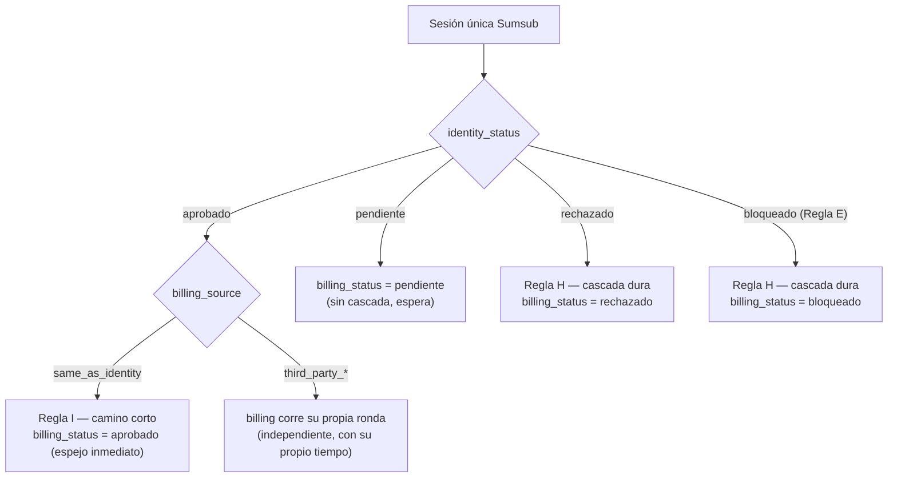

# Casos cuenta ↔ facturación dentro de una sola sesión Sumsub

> [← Volver al Blueprint](Service_Blueprint_Diagrama_Fase_5.md) · relacionado: [Mapa de decisión](Service_Blueprint_Fase_5_Mapa-Decision.md) · fuente: [`Hablemos desarollo validación identidad_ 2026_08_11...md`](Hablemos%20desarollo%20validación%20identidad_%202026_08_11%2011_00%20GMT-05_00%20-%20Notas%20de%20Gemini.md)
>
> ⚠️ **Alcance:** este doc solo cubre **Resto de países** (Sumsub, una sola sesión resuelve cuenta + facturación). Colombia ya tiene proveedores separados (Truora para identidad, Sumsub para facturación, sesiones independientes) — su cascada es distinta y ya está cubierta por el flujo secuencial de C5 del [Blueprint](Service_Blueprint_Diagrama_Fase_5.md#c5--validación-y-ruteo--país--lo-que-falta) ("Primero Truora, luego Sumsub").

## El problema que resuelve este doc

De cara al usuario, Sumsub es **un solo flujo**: entra, sube su documento, se toma una foto, confirma unos datos y sale. Pero por dentro Dropi sigue necesitando **dos registros de estado separados** — `identity` (Información de cuenta) y `billing` (Datos de facturación) — porque son dos páginas distintas, con dos dueños de negocio distintos (Compliance/Usuarios vs. Financiero), y porque el principio de Víctor (TI) en la reunión del 2026-08-11 es que el servicio de validación siempre valida **personas o empresas**, nunca "identidad" o "facturación" como cosas aparte — lo que cambia es qué datos se presentan y quién consume el resultado.

Eso deja dos preguntas sin cerrar que el Blueprint principal no resolvía explícitamente:

1. **Si la parte de cuenta se rechaza dentro de esa sesión única, ¿qué le pasa a facturación?**
2. **Si la persona que factura es la misma persona natural de la cuenta, ¿por qué el proceso debe ser más corto y cómo se refleja eso en los estados?**

## Modelo de datos interno

Dos registros independientes por usuario/país, cada uno con su propio ciclo de vida — nunca un solo estado combinado:

| Registro | Campo | Valores |
|---|---|---|
| `identity` | `identity_status` | `pendiente` \| `aprobado` \| `rechazado` \| `bloqueado` |
| `billing` | `billing_status` | `pendiente` \| `aprobado` \| `rechazado` \| `bloqueado` |
| `billing` | `billing_source` | `same_as_identity` (reuso — misma persona/empresa de la cuenta) \| `third_party_natural` (factura a nombre de otra persona natural) \| `third_party_legal` (factura a nombre de una empresa) |

`billing_source` es la pieza que faltaba: es lo que le dice al motor de estados si `billing` debe **espejar** a `identity` (camino corto) o correr **su propia ronda** de validación (camino encadenado), tal como lo describió Víctor: "una sola persona que está proporcionando los datos de dos personas diferentes… son dos rondas".

## Mapeo a la sesión Sumsub

Un solo applicant / WebSDK. El workflow de Sumsub ya trae un paso condicional confirmado (`datos_para_sumsub.md`): *"¿quieres facturar con los mismos datos de la cuenta?"* → autorelleno (⇒ `billing_source = same_as_identity`) o nueva validación KYB (⇒ `billing_source = third_party_*`).

> 🚧 **Punto abierto — pendiente de confirmar con el PoC de Sumsub (habilitador HU-00 de `Historia.md`):** no sabemos todavía si el workflow **bloquea técnicamente** el avance al paso de facturación cuando el paso de identidad falla, o si dentro de la misma sesión ambos pasos pueden completarse y la cascada es una regla que Dropi aplica al recibir los dos resultados. La diferencia importa para el diseño:
>
> | Sub-caso | Qué pasa con `billing` | Consecuencia práctica |
> |---|---|---|
> | **A. Gate técnico de Sumsub** — el workflow no deja avanzar al paso de facturación si identidad no pasó | `billing_status` nunca sale de `pendiente` (estado "sin iniciar por bloqueo previo") | No hay nada que revertir — nunca se generó un resultado de facturación |
> | **B. Pasos independientes dentro de la sesión** — Sumsub permite completar ambos y evalúa/rechaza identidad después (p. ej. en revisión manual tardía) | `billing` puede haber llegado a `aprobado` antes de que `identity` se rechace | Dropi debe **revertir** `billing_status` a `rechazado` de forma retroactiva cuando llega el webhook de rechazo de identidad — con noticia al usuario y sin perder el dato fiscal ya capturado (ver [Consecuencias](#consecuencias)) |
>
> Hasta que el PoC confirme cuál aplica, el Blueprint y este doc **asumen el sub-caso B** para el diseño de UI (es el más exigente: si B está cubierto, A queda cubierto gratis).

## Regla H — Cascada dura (identidad rechazada ⇒ facturación rechazada)

**Decisión de negocio, sin excepción, para Resto de países:** si `identity_status = rechazado`, el motor de estados fuerza `billing_status = rechazado` en el mismo instante, sin importar en qué estado estuviera `billing` antes. Nunca existe "facturación aprobada" con "identidad rechazada" — es la misma persona/empresa la que se está validando, así los datos de facturación difieran.

Lo mismo aplica a la bandera de riesgo de [`Regla E`](Service_Blueprint_Diagrama_Fase_5.md#reglas-transversales) del Blueprint principal (Bloqueado por Legal/Financiero, no por el proveedor): si `identity_status = bloqueado`, `billing_status` también pasa a `bloqueado` — la bandera de riesgo es sobre la persona, no sobre el trámite que esa persona está completando.

`identity_status = pendiente` (en revisión) **no** dispara la cascada — `billing` simplemente espera, igual que hoy (comportamiento ya cubierto por el Blueprint principal, sin cambios).

## Regla I — Camino corto por reuso

Cuando `billing_source = same_as_identity`, `billing_status` **refleja automáticamente** el valor de `identity_status` apenas Sumsub confirma la reutilización de datos — sin segunda ronda de validación, sin segundo webhook de espera, sin que el usuario vea un "en proceso" separado en Datos de facturación. Es el mismo hallazgo rápido que ya usa Mercado Libre (mencionado por Víctor en la reunión): "usar los mismos datos" es un checkbox, no un formulario nuevo.

Cuando `billing_source ∈ {third_party_natural, third_party_legal}`, `billing` corre su propia ronda, con su propio tiempo de resolución — puede aprobar, rechazar o quedar pendiente de forma independiente de `identity` (salvo que la Regla H la fuerce a rechazado).

## Matriz SI → ENTONCES

| `identity_status` | `billing_source` | `billing_status` resultante | Qué ve el usuario | Hard gate |
|---|---|---|---|---|
| `aprobado` | `same_as_identity` | `aprobado` (espejo inmediato, Regla I) | Ambas páginas: "¡Cuenta verificada!" a la vez, sin espera adicional en Facturación | Se libera en ambas páginas |
| `aprobado` | `third_party_natural` / `third_party_legal` | `pendiente` → su propio resultado | Información de cuenta: solo lectura. Datos de facturación: banner "Estamos confirmando tus datos" (su propia ronda) | Cuenta liberada; Facturación sigue bloqueando salidas hasta resolver |
| `pendiente` | cualquiera | `pendiente` (espera, sin cascada) | Ambas páginas: "Estamos confirmando tus datos" | Ambas bloquean salidas |
| **`rechazado`** | cualquiera | **`rechazado` (Regla H, cascada dura)** | Ambas páginas: "No pudimos validar tus datos" — un solo evento, no dos rechazos separados | Ambas bloquean salidas; reintento disponible en ambas a la vez |
| **`bloqueado`** (bandera de riesgo, Regla E) | cualquiera | **`bloqueado` (Regla H)** | Ambas páginas: "Tu cuenta está bloqueada por seguridad" / "…suspendida de forma definitiva" según el caso | Ambas bloquean; sin botón de reintento, va a soporte |

## Matriz de combinaciones — Cuenta (identidad) × Facturación

La tabla anterior cruza `identity_status` × `billing_source` (según qué datos usa para facturar). Esta cruza directamente **los cuatro estados de Cuenta contra los cuatro estados de Facturación**, para responder de un vistazo la pregunta más literal: *"si soy A o B en cuenta, ¿qué puede pasar en facturación, y qué significa cada combinación?"*

| Cuenta ↓ / Facturación → | Aprobada | Rechazada | Pendiente | Bloqueada |
|---|---|---|---|---|
| **Aprobada** | ✅ Posible — reuso (Regla I, espejo inmediato) o tercero con ronda propia ya aprobada. *"¡Cuenta verificada!"* en ambas páginas | ✅ Posible — solo con tercero: rechazo **propio** de esa ronda, no es cascada. Cuenta en solo lectura; Facturación con su propio reintento | ✅ Posible — solo con tercero: su ronda aún no resuelve. Cuenta en solo lectura; Facturación banner "en proceso" | ✅ Posible — bandera de riesgo (`Regla E`) puesta directamente sobre el trámite de facturación, independiente de que identidad esté aprobada |
| **Rechazada** | ❌ **Imposible** — `Regla H` (cascada dura) lo prohíbe sin excepción. Nunca hay facturación aprobada con identidad rechazada | ✅ Posible — es el caso esperado de `Regla H`: mismo evento, mismo instante, un solo rechazo genérico ("No pudimos validar tus datos") | ⚠️ Solo transitorio — `Regla H` fuerza el paso a Rechazada en el mismo instante; no debería observarse como estado estable | ✅ Posible — bandera de riesgo adicional sobre facturación, encima del rechazo de cuenta (infrecuente, no contradictorio) |
| **Pendiente** | ✅ Posible, pero condicional — solo con tercero (🚧 sub-caso B, sin confirmar con Sumsub): su ronda ya aprobó mientras cuenta sigue en revisión. Si cuenta luego se rechaza, esta aprobación **se revierte** (`Regla H` retroactiva, ver Consecuencias) | ✅ Posible — solo con tercero: rechazo propio de esa ronda, cuenta aún no resuelve | ✅ Posible — estado normal en curso: ambas páginas esperando, o solo Facturación si es un tercero con ronda más lenta | ✅ Posible — bandera de riesgo sobre facturación mientras identidad todavía no resuelve |
| **Bloqueada** | ❌ **Imposible** — misma razón que Rechazada×Aprobada: la bandera de riesgo también cascada (`Regla H`) | ❌ **Imposible** — `Regla H` fuerza Facturación a **Bloqueada**, no a Rechazada; son estados distintos y no se mezclan | ⚠️ Solo transitorio — `Regla H` lo resuelve al instante a Bloqueada | ✅ Posible — caso esperado de `Regla H`: la bandera de riesgo es sobre la persona, se propaga a ambos trámites |

**Cómo leerla:**
- ❌ **Imposible** = el sistema nunca debería llegar a ese estado — si aparece en producción, es un bug de la cascada, no un caso de negocio válido.
- ⚠️ **Solo transitorio** = puede existir por milisegundos mientras el motor de estados procesa la cascada, pero nunca debe persistir ni mostrarse al usuario.
- ✅ **Posible** = estado estable y esperado, con su propia UI ya definida en el Blueprint principal (C5/C6) o en la matriz SI→ENTONCES de arriba.
- 🚧 = depende del sub-caso técnico de Sumsub aún sin confirmar (ver [Mapeo a la sesión Sumsub](#mapeo-a-la-sesión-sumsub)).

> Nota sobre "Bloqueada": por `Regla E` del Blueprint principal, el bloqueo por bandera de riesgo es un flag aparte que puede coexistir técnicamente con cualquier resultado del proveedor (incluso "Aprobado") — pero de cara al usuario, cuando el flag está activo, siempre **domina** la pantalla (se muestra el banner de bloqueo, no el de aprobado/rechazado). Por eso esta matriz trata "Bloqueada" como el estado que ve el usuario, no como el resultado crudo del webhook.

## Consecuencias — qué se conserva y qué se descarta

- **Datos fiscales ya capturados por Sumsub antes del rechazo** (sub-caso B de arriba): se **conservan** para el reintento, siguiendo el mismo criterio que `RN-23` de `Historia.md` ya aplica al fallo de KYB — "no se degrada al usuario, se conservan los datos para el reintento". No se le pide a la persona volver a escribir lo que ya había diligenciado.
- **El usuario nunca ve dos rechazos separados** en Resto de países — ver un rechazo de "cuenta" y luego, por separado, uno de "facturación" sugeriría dos trámites distintos cuando en realidad es una sola decisión sobre una sola persona/empresa. Por eso el copy de C6 del Blueprint principal ("No pudimos validar tus datos") es deliberadamente genérico para Resto de países — no es falta de detalle, es que la cascada dura hace que sea siempre el mismo evento.
- **El reintento reabre ambas páginas a la vez** — no tiene sentido dejar reintentar solo facturación si identidad es la causa raíz.
- **Excepción — reuso ya confirmado antes del rechazo:** si `billing_source = same_as_identity` y ya se había reflejado un `aprobado` momentáneo por Regla I antes de que llegara una revisión manual tardía que rechaza identidad (sub-caso B), ese `aprobado` de facturación también se revierte — el espejo aplica en ambas direcciones, no solo hacia adelante.

## Diagrama

## Ver también

- [Blueprint principal — C4/C5/C6](Service_Blueprint_Diagrama_Fase_5.md#c5--validación-y-ruteo--país--lo-que-falta) para el copy exacto por pantalla.
- [`Historia.md`](Historia.md) — `RN-20` (reuso de KYC del representante legal en KYB) y `RN-23` (no degradar en fallo de KYB) son los precedentes de negocio de las Reglas H e I aquí formalizadas.
- [`datos_para_sumsub.md`](datos_para_sumsub.md) — confirma el condicional nativo de Sumsub "¿mismos datos de cuenta?" y que los estados llegan por webhook, modulares.
