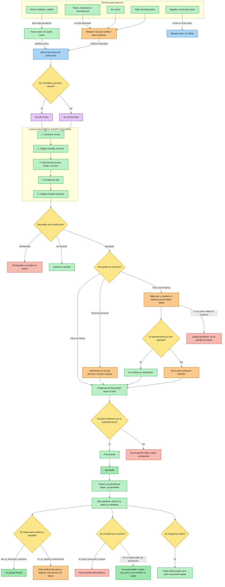
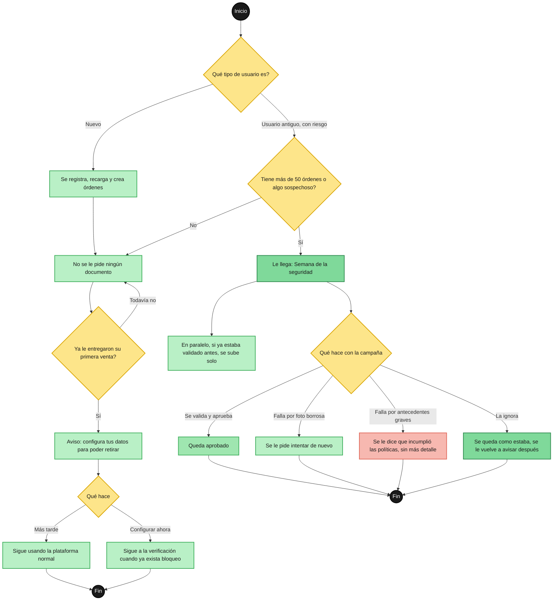
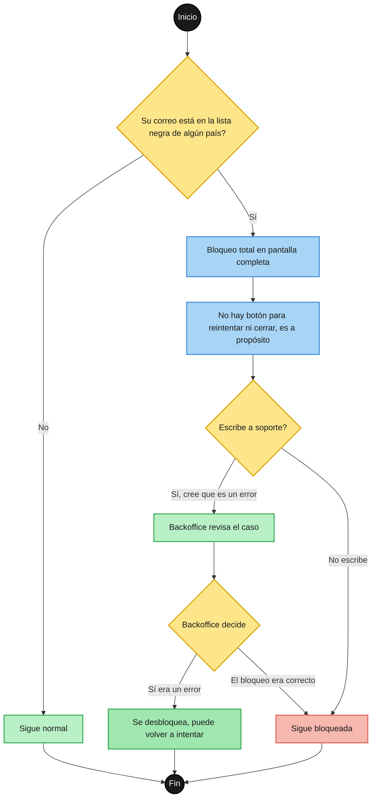
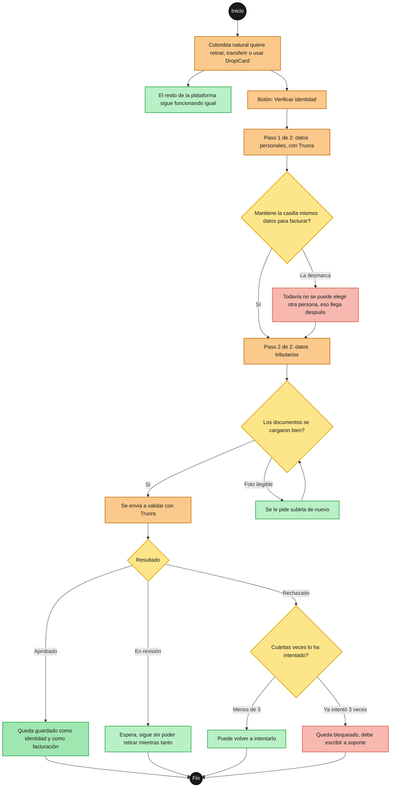
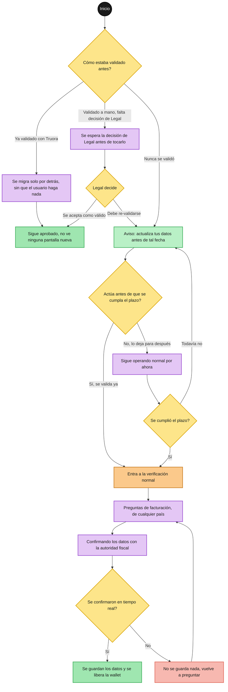
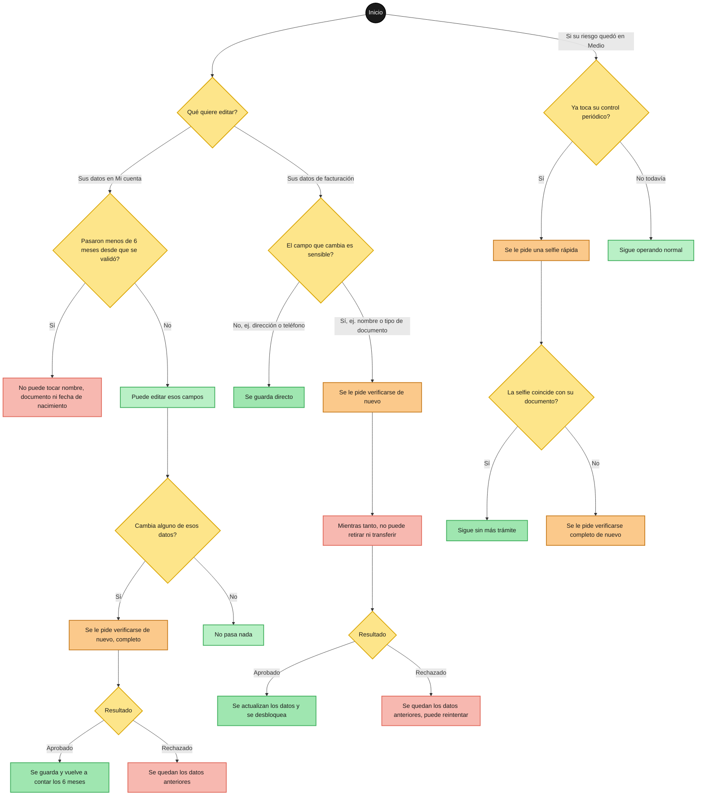

# Plan: Rediseño del flujo de validación de identidad (KYC/KYB) + facturación — consolidación en `/new/*`

## Contexto

Hoy existen **dos implementaciones paralelas y desconectadas** del flujo de validación de identidad en el prototipo:

1. **Sistema "productivo"**, ya integrado en las páginas reales `/new/*` y controlado por el demo-panel global: `IdentityDemoStateService` + `IdentityModalService` + `IdentityGateComponent` (bloqueo duro) + `IdentitySoftBannerComponent` (nudge suave) + `IdentitySumsubModalComponent` (simulación del WebSDK).
2. **Showcase aislado** en `configuraciones/flujo-identidad-2026-06-18` (`FlujoIdentidadComponent`), que implementa más literalmente el spec viejo de 15 vistas (`docs/Plan1.md`), con su propio sistema de tipos, sus propios mocks, y funcionalidad (OTP/MFA, taxonomía de 12 motivos de rechazo) que nunca se integró al sistema (1).

Esto generó gaps concretos contra las reglas de negocio reales (`docs/validacion/Historia.md`, `Consideraciones.md`, `Reglasvalidacion.md`, `StartUser.md`, `datos_para_sumsub.md`, transcripción de la reunión, y el Excel real `Copia de Información Datos de Facturación LATAM.xlsx`):

- El modal actual pide el tipo de facturación (personal/empresa) **antes** de capturar documento — el orden correcto que pidió el usuario es: correo → OTP correo → foto documento (detección automática de tipo) → prueba de vida → celular + OTP → **recién ahí** la pregunta de facturación con 3 rutas (mis datos / tercero persona natural / persona jurídica). Hoy solo existen 2 rutas (falta "tercero natural").
- No existe la distinción **Colombia-natural usa Truora / resto usa Sumsub** (Fase 2) — el modal está 100% marcado como Sumsub sin importar país/tipo de persona.
- El cuestionario fiscal solo cubre CO/MX/AR de forma hardcodeada; el Excel real tiene reglas exactas para 9 países (Paraguay, Argentina, Colombia, Perú, Guatemala, Costa Rica, México, Ecuador, Chile) con tipos de documento, regímenes y documentos a cargar específicos por país × tipo de persona.
- Faltan reglas de negocio clave: RN-20 (reutilizar KYC del representante legal si ya es usuario validado), RN-23 (KYB fallido → estado `pj_pendiente`, no degradar a natural), RN-11 (bloqueo de 6 meses en "Dueño de cuenta"), RN-14/15 (campos sensibles vs no sensibles en edición), RN-10 (monitoreo por score de riesgo), "Caso Ecuador" (nunca guardar datos fiscales sin confirmación real vía webhook).
- `wallet.component.ts` no tiene bloqueo duro en transferencias entre wallets (solo banner suave), pese a que la regla de negocio dice que debe bloquearse igual que retiros/DropiCard.
- Bug independiente: `configuraciones/flujo-identidad-2026-06-18` está registrada dos veces en `app.routes.ts`; por orden de matching de Angular, la versión `pages/old/...` es la que realmente responde, dejando la `pages/new/...` inalcanzable.

**Objetivo de este plan:** consolidar todo sobre el sistema (1) como única fuente de verdad, rediseñar el orden y cobertura del modal Sumsub/Truora según el flujo real descrito por el usuario, extender la cobertura a los 9 países del Excel, implementar las reglas de negocio faltantes, y dar al demo-panel controles para ver el flujo adaptado por **Fase de entrega** del proyecto, por **Etapa del usuario** (journey PLG), por segmento de usuario y por país/motor de validación.

Se confirmaron dos hechos técnicos durante la investigación: el token de color canónico para `/new/*` es `_variables-new.scss` (`$primary-500: #FF6102`), y la ruta duplicada de `flujo-identidad-2026-06-18` efectivamente deja la versión `/old/` como la que responde en runtime — ambos se tratan como parte del plan.

**Auditoría de alcance (verificada por grep contra el código, no supuesta):** el título "consolidación en `/new/*`" es preciso para páginas, rutas y el demo-panel, pero `IdentityDemoStateService`/`identity-flow.models.ts` son un singleton compartido que también consumen 9 páginas de `/old/` (ver sección "Hallazgo de auditoría" antes de "Cambios por archivo"). Por eso el modelo/servicio nuevos que pide este plan (9 países, `pj_pendiente`, 3 vías de facturación, `faseProyecto`/`segmentoUsuario`) se implementan en archivos **nuevos y aditivos** (`identity-flow-v2.models.ts`, `identity-demo-state-v2.service.ts`) que nunca modifican los tipos/signals que `/old/` ya consume — así el plan sí queda exclusivo de `/new/*` en la práctica, no solo en el título.

## Cómo leer las Fases: rollout acumulativo, no un interruptor por usuario

Esta sección corrige un error de modelo mental que estaba implícito en versiones anteriores de este documento — se deja explícito aquí porque condiciona la lectura de todo lo que sigue (Matriz maestra, mermaids, y cada sección de Fase).

**Las Fases 0-5 (`Historia.md`) NO son un estado exclusivo en el que "cae" un usuario según su etapa del journey.** Son hitos cronológicos y **acumulativos** del rollout del proyecto: cada Fase agrega una capacidad técnica nueva sobre las anteriores, y ninguna Fase reemplaza instantáneamente a la anterior para todos los casos — solo la reemplaza para los casos que esa Fase específicamente cubre.

Esto tiene una consecuencia directa: **en cualquier momento del proyecto (es decir, estando "en" una Fase determinada), las 5 Etapas del usuario (`StartUser.md`) existen simultáneamente y todas necesitan algún tipo de atención.** Lo que varía Fase a Fase no es "qué etapas aplican" (todas aplican siempre), sino **qué mecanismo atiende a cada etapa en ese momento**:

- Si la Fase actual ya construyó tecnología nativa para esa etapa/segmento → se usa esa tecnología nueva.
- Si la Fase actual todavía no ha llegado a esa etapa/segmento → se sigue usando el mecanismo **heredado** de la Fase anterior (que en Fase 0 es, casi siempre, un proceso manual/no-code vía Backoffice).

Ejemplo concreto que motivó esta corrección: durante la ventana de **Fase 0**, un usuario en **Etapa 3 (Compromiso/Habit Moment)** que intenta retirar dinero **sí existe y sí necesita ser atendido** — hoy Dropi lo atiende con el 40% manual vía WhatsApp/Intercom que describe `Historia.md`. Eso NO es `N/A`: es el mecanismo vigente para esa combinación hasta que Fase 2/3 construyan el hard gate automatizado. Versiones anteriores de este documento marcaban esa celda como `N/A`, lo cual sugería incorrectamente que ese usuario no existía o no importaba en Fase 0.

**Regla de lectura para el resto del documento:** cada vez que se describe una Fase, se listan las 5 Etapas sin excepción, indicando para cada una si el mecanismo es **nativo de esta Fase** o **heredado de una Fase anterior** (casi siempre Fase 0, el fallback manual universal). Nunca se usa `N/A` para decir "esta etapa no aplica" — porque todas las etapas aplican siempre; lo que se documenta es *con qué* se resuelve cada una en cada momento del rollout.

Una excepción real y permanente: la **Regla de Validación Nula** en Etapa 1 (Setup) no es "el mecanismo de Fase 0" que después se reemplaza — es una regla de negocio **permanente que nunca cambia en ninguna Fase** (`Reglasvalidacion.md` §2): jamás se exige documento al registrarse ni al recargar, en ninguna Fase del proyecto, para siempre.

## Decisiones de alcance (sin respuesta explícita del usuario — se aplicó el default recomendado)

- **Alcance**: se documentan las 7 partes completas (tipos base, modal, rama de 3 vías, formulario fiscal por país, gates de página, webhook Fase 4, demo-panel) con su orden de dependencia; la ejecución se trocea en PRs siguiendo ese orden.
- **Limpieza legacy**: se marca `ARCHIVADO` en `navigation-map.json` para las 5 entradas viejas de identidad y se corrige la colisión de rutas en `app.routes.ts`, sin borrar archivos ni componentes.
- **Cobertura de países**: los 9 países completos del Excel desde el inicio (no un subconjunto).

## Habilitadores (HU-00) — Track transversal, sin superficie de demo

`Historia.md` define un track de habilitadores que arranca el día 1 en paralelo a todo lo demás. No es una entrega visible al usuario ni tiene un estado propio en el demo-panel — es contexto/dependencia que condiciona cuándo pueden empezar a construirse ciertas fases del prototipo:

- **PoC técnico con el sandbox de SumSub**: confirma qué retorna realmente la API. Hoy el diseño de la precarga (Fase 3, "validar → precargar") está basado en supuestos, no en certezas — si el PoC revela un shape distinto de respuesta OCR, la Fase 3 de este plan debe revisarse.
- **Aval de seguridad formal**: manejo de datos biométricos y documentos de identidad. Precondición dura antes de que "arquitectura arranque KYB" (`Historia.md`, DoD de TI) — es decir, antes de construir en serio la Fase 3.
- **Modelo de datos del registro consolidado de baneados**: hoy las bases por país son independientes; la Fase 1 (bloqueo cruzado) asume que este modelo ya combina las listas. En el prototipo esto se simula con `bannedEmails: Record<Pais, string[]>` (ver Tabla de vistas, #1) sin esperar al modelo real.
- **Motor de ruteo por nacionalidad (base)**: KYC contra las bases del país de nacionalidad del usuario; KYB contra las bases del país de constitución de la empresa, no del país de operación en Dropi. Esta es la base conceptual de RN-03 (Ruteo Dual), que la Fase 3 de este plan implementa en el demo con datos simulados.

**Nota para el prototipo:** ninguno de estos cuatro puntos requiere un toggle en el demo-panel — son prerequisitos organizacionales/técnicos de TI y Legal. Se documentan aquí solo para que quede explícito que si el PoC de Sumsub o el aval de seguridad cambian de alcance, las Fases 3 y 4 de este plan (que sí tienen superficie de demo) deben revisarse en consecuencia.

## Mermaid — journey consolidado

Convenciones usadas en todos los diagramas de este documento (tomadas del board de Figma "Validación de identidad · Convenciones"): círculo negro = inicio/fin, rectángulo verde = pantalla que ve el usuario, rectángulo naranja = pantalla que abre un flujo nuevo/obligatorio, rectángulo morado = acción del sistema (no es una pantalla), rombo amarillo = decisión, rectángulo azul = modal, verde intenso = resultado positivo, rojo = resultado negativo/bloqueo.



## Matriz maestra: cobertura acumulativa por Fase × Etapa del usuario

Esta matriz cruza el eje de **entrega del producto** (Fase 0-5, acumulativo — `Historia.md`/`Consideraciones.md`) con el eje de **journey PLG del usuario** (Etapa 1-5, `StartUser.md`). A diferencia de una versión anterior de este documento, **ninguna celda es `N/A`**: las 5 Etapas existen siempre, en cualquier Fase; cada celda dice qué mecanismo la atiende en ese momento del rollout — **nativo** (la Fase actual construyó tecnología propia para esa etapa/segmento) o **heredado** (sigue usando el mecanismo de una Fase anterior, casi siempre el fallback manual de Fase 0).

| Fase de entrega | Et.1 Setup | Et.2 Activación/Aha | Et.3 Compromiso/Habit | Et.4 Cross-Border/Profesionalización | Et.5 Mantenimiento/Migración |
|---|---|---|---|---|---|
| **Fase 0** — Asistida (no-code/manual) | **Nativo y permanente:** Regla de Validación Nula, cero campos (Reglasvalidacion.md §2) | **Nativo:** soft touchpoint tras 1ra venta (0-A) — nunca se retira en fases posteriores | **Nativo (único mecanismo disponible):** sin bloqueo de producto — 100% manual vía Backoffice/WhatsApp/Intercom, el 40% sin SLA que describe `Historia.md` | **Nativo (único mecanismo disponible):** KYB no existe formalmente — solo "proveedores exclusivos" validados manualmente caso por caso | **Nativo:** segmentación por riesgo/volumen + campaña "Semana de la seguridad" (0-B) + carga masiva silenciosa + rechazo genérico (0-C) |
| **Fase 1** — Bloqueo cruzado | **Se agrega:** cruce de correo contra lista negra global (1-A), corre antes que la Regla de Validación Nula, no la reemplaza | **Heredado de Fase 0:** sigue solo el soft touchpoint; el cruce de Fase 1 puede disparar igual si cambia de país | **Heredado de Fase 0:** sigue 100% manual vía Backoffice; el cruce de Fase 1 se suma si hay reincidencia cross-country | **Heredado de Fase 0:** sigue el KYB ad-hoc; el cruce de Fase 1 es relevante para operadores cross-border reincidentes | **Heredado de Fase 0:** sigue la segmentación/campaña; el cruce aplica igual a legacy migrando de país |
| **Fase 2** — Formulario unificado + Truora (solo CO-natural) | **Heredado (permanente):** Regla de Validación Nula sin cambios | **Nativo para CO-natural:** dispara formulario unificado (2-B/2-C) en el Aha Moment. **Heredado para el resto:** sigue solo con soft touchpoint | **Nativo para CO-natural:** hard gate automatizado con Truora (2-A) — cierra el 40% manual para ese segmento. **Heredado para el resto:** sigue 100% manual vía Backoffice, Fase 2 no los cubre todavía | **Heredado de Fase 0:** Fase 2 es exclusiva de CO-natural, no toca personas jurídicas ni cross-border — sigue el KYB ad-hoc | **Heredado de Fase 0:** sigue la segmentación/campaña; un legacy CO-natural que se active sí puede usar el formulario unificado como cualquier usuario nuevo de ese segmento |
| **Fase 3** — KYB + Sumsub + ruteo + KYT | **Heredado (permanente):** sin cambios | **Sin cambios frente a Fase 2:** CO-natural con Truora, resto con soft touchpoint hasta que dispare la Etapa 3 | **Nativo para todo el resto (≠ CO-natural, o CO-jurídica):** hard gate automatizado con WebSDK completo de Sumsub (3-A a 3-F) — cierra el gap manual para el resto de la base. **Sin cambios para CO-natural:** sigue con Truora | **Nativo:** KYB fricción cero + RN-20 + RN-23 + ruteo dual RN-03 + KYT en USDT (3-G a 3-J) — caso central de esta Fase, cierra la brecha legal más crítica | **Heredado de Fase 0:** sigue la segmentación/campaña para el universo aún no migrado; legacy que se activa ya usa Truora/Sumsub según corresponda, pero sin migración masiva sistemática todavía |
| **Fase 4** — Migración de base existente | **Heredado (permanente):** sin cambios | **Sin cambios frente a Fase 3** | **Sin cambios frente a Fase 3** (Truora/Sumsub ya son nativos desde Fase 2/3) | **Sin cambios frente a Fase 3** | **Nativo:** migración masiva sistemática — ZIP Truora→Sumsub invisible para ya-validados, ventanas pedagógicas por cohorte (4-A), gate de webhook "Caso Ecuador" (4-B) — reemplaza la segmentación ad-hoc de Fase 0 |
| **Fase 5** — Edición post-validación | **Heredado (permanente):** sin cambios | **Sin cambios** (recién se valida por primera vez, no aplica edición) | **Nativo:** bloqueo de 6 meses del Dueño de cuenta (RN-11, 5-A) para cualquiera ya validado por Truora o Sumsub | **Nativo:** re-validación inteligente por campo sensible/no sensible (RN-14/15, 5-B) | **Nativo:** monitoreo periódico por score de riesgo (RN-10, 5-C) para los recién migrados en Fase 4 |

**Notas de lectura de la matriz:**
- Ninguna celda es `N/A`. Toda combinación Fase × Etapa tiene un mecanismo vigente — nativo de esa Fase, o heredado de una Fase anterior (normalmente Fase 0). El demo-panel debe poder reproducir ambos: al seleccionar una Fase temprana + una Etapa que esa Fase todavía no cubre nativamente, debe mostrarse explícitamente el mecanismo heredado (ej. un indicador "Gestión manual — Backoffice"), nunca una pantalla vacía o un comportamiento silencioso.
- Las celdas remiten a los códigos de wiretext ya existentes en cada sección de Fase (0-A, 2-B, 3-F, etc.).
- Esta matriz es la implementación concreta de la sección "Decisión: `FaseUsuario` (existente) vs 'Fase del proyecto' (pedida)" (más abajo): los dos ejes son ortogonales, pero además acumulativos — el demo-panel necesita reflejar tanto el eje ortogonal (dos filas de chips) como la herencia entre Fases (qué mecanismo sigue vigente si la Fase seleccionada no construyó todavía algo nativo para esa Etapa).

## Mermaid — cobertura acumulativa por Etapa a través de las Fases

Este segundo diagrama reemplaza la versión anterior (que enrutaba cada Etapa a "su" Fase, reforzando el modelo incorrecto). Ahora muestra, para cada Etapa, cómo el mecanismo que la atiende **se acumula y mejora** a medida que avanzan las Fases — nunca la etapa "pertenece" a una sola Fase.

```mermaid
flowchart TD
    classDef pantalla fill:#b9f0c6,stroke:#3fae5c,color:#1a1a1a,stroke-width:2px
    classDef pantallaNueva fill:#fbc98b,stroke:#c77b1e,color:#1a1a1a,stroke-width:2px
    classDef si fill:#9fe6b0,stroke:#3fae5c,color:#1a1a1a,stroke-width:2px
    classDef no fill:#f7b8b0,stroke:#e0685a,color:#1a1a1a,stroke-width:2px

    subgraph E1[Etapa 1 · Setup]
      E1_ALL[Nunca se pide documento, en ninguna Fase]
    end

    subgraph E2[Etapa 2 · Primera venta]
      E2_F0[Fase 0: aviso suave tras la primera venta]
      E2_F2[Fase 2: si es Colombia natural, ya pide el formulario completo]
      E2_F0 --> E2_F2
    end

    subgraph E3[Etapa 3 · Quiere retirar dinero]
      E3_F0[Fase 0: todavía no hay bloqueo, lo resuelve Backoffice a mano]
      E3_F2[Fase 2: Colombia natural ya queda bloqueado hasta verificarse con Truora]
      E3_F3[Fase 3: el resto de países y empresas también quedan bloqueados, ahora con Sumsub]
      E3_F0 --> E3_F2 --> E3_F3
    end

    subgraph E4[Etapa 4 · Empresa o varios países]
      E4_F0[Fase 0: no existe verificación de empresas, se hace caso por caso]
      E4_F3[Fase 3: ya se puede verificar la empresa buscándola por nombre]
      E4_F5[Fase 5: cambiar de dueño o de empresa ya pide re-verificación cuando toca]
      E4_F0 --> E4_F3 --> E4_F5
    end

    subgraph E5[Etapa 5 · Usuarios antiguos]
      E5_F0[Fase 0: se les avisa según su riesgo, uno por uno]
      E5_F4[Fase 4: se migran todos en bloques, con aviso previo]
      E5_F5[Fase 5: a los de riesgo medio se les pide una prueba rápida cada tanto]
      E5_F0 --> E5_F4 --> E5_F5
    end

    class E1_ALL pantalla
    class E2_F0,E3_F0,E4_F0,E5_F0 no
    class E2_F2,E3_F2,E4_F3,E5_F4 pantallaNueva
    class E3_F3,E4_F5,E5_F5 si
```



## Flujo explícito de usuario por fase, con wiretext

Esta sección responde específicamente a qué ve y qué hace el usuario en cada una de las 6 fases del proyecto, citando la regla exacta de `Reglasvalidacion.md`, `StartUser.md` y `Consideraciones.md` que la origina. Los wiretext son bocetos de bajo nivel (no mockups visuales) para dejar clara la estructura de cada pantalla — el detalle visual final sigue las specs de DS Registry. Cada Fase incluye ahora una subsección **"Etapas aplicables"** (ver Matriz maestra arriba) que traduce la fila correspondiente de la matriz al detalle de configuración del demo-panel.

### Fase 0 — Validación asistida (no-code / manual)

**Reglas que aplican:** Regla de Validación Nula (Reglasvalidacion.md §2: "prohibido exigir documentos... al momento del registro o recargas"); Interacción Sutil / Soft Touchpoint (Consideraciones.md Fase 0); Enfoque de Urgencia y Segmentación de Riesgo + Periodo Pedagógico e Incentivos + Carga Masiva Silenciosa + Manejo de Rechazos sin revelar investigación (Consideraciones.md Fase 0); Etapas 1-2 de `StartUser.md`.

**Mecanismo vigente por etapa en esta Fase** (Fase 0 es, por definición, el fallback universal — todo lo que no tiene tecnología propia todavía se resuelve aquí):

| Etapa del usuario | Mecanismo vigente en Fase 0 |
|---|---|
| **Etapa 1 — Setup** | Regla de Validación Nula (permanente, nunca cambia en ninguna Fase): cero campos de identidad al registrarse o recargar. Demo-panel: `faseProyecto = fase0`, `momentoUsuario = setup`. |
| **Etapa 2 — Activación/Aha** | Nativo: soft touchpoint tras primera venta entregada (wiretext 0-A). Demo-panel: `faseProyecto = fase0`, `momentoUsuario = activacion`. |
| **Etapa 3 — Compromiso/Habit** | Nativo (único mecanismo disponible en Fase 0): **sin bloqueo de producto todavía** — el usuario que intenta retirar/transferir se atiende 100% manual, por Backoffice vía WhatsApp/Intercom, sin SLA ni tickets formales (el 40% de casos manuales que describe `Historia.md`). Este es el gap que Fase 2/3 cierran; hasta entonces, cualquier usuario en Etapa 3 durante Fase 0 pasa por este canal. Demo-panel: `faseProyecto = fase0`, `momentoUsuario = habito` debe mostrar un indicador de "Gestión manual — Backoffice", no un hard gate ni una pantalla vacía. |
| **Etapa 4 — Cross-Border/Profesionalización** | Nativo (único mecanismo disponible en Fase 0): KYB no existe formalmente — solo "proveedores exclusivos" se validan manualmente como empresa, caso por caso, por decisión ad-hoc del equipo. Demo-panel: `faseProyecto = fase0`, `momentoUsuario = profesional` debe mostrar el mismo indicador de "Gestión manual — Backoffice" que Etapa 3, aclarando que es un proceso ad-hoc sin SLA. |
| **Etapa 5 — Mantenimiento/Migración** | Nativo: segmentación por riesgo/volumen + campaña "Semana de la seguridad" (0-B) + carga masiva silenciosa a Sumsub + rechazo genérico sin revelar investigación (0-C). Demo-panel: `faseProyecto = fase0`, `momentoUsuario = legacy`, `segmentoUsuario` con riesgo alto. |

**Mermaid — flujo de usuario (Fase 0, happy path + casos no felices):**



**Flujo — usuario nuevo:**
1. Se registra, recarga wallet, crea órdenes. Ningún campo de identidad se pide (`Setup Moment`). Retiro/transferencia/DropiCard ya están bloqueados en el fondo, pero el usuario no lo nota hasta entrar a esas secciones (`StartUser.md` Etapa 1: "zonas de transferencia... bloqueadas, solo se da cuenta al ver notificación en cada sección").
2. Primera orden entregada → aparece el soft touchpoint (no bloquea nada).
3. Si el usuario ignora el soft touchpoint, no pasa nada más en Fase 0 — no hay escalamiento a bloqueo duro todavía (eso empieza en Fase 2).

**Flujo — usuario activo/antiguo (backoffice, no visible al usuario final salvo el aviso):**
1. Sistema segmenta por riesgo: >50 órdenes o movimientos de wallet, o comportamiento de riesgo (reportes, retiros sospechosos).
2. A los segmentados se les muestra una campaña "Semana de la seguridad" (Userpilot + WhatsApp/CRM) con incentivo monetario.
3. En paralelo, se hace carga masiva silenciosa al backoffice de Sumsub de usuarios ya validados por Cartera — el usuario no ve nada, no se le pide repetir nada.
4. Si el usuario se valida y falla por antecedentes graves (AML), el bloqueo usa mensaje genérico ("incumplimiento de políticas"), nunca revela que fue investigado.

**Wiretext 0-A — Soft touchpoint tras primera venta (Home, Etapa 2 Aha Moment):**
```
┌─────────────────────────────────────────────────┐
│  🎉  ¡Tu primera venta llegó!                     │
│                                                    │
│  Tienes $45.000 disponibles en tu wallet          │
│                                                    │
│  💡 Configura tus datos para poder retirarlos      │
│     cuando quieras. Toma 5 minutos.               │
│                                                    │
│      [ Más tarde ]        [ Configurar ahora → ]  │
└─────────────────────────────────────────────────┘
```
- "Más tarde" siempre visible en Fase 0 (nunca es bloqueo duro todavía).
- No usa la palabra "KYC" ni "validación de identidad" — lenguaje de beneficio, no legal.

**Wiretext 0-B — Campaña de incentivo para usuario antiguo de riesgo (Userpilot/CRM):**
```
┌───────────────────────────────────────────────────┐
│  🛡️  Semana de la seguridad                         │
│                                                      │
│  Valida tu identidad esta semana y recibe            │
│  $10.000 en saldo para tus fletes.                   │
│                                                      │
│  Vence en: 3 días                                    │
│                                                      │
│              [ Validar ahora ]                       │
└───────────────────────────────────────────────────┘
```

**Wiretext 0-C — Rechazo genérico (sin revelar investigación por antecedentes):**
```
┌─────────────────────────────────────────────┐
│  Tu cuenta fue restringida                    │
│                                                │
│  No pudimos habilitar esta función por         │
│  incumplimiento de nuestras políticas de uso.  │
│                                                │
│  Escríbenos a soporte@dropi.co si crees que    │
│  esto es un error.                             │
└─────────────────────────────────────────────┘
```
(Nunca menciona AML, lavado de activos, ni bases de datos criminales — deliberado.)

**Demo panel en esta fase:** `faseProyecto = fase0` no tiene modal Sumsub/Truora todavía (esa tecnología no existe hasta Fase 2/3) — se ven los wiretext 0-A/0-B/0-C, y para `momentoUsuario = habito` o `profesional` debe verse explícitamente el indicador "Gestión manual — Backoffice" (nunca una pantalla vacía ni un hard gate que todavía no existe).

**Wiretext — Controles del demo-panel (Fase 0):**
```
┌────────────────────────────────────────────────────────────────────────────┐
│  MODO PROTOTIPO                                                  [Ocultar]  │
├────────────────────────────────────────────────────────────────────────────┤
│ FASE DE ENTREGA      [●Fase 0] [ Fase 1 ] [ Fase 2 ] [ Fase 3 ] [ Fase 4 ] [ Fase 5 ]    │
│ MOMENTO DEL USUARIO  [●Setup] [●Activación] [●Habit] [●Cross-Border] [●Legacy]           │
│ SEGMENTO             [ dropshipper-natural ] [ proveedor-jurídica ]                       │
│                      [ baneado-cross-country ] [ migrado-legacy · riesgo: alto ]           │
│ MECANISMO            [ 🟡 Gestión manual — Backoffice (WhatsApp/Intercom, sin SLA) ]        │
│ IDENTIDAD            (sin modal — Sumsub/Truora todavía no existen en Fase 0)              │
│ PAÍS / PERSONA       (sin efecto todavía en Fase 0 — el motor de validación no existe aún)  │
└────────────────────────────────────────────────────────────────────────────┘
```
- `Setup` reproduce la Regla de Validación Nula; `Activación` reproduce el wiretext 0-A (soft touchpoint) — ambos son mecanismo nativo de Fase 0.
- `Habit` y `Cross-Border` activan el badge "🟡 Gestión manual — Backoffice": son las dos etapas que en Fase 0 **no tienen tecnología propia todavía** y dependen enteramente del proceso manual (esto es intencional, no un placeholder — así opera Dropi hoy según `Historia.md`).
- `Legacy` + segmento `migrado-legacy · riesgo: alto` reproduce 0-B (campaña) y, si se fuerza un resultado de rechazo, 0-C (mensaje genérico).

---

### Fase 1 — Bloqueo cruzado de usuarios baneados

**Reglas que aplican:** RN-17 (detección de duplicados por correo entre países); Detección en el Registro (Consideraciones.md Fase 1, "impide el avance y muestra un mensaje explicativo sin botón de reintento"); Buscador Multipaís + Bloqueo Modal No-Code (Consideraciones.md Fase 1).

**Mecanismo vigente por etapa en esta Fase** (Fase 1 se apila sobre Fase 0: agrega el cruce de baneados, no reemplaza el resto de mecanismos ya vigentes en cada etapa):

| Etapa del usuario | Mecanismo vigente en Fase 1 |
|---|---|
| **Etapa 1 — Setup** | Nativo de Fase 1: cruce de correo contra la lista negra global en registro/login (1-A), corre ANTES que la Regla de Validación Nula, no la reemplaza. Demo-panel: `faseProyecto = fase1`, `momentoUsuario = setup`, `segmentoUsuario = baneado-cross-country`. |
| **Etapa 2 — Activación/Aha** | Heredado de Fase 0: sigue solo el soft touchpoint (0-A). El cruce de Fase 1 puede disparar igual si el usuario inicia sesión en un país nuevo, independientemente de si ya tuvo su Aha Moment. |
| **Etapa 3 — Compromiso/Habit** | Heredado de Fase 0: sigue 100% manual vía Backoffice para salidas de dinero. El cruce de Fase 1 se suma como capa adicional si hay reincidencia cross-country. |
| **Etapa 4 — Cross-Border/Profesionalización** | Heredado de Fase 0: sigue el KYB ad-hoc. El cruce de Fase 1 es especialmente relevante aquí — es el caso explícito de operadores cross-border (ej. venezolano operando en Colombia) que intentan abrir cuenta en un tercer país. |
| **Etapa 5 — Mantenimiento/Migración** | Heredado de Fase 0: sigue la segmentación por riesgo/campaña. El cruce de Fase 1 aplica igual a un usuario legacy migrando de país — es transversal a cualquier etapa. |

Demo-panel: el toggle "Email en lista negra" es independiente de `momentoUsuario` — se puede activar en cualquier etapa para reproducir el cruce transversal, sin desactivar el mecanismo que ya cubre a esa etapa (heredado o nativo).

**Mermaid — flujo de usuario (Fase 1, happy path + casos no felices):**



**Flujo:**
1. Usuario (nuevo o ya activo en otro país) intenta registrarse o iniciar sesión.
2. Sistema cruza el correo contra la lista global de baneados de todos los países.
3. Si hay coincidencia → modal de pantalla completa, sin botón de cierre ni reintento, aparece antes de que pueda ver cualquier otra pantalla.
4. Si no hay coincidencia → continúa a Fase 0/2 normalmente.

**Wiretext 1-A — Bloqueo total (full-screen, sin salida):**
```
┌─────────────────────────────────────────────────┐
│                                                    │
│                     🚫                             │
│                                                    │
│      No podemos completar esta acción              │
│                                                    │
│   Esta cuenta no cumple con nuestras políticas      │
│   de uso de la plataforma en ninguno de              │
│   nuestros países de operación.                      │
│                                                    │
│   Si crees que esto es un error, escríbenos a        │
│   soporte@dropi.co                                   │
│                                                    │
│        (sin botón "Reintentar" ni "Cerrar")          │
└─────────────────────────────────────────────────┘
```
- Nota de diseño: este modal NO tiene `X` ni click-outside-to-close — es intencional (Heurística de control de usuario suspendida a propósito aquí, por regla de negocio explícita).

**Demo panel en esta fase:** toggle "Email en lista negra" en el segmento `baneado-cross-country`, disponible desde `faseProyecto >= fase1`.

**Wiretext — Controles del demo-panel (Fase 1):**
```
┌────────────────────────────────────────────────────────────────────────────┐
│  MODO PROTOTIPO                                                  [Ocultar]  │
├────────────────────────────────────────────────────────────────────────────┤
│ FASE DE ENTREGA      [ Fase 0 ] [●Fase 1] [ Fase 2 ] [ Fase 3 ] [ Fase 4 ] [ Fase 5 ]    │
│ MOMENTO DEL USUARIO  [●Setup] [ Activación ] [ Habit ] [ Cross-Border ] [ Legacy ]        │
│ SEGMENTO             [ dropshipper-natural ] [ proveedor-jurídica ]                        │
│                      [●baneado-cross-country] [ migrado-legacy ]                           │
│ TOGGLE               [ ✅ Email en lista negra ]  ← activa el bloqueo 1-A                  │
│ IDENTIDAD            (no llega a mostrarse — el bloqueo ocurre antes de cualquier modal)    │
└────────────────────────────────────────────────────────────────────────────┘
```
- El toggle "Email en lista negra" es independiente de `momentoUsuario`: puede activarse en cualquier etapa para reproducir el cruce transversal.

---

### Fase 2 — Formulario unificado + KYC persona natural en Colombia (Truora)

**Reglas que aplican:** Regla del Bloqueo Restrictivo Parcial (Reglasvalidacion.md §2: bloqueo solo en salidas de dinero, nunca en crear-orden/recargar); "La Regla del Motor" (Reglasvalidacion.md §5: "a la orden se le cuida siempre"); Unificación Formulario→Validación (Consideraciones.md Fase 2); herramienta = Truora solo para CO natural (Historia.md "Herramientas por país").

**Mecanismo vigente por etapa en esta Fase** (Fase 2 agrega tecnología nativa, pero **solo para el segmento CO-natural** — todos los demás segmentos siguen exactamente como en Fase 0/1):

| Etapa del usuario | Mecanismo vigente en Fase 2 |
|---|---|
| **Etapa 1 — Setup** | Heredado (permanente): Regla de Validación Nula, sin cambios. |
| **Etapa 2 — Activación/Aha** | **Nativo para CO-natural:** dispara el formulario unificado (2-B/2-C) en el momento del Aha Moment. Demo-panel: `faseProyecto = fase2`, `momentoUsuario = activacion`, `pais = CO`, `tipoPersona = natural`. **Heredado para cualquier otro país o jurídica:** sigue solo el soft touchpoint de Fase 0 — el formulario todavía no existe para ellos. |
| **Etapa 3 — Compromiso/Habit** | **Nativo para CO-natural:** hard gate automatizado con Truora (2-A) sobre retiro/transferencia/DropiCard — cierra el 40% manual para ese segmento específico. Demo-panel: `faseProyecto = fase2`, `momentoUsuario = habito`, mismo país/persona. **Heredado para el resto:** sigue 100% manual vía Backoffice (Fase 2 no los cubre, eso llega en Fase 3). |
| **Etapa 4 — Cross-Border/Profesionalización** | Heredado de Fase 0: sigue el KYB ad-hoc — Fase 2 es exclusiva de CO-natural, no toca personas jurídicas ni cross-border. |
| **Etapa 5 — Mantenimiento/Migración** | Heredado de Fase 0: sigue la segmentación/campaña. Un legacy CO-natural que se active durante esta ventana sí puede pasar por el formulario unificado como cualquier usuario nuevo de ese segmento, pero la migración masiva sistemática todavía no existe (eso es Fase 4). |

**Mermaid — flujo de usuario (Fase 2, happy path + casos no felices):**



**Flujo:**
1. Usuario CO persona natural intenta **retirar, transferir entre wallets, o usar DropiCard** (nunca al recargar o crear orden).
2. Aparece `IdentityGateComponent` (bloqueo duro) sobre esa acción específica — el resto de la plataforma (catálogo, órdenes, recargas) sigue funcionando sin restricción.
3. CTA "Verificar identidad" abre el formulario unificado — **branding Truora**, no Sumsub, porque es CO + natural.
4. El usuario llena datos personales UNA vez; el sistema ya asume que esos mismos datos son los de facturación (Escenario Base).
5. Truora valida. Si aprueba, los datos quedan simultáneamente en la tabla de identidad y en la de facturación — no se vuelven a pedir.

**Wiretext 2-A — Hard gate sobre acción de salida de dinero (ej. Retiros):**
```
┌─────────────────────────────────────────────────┐
│  🔒  Verifica tu identidad para retirar            │
│                                                    │
│  Por seguridad, necesitamos validar quién eres      │
│  antes de que puedas sacar tu dinero.               │
│  Toma ~5 minutos.                                   │
│                                                    │
│  ✅ Puedes seguir vendiendo y creando órdenes        │
│     mientras tanto — eso nunca se bloquea.           │
│                                                    │
│              [ Verificar identidad ]                 │
└─────────────────────────────────────────────────┘
```
- La línea "✅ Puedes seguir vendiendo..." es obligatoria en todo hard gate — hace explícita "la regla del motor".

**Wiretext 2-B — Formulario unificado, paso 1/2 (branding Truora, CO natural):**
```
┌───────────────────────────────────────────────────┐
│  Verificación de identidad              Truora  ⓘ   │
│  ●───○   Paso 1 de 2 · Datos personales             │
│                                                      │
│  País: Colombia (fijo)                               │
│                                                      │
│  Primer nombre      [_______________]                │
│  Primer apellido    [_______________]                │
│  Fecha de nacimiento [dd/mm/aaaa]                     │
│  Tipo de documento  [ Cédula ▾ ]                       │
│  Número de documento [_______________]                │
│  Municipio / Depto. [_______________]                  │
│  Dirección          [_______________]                   │
│  Correo de contacto [_______________]                    │
│  Teléfono           [+57][__________]                    │
│                                                      │
│  ☑ Estos datos también se usarán para tu facturación  │
│    (puedes cambiarlo más adelante)                     │
│                                                      │
│                                [ Continuar → ]         │
└───────────────────────────────────────────────────┘
```

**Wiretext 2-C — Paso 2/2, régimen fiscal CO (solo si se mantiene "usar mis datos"):**
```
┌───────────────────────────────────────────────────┐
│  Verificación de identidad              Truora  ⓘ   │
│  ●───●   Paso 2 de 2 · Datos tributarios            │
│                                                      │
│  Régimen fiscal      [ Régimen Simple (RST) ▾ ]       │
│  Responsabilidad IVA [ No responsable ▾ ]              │
│                                                      │
│  Documentos requeridos:                               │
│   📎 Cédula de ciudadanía          [ Cargar ]           │
│   📎 RUT actualizado                [ Cargar ]           │
│                                                      │
│  ☑ Acepto términos y condiciones                        │
│  ☑ Acepto la política de tratamiento de datos            │
│                                                      │
│                        [ Revisar antes de enviar ]      │
└───────────────────────────────────────────────────┘
```

**Demo panel en esta fase:** con `pais = CO` y `tipoPersona = natural`, el badge "Motor" debe mostrar **Truora** tan pronto `faseProyecto >= fase2`. Para cualquier otro país, o CO+jurídica, el WebSDK de Sumsub **todavía no es nativo** (eso llega recién en Fase 3) — el badge debe mostrar el mismo indicador "Gestión manual — Backoffice" heredado de Fase 0, nunca simular un Sumsub automatizado que en Fase 2 aún no existe.

**Wiretext — Controles del demo-panel (Fase 2):**
```
┌────────────────────────────────────────────────────────────────────────────┐
│  MODO PROTOTIPO                                                  [Ocultar]  │
├────────────────────────────────────────────────────────────────────────────┤
│ FASE DE ENTREGA      [ Fase 0 ] [ Fase 1 ] [●Fase 2] [ Fase 3 ] [ Fase 4 ] [ Fase 5 ]    │
│ MOMENTO DEL USUARIO  [ Setup ] [●Activación] [●Habit] [ Cross-Border ] [ Legacy ]         │
│ PAÍS                 [●CO] [ MX ] [ AR ] [ CL ] [ EC ] [ +4 países ]                       │
│ PERSONA              [●Natural] [ Jurídica ]                                               │
│ MOTOR                [ 🟢 Truora ]  ← so lo aparece así con CO + Natural                     │
│ IDENTIDAD            [ Aprobado ] [ En revisión ] [ Rechazado ]                             │
└────────────────────────────────────────────────────────────────────────────┘

  ── Si se cambia PAÍS a cualquier otro valor, o PERSONA a "Jurídica" ──

│ MOTOR                [ 🟡 Gestión manual — Backoffice ]  ← Sumsub todavía no es nativo, eso es Fase 3 │
```
- `Activación` reproduce el disparo del formulario unificado (2-B/2-C); `Habit` reproduce el hard gate (2-A) — ambos exclusivos de CO+Natural.
- Cambiar PAÍS a cualquier otro valor, o PERSONA a "Jurídica", NO activa un motor Sumsub automatizado en Fase 2 — cae al mismo fallback manual heredado de Fase 0, porque la tecnología Sumsub recién se vuelve nativa en Fase 3.

---

### Fase 3 — KYB con Sumsub + motor de ruteo + KYT

**Reglas que aplican:** Flujo Invertido validar→precargar (Consideraciones.md Fase 3, fuera de Colombia); KYB Fricción Cero (Consideraciones.md Fase 3, "no digita el NIT"); RN-20 (KYC embebido del representante); RN-23 (protección al fallo KYB); Ruteo Dual RN-03 (identidad vs país de nacionalidad, facturación vs país de operación); Screening KYT/Tether OFAC-ONU (Consideraciones.md Fase 3); el orden exacto de 6 pasos que definió el usuario para el WebSDK.

**Mecanismo vigente por etapa en esta Fase** (Fase 3 es la que más agrega: extiende la automatización de CO-natural-only a todo el resto de la base, y estrena el KYB):

| Etapa del usuario | Mecanismo vigente en Fase 3 |
|---|---|
| **Etapa 1 — Setup** | Heredado (permanente): Regla de Validación Nula, sin cambios. |
| **Etapa 2 — Activación/Aha** | Sin cambios frente a Fase 2: CO-natural sigue con Truora; el resto sigue solo con soft touchpoint — el WebSDK de Sumsub se dispara recién en Etapa 3 (salida de dinero), no en el Aha Moment. |
| **Etapa 3 — Compromiso/Habit** | **Nativo para todo el resto (≠ CO-natural, o CO-jurídica):** hard gate automatizado con el WebSDK completo de Sumsub (3-A a 3-F) — cierra el gap manual que hasta Fase 2 seguía en Backoffice para estos segmentos. Demo-panel: `faseProyecto = fase3`, `momentoUsuario = habito`, `pais ≠ CO` o `tipoPersona = juridica`. **Sin cambios para CO-natural:** sigue con Truora desde Fase 2. |
| **Etapa 4 — Cross-Border/Profesionalización** | **Nativo (caso central de esta Fase):** KYB fricción cero + RN-20 (rep. legal) + RN-23 (`pj_pendiente`) + ruteo dual RN-03 + KYT en USDT (3-G a 3-J) — reemplaza el KYB ad-hoc heredado de Fase 0. Demo-panel: `faseProyecto = fase3`, `momentoUsuario = profesional`, con el toggle de representante legal (RN-20) y el estado `pj_pendiente` disponibles. |
| **Etapa 5 — Mantenimiento/Migración** | Heredado de Fase 0: sigue la segmentación por riesgo/campaña para el universo aún no migrado. Un legacy que se active durante esta ventana ya usa Truora o Sumsub según corresponda (los mecanismos nativos ya existen), pero la migración masiva sistemática todavía no existe — eso es Fase 4. |

**Mermaid — flujo de usuario (Fase 3, happy path + todos los casos no felices):**

```mermaid
flowchart TD
    classDef inicioFin fill:#1a1a1a,stroke:#000000,color:#ffffff,stroke-width:2px
    classDef pantalla fill:#b9f0c6,stroke:#3fae5c,color:#1a1a1a,stroke-width:2px
    classDef pantallaNueva fill:#fbc98b,stroke:#c77b1e,color:#1a1a1a,stroke-width:2px
    classDef decision fill:#fde58a,stroke:#d9a400,color:#1a1a1a,stroke-width:2px
    classDef si fill:#9fe6b0,stroke:#3fae5c,color:#1a1a1a,stroke-width:2px
    classDef no fill:#f7b8b0,stroke:#e0685a,color:#1a1a1a,stroke-width:2px

    START((Inicio)) --> GATE[Quiere retirar dinero, y no es Colombia natural]
    GATE --> S1[Paso 1: confirmar correo]
    S1 -->|Ya lo tenía, se salta| S2
    S1 -->|Lo escribe| S2[Paso 2: código al correo]
    S2 --> OTP1{Código correcto?}
    OTP1 -->|Sí| S3[Paso 3: foto del documento]
    OTP1 -->|No, le quedan intentos| S2
    OTP1 -->|Agotó 3 intentos| LOCK1[Debe reiniciar la verificación]
    OTP1 -->|Pasaron 10 minutos| TIMEOUT1[Se vence, debe abrir el formulario otra vez]
    S3 --> DETECT{La foto se ve bien?}
    DETECT -->|Sí| S4[Paso 4: prueba de vida]
    DETECT -->|Está borrosa| RETRY3[Se le pide repetirla]
    S4 --> LIVE{La prueba de vida salió bien?}
    LIVE -->|Sí| S5[Paso 5: código al celular]
    LIVE -->|No, no coincide con la foto| RETRY4[Se le pide repetirla]
    S5 --> OTP2{Código correcto?}
    OTP2 -->|Sí| KYCRESULT{Resultado de la verificación}
    OTP2 -->|Agotó los intentos| LOCK2[Debe reiniciar]
    KYCRESULT -->|Rechazado| REJ[Rechazado, se explica el motivo]
    KYCRESULT -->|En revisión| REV[Queda en revisión hasta 24 horas]
    KYCRESULT -->|Aprobado| BILLQ{Para quién es la factura?}

    BILLQ -->|Para mí mismo| FISCALOK[Pasa directo a las preguntas de facturación]

    BILLQ -->|Para otra persona| KYC2START[Se verifica también a esa persona: mismos 5 pasos]
    KYC2START --> KYC2RESULT{Resultado de esa verificación}
    KYC2RESULT -->|Aprobado| FISCALOK
    KYC2RESULT -->|Rechazado o en revisión| KYC2FAIL[Se trata igual que un rechazo del dueño]

    BILLQ -->|Para una empresa| KYBSEARCH[Busca la empresa por país y nombre, sin digitar NIT]
    KYBSEARCH --> KYBFOUND{La encuentra?}
    KYBFOUND -->|Sí| KYBCONFIRM[Confirma que es su empresa]
    KYBFOUND -->|No la encuentra| KYBRETRY[Se le pide ajustar el nombre]
    KYBRETRY --> KYBSEARCH
    KYBCONFIRM --> RN20{El representante legal ya está validado en Dropi?}
    RN20 -->|Sí| REUSE[Se reutiliza esa verificación]
    RN20 -->|No| KYCREP[Se le pide verificarse también]
    KYCREP --> KYCREPRESULT{Resultado}
    KYCREPRESULT -->|Aprobado| REUSE
    KYCREPRESULT -->|Rechazado| KYBFAIL
    REUSE --> KYBRESULT{Se pudo validar la empresa?}
    KYBRESULT -->|Sí| FISCALOK
    KYBRESULT -->|No| KYBFAIL[Queda pendiente, no pierde los datos ni pasa a persona natural]
    KYBFAIL --> KYBRETRYDIRECT[Puede reintentar directo, sin perder lo avanzado]
    KYBRETRYDIRECT --> KYBSEARCH

    FISCALOK --> USDT{El movimiento es en USDT?}
    USDT -->|Sí| KYT{Pasa el control de listas internacionales?}
    KYT -->|No| KYTBLOCK[Se suspende la cuenta, sin explicar el motivo]
    KYT -->|Sí| CONTINUE[Sigue el flujo normal]
    USDT -->|No| CONTINUE

    class START inicioFin
    class S1,S2,S3,S4,S5,REV,KYBCONFIRM,KYBRETRY,KYBRETRYDIRECT,RETRY3,RETRY4,CONTINUE pantalla
    class GATE,KYC2START,KYBSEARCH,KYCREP pantallaNueva
    class OTP1,DETECT,LIVE,OTP2,KYCRESULT,BILLQ,KYC2RESULT,KYBFOUND,RN20,KYCREPRESULT,KYBRESULT,USDT,KYT decision
    class FISCALOK,REUSE si
    class LOCK1,TIMEOUT1,LOCK2,REJ,KYC2FAIL,KYBFAIL,KYTBLOCK no
```



**Flujo — cualquier país ≠ CO-natural (o CO-jurídica):**
1. El usuario dispara el mismo `IdentityGateComponent` al intentar una salida de dinero (igual que Fase 2), pero el motor ahora es **Sumsub WebSDK**, y el orden es "validar primero, precargar después": el KYC del dueño de cuenta corre completo ANTES de preguntar nada de facturación.
2. **Paso 1 — Email**: si ya está precargado (viene del registro), se salta.
3. **Paso 2 — OTP email**: código de 6 dígitos, reenvío tras 60s, bloqueo tras 3 intentos.
4. **Paso 3 — Documento**: sube foto de frente y reverso; el sistema detecta automáticamente qué tipo de documento es (cédula, pasaporte, DNI, etc. — sin catálogo por país, eso lo resuelve Sumsub).
5. **Paso 4 — Liveness**: prueba de vida con el rostro.
6. **Paso 5 — Teléfono + OTP**: mismo patrón que el paso 2, con el celular.
7. **Paso 6 — Pregunta de facturación** (recién aquí, con el KYC del dueño ya aprobado): "¿Deseas usar tus datos personales como datos de facturación, o prefieres facturar datos diferentes?" con 3 rutas:
   - **(a) Usar mis datos** → autocompletado desde el KYC recién hecho, el usuario solo confirma (objetivo: 90% sin modificar). Reutiliza la validación, no dispara una segunda.
   - **(b) Otra persona natural** → dispara una 2ª validación KYC independiente y modular para esa persona (mismos pasos 1-5, pero para el tercero).
   - **(c) Persona jurídica** → dispara flujo KYB: el usuario elige país + escribe el nombre de la empresa, Sumsub devuelve NIT/representante legal/mesa accionaria para confirmar (cero fricción, nunca digita el NIT).
8. Si eligió (c): RN-20 — el sistema compara si el representante legal ya es un usuario Dropi validado. Si coincide, reutiliza su KYC sin pedir nada más. Si no coincide, dispara un KYC nuevo para esa persona.
9. Si el KYB falla en cualquier punto: RN-23 — el estado queda `pj_pendiente`, se conservan todos los datos ya ingresados, NO se degrada al usuario a persona natural. Puede reintentar directamente sin perder lo avanzado.
10. Ruteo dual (RN-03, transversal a todo lo anterior): la identidad del dueño de cuenta se valida contra la base de su país de **nacionalidad**; los datos de facturación/fiscales se validan contra el país de **operación** en Dropi — pueden ser países distintos (ej. venezolano operando en Colombia).
11. KYT (aparte, en recargas/retiros de USDT): screening OFAC/ONU en cada movimiento; si hay riesgo alto, bloqueo de cuenta con mensaje de suspensión que no revela la investigación (mismo patrón que Fase 0).

**Wiretext 3-A — Paso 1, Email (si no está precargado):**
```
┌───────────────────────────────────────────────────┐
│  ✕                            Sumsub        1 / 6   │
│                                                      │
│         Antes de empezar, confirma tu correo         │
│                                                      │
│  Correo electrónico   [_______________________]       │
│                                                      │
│                              [ Enviar código → ]      │
└───────────────────────────────────────────────────┘
```

**Wiretext 3-B — Paso 2, OTP email:**
```
┌───────────────────────────────────────────────────┐
│  ✕                            Sumsub        2 / 6   │
│                                                      │
│  Enviamos un código a j***@correo.com                │
│                                                      │
│         [ _ ] [ _ ] [ _ ] [ _ ] [ _ ] [ _ ]           │
│                                                      │
│  Código incorrecto, te quedan 2 intentos             │
│                                                      │
│  Reenviar código en 0:47                              │
└───────────────────────────────────────────────────┘
```

**Wiretext 3-C — Paso 3, documento (autodetección, sin selector manual de tipo):**
```
┌───────────────────────────────────────────────────┐
│  ✕                            Sumsub        3 / 6   │
│                                                      │
│         📄 Foto del frente de tu documento            │
│                                                      │
│        ┌───────────────────────────────┐             │
│        │                                │             │
│        │       [ marco de cámara ]      │             │
│        │                                │             │
│        └───────────────────────────────┘             │
│                                                      │
│   Detectando tipo de documento automáticamente...    │
│                                                      │
│                      [ Tomar foto ]                    │
└───────────────────────────────────────────────────┘
```
(Repite un paso análogo para "reverso"; nunca se le pregunta al usuario "¿qué tipo de documento es?" — eso lo decide el sistema.)

**Wiretext 3-D — Paso 4, Liveness:**
```
┌───────────────────────────────────────────────────┐
│  ✕                            Sumsub        4 / 6   │
│                                                      │
│           Ahora, una prueba de vida rápida            │
│                                                      │
│              ┌───────────────────┐                    │
│              │    (óvalo guía     │                    │
│              │     de rostro)     │                    │
│              └───────────────────┘                    │
│                                                      │
│         Sigue las instrucciones en pantalla           │
└───────────────────────────────────────────────────┘
```

**Wiretext 3-E — Paso 5, Teléfono + OTP:**
```
┌───────────────────────────────────────────────────┐
│  ✕                            Sumsub        5 / 6   │
│                                                      │
│  Número de teléfono   [+57][__________]               │
│                              [ Enviar código → ]       │
│  ──────────────────────────────────────────────      │
│         [ _ ] [ _ ] [ _ ] [ _ ] [ _ ] [ _ ]           │
│  Reenviar código en 0:60                              │
└───────────────────────────────────────────────────┘
```

**Wiretext 3-F — Paso 6, pregunta de facturación (3 vías, después de todo el KYC):**
```
┌───────────────────────────────────────────────────┐
│  ✕                            Sumsub        6 / 6   │
│                                                      │
│  Ya verificamos tu identidad ✓                        │
│                                                      │
│  ¿Deseas usar tus datos personales como datos de       │
│  facturación, o prefieres facturar con datos            │
│  diferentes?                                            │
│                                                      │
│   ( ) Usar mis propios datos                            │
│   ( ) Facturar a nombre de otra persona natural           │
│   ( ) Facturar a nombre de una empresa                     │
│                                                      │
│                                [ Continuar → ]           │
└───────────────────────────────────────────────────┘
```

**Wiretext 3-G — Ruta (c), búsqueda KYB sin digitar NIT:**
```
┌───────────────────────────────────────────────────┐
│  Datos de tu empresa                                 │
│                                                      │
│  País de constitución   [ Chile ▾ ]                    │
│  Nombre de la empresa   [ Dropi_______________ ]        │
│                                       [ Buscar ]         │
│  ────────────────────────────────────────────────     │
│  Resultado encontrado:                                 │
│   🏢 DROPI SPA                                          │
│   RUT: 76.XXX.XXX-K                                      │
│   Representante legal: Juan Pérez                        │
│   Mesa accionaria: 3 socios                                │
│                                                      │
│                  [ Esta es mi empresa → ]                  │
└───────────────────────────────────────────────────┘
```

**Wiretext 3-H — RN-20, verificación del representante legal (caso: coincide con dueño ya validado):**
```
┌───────────────────────────────────────────────────┐
│  Verificación del representante legal                 │
│                                                      │
│  Juan Pérez ya está validado en Dropi ✓                 │
│  Reutilizaremos su verificación de identidad,            │
│  no necesita repetir el proceso.                          │
│                                                      │
│                     [ Continuar → ]                       │
└───────────────────────────────────────────────────┘
```
**Wiretext 3-H' — RN-20, caso: representante legal desconocido (dispara su propio KYC):**
```
┌───────────────────────────────────────────────────┐
│  Verificación del representante legal                 │
│                                                      │
│  Necesitamos validar la identidad de Juan Pérez         │
│  como representante legal de DROPI SPA.                   │
│  Esto es una segunda verificación, independiente          │
│  de la tuya.                                              │
│                                                      │
│                [ Verificar representante → ]               │
└───────────────────────────────────────────────────┘
```
(Abre el mismo sub-flujo de pasos 1-5, pero rotulado explícitamente como "verificación del representante legal", nunca como un error o repetición — literal de `Historia.md`/`Plan1.md` Vista 8.)

**Wiretext 3-I — RN-23, KYB fallido (estado `pj_pendiente`):**
```
┌─────────────────────────────────────────────────┐
│  ⚠️  Validación de empresa pendiente                │
│                                                    │
│  No pudimos validar tu empresa en este momento.     │
│  Tus datos quedaron guardados — no tienes que        │
│  volver a ingresarlos.                                │
│                                                    │
│  Mientras tanto, tu cuenta sigue operando              │
│  normalmente como persona natural.                      │
│                                                    │
│              [ Reintentar validación ]                  │
└─────────────────────────────────────────────────┘
```

**Wiretext 3-J — KYT, bloqueo por screening OFAC/ONU en USDT (sin revelar investigación):**
```
┌─────────────────────────────────────────────┐
│  Esta operación no se pudo completar           │
│                                                │
│  Tu cuenta fue suspendida temporalmente por     │
│  incumplimiento de nuestras políticas de uso.   │
│                                                │
│  Escríbenos a soporte@dropi.co                  │
└─────────────────────────────────────────────┘
```

**Demo panel en esta fase:** `faseProyecto = fase3` habilita: el badge "Motor" pasa a Sumsub para todo excepto CO-natural; aparecen las 3 opciones de facturación (hoy solo hay 2); aparece el toggle de "representante legal ya validado / desconocido" para demostrar RN-20; aparece el estado `pj_pendiente` como opción del chip IDENTIDAD.

**Wiretext — Controles del demo-panel (Fase 3):**
```
┌──────────────────────────────────────────────────────────────────────────────┐
│  MODO PROTOTIPO                                                    [Ocultar]  │
├──────────────────────────────────────────────────────────────────────────────┤
│ FASE DE ENTREGA      [ Fase 0 ] [ Fase 1 ] [ Fase 2 ] [●Fase 3] [ Fase 4 ] [ Fase 5 ]  │
│ MOMENTO DEL USUARIO  [ Setup ] [ Activación ] [●Habit] [●Cross-Border] [ Legacy ]       │
│ PAÍS                 [ CO ] [●MX] [ AR ] [ CL ] [●EC] [ +4 países ]                      │
│ PERSONA              [ Natural ] [●Jurídica]                                             │
│ MOTOR                [ 🔵 Sumsub ]                                                        │
│ IDENTIDAD            [ Aprobado ] [ En revisión ] [ Rechazado ] [●pj_pendiente]           │
│ REP. LEGAL (RN-20)   [●Ya validado en Dropi] [ Desconocido - dispara nuevo KYC ]          │
└──────────────────────────────────────────────────────────────────────────────┘
```
- `Habit` + país≠CO reproduce el WebSDK completo de 6 pasos (3-A a 3-F); `Cross-Border` + `Jurídica` reproduce el caso central de KYB (3-G a 3-J).
- El toggle "REP. LEGAL" alterna entre los wiretext 3-H (coincide) y 3-H' (dispara KYC nuevo) sin salir del demo-panel.
- El chip `pj_pendiente` en IDENTIDAD fuerza directamente el estado terminal de RN-23 (wiretext 3-I) para inspeccionarlo sin tener que fallar el KYB manualmente.

---

### Fase 4 — Migración de la base existente

**Reglas que aplican:** Regla del Despliegue por Lotes + Regla del Periodo Pedagógico (Reglasvalidacion.md §4); Prevención del "Caso Ecuador" (Reglasvalidacion.md §4, webhook debe confirmar antes de liberar wallet); Carga Masiva ZIP + Decisión Legal Pendiente (Consideraciones.md Fase 4); Migración escalonada (StartUser.md Etapa 5).

**Mecanismo vigente por etapa en esta Fase** (Fase 4 agrega una sola capacidad — migración masiva sistemática — que es específica de Etapa 5; el resto de etapas simplemente continúan con lo que ya construyeron Fases 2/3):

| Etapa del usuario | Mecanismo vigente en Fase 4 |
|---|---|
| **Etapa 1 — Setup** | Heredado (permanente): sin cambios. |
| **Etapa 2 — Activación/Aha** | Sin cambios frente a Fase 3. |
| **Etapa 3 — Compromiso/Habit** | Sin cambios frente a Fase 3 (Truora para CO-natural / Sumsub para el resto ya son nativos desde Fase 2/3). |
| **Etapa 4 — Cross-Border/Profesionalización** | Sin cambios frente a Fase 3. |
| **Etapa 5 — Mantenimiento/Migración** | **Nativo (caso central de esta Fase):** pasa de la segmentación ad-hoc heredada de Fase 0 a migración masiva sistemática — carga ZIP Truora→Sumsub invisible para los ya validados automáticamente, ventanas pedagógicas por cohorte de volumen para el resto (4-A), y gate de webhook contra el "Caso Ecuador" (4-B). Demo-panel: `faseProyecto = fase4`, `momentoUsuario = legacy`, `segmentoUsuario = migrado-legacy`. |

**Mermaid — flujo de usuario (Fase 4, happy path + casos no felices):**



**Flujo — usuario legacy validado automáticamente con Truora (candidato a migración masiva):**
1. Backend migra su estado a Sumsub vía ZIP, sin que el usuario haga nada ni note un cambio. Conserva el estado "aprobado".
2. No hay pantalla nueva para este caso — es intencionalmente invisible.

**Flujo — usuario legacy sin validación o pendiente de decisión Legal (cohortes por volumen):**
1. Recibe avisos pedagógicos 1-2 semanas antes de que se le aplique cualquier bloqueo (nunca inmediato ni a toda la base a la vez).
2. Si sigue sin validar cuando vence la ventana, entra al mismo `IdentityGateComponent` de Fase 2/3 (bloqueo solo en salidas de dinero).
3. En cualquier país donde el "Caso Ecuador" sea relevante (o cualquier país en general, es una regla transversal): el formulario de datos fiscales **nunca** guarda información hasta que el webhook de Sumsub confirme el estado real — nunca se acepta un NIT tipeado sin validar contra la fuente real.

**Wiretext 4-A — Aviso pedagógico previo al bloqueo (banner persistente, no modal):**
```
┌───────────────────────────────────────────────────┐
│  ⏳ Actualiza tus datos antes del 15 de julio          │
│                                                      │
│  A partir de esa fecha necesitarás validar tu          │
│  identidad para seguir retirando tu saldo.               │
│                                                      │
│         [ Validar ahora ]     [ Recordar luego ]         │
└───────────────────────────────────────────────────┘
```
- Aparece en Home/Wallet durante la ventana de tolerancia; nunca es full-screen ni bloqueante todavía.

**Wiretext 4-B — Gate de webhook, "Caso Ecuador" (evita guardar datos basura):**
```
┌─────────────────────────────────────────────────┐
│  Confirmando tus datos con la autoridad fiscal…    │
│                                                    │
│         ⏳  Esto puede tardar unos minutos          │
│                                                    │
│  No cierres esta ventana todavía                    │
└─────────────────────────────────────────────────┘
```
```
┌─────────────────────────────────────────────────┐
│  No pudimos confirmar estos datos                   │
│                                                    │
│  Revisa que el número de documento/NIT sea            │
│  correcto e inténtalo de nuevo.                        │
│                                                    │
│              [ Volver a intentar ]                     │
└─────────────────────────────────────────────────┘
```
(El segundo wiretext es el estado cuando el webhook NO confirma — el sistema se niega a guardar el dato ingresado, a diferencia del comportamiento histórico de Ecuador donde se guardaba cualquier cosa.)

**Demo panel en esta fase:** segmento `migrado-legacy` + `faseProyecto = fase4` habilita el banner 4-A automáticamente (sin acción del usuario) y expone el toggle "Webhook Ecuador: confirma / no confirma" descrito en el plan original, visible solo cuando `pais = EC`.

**Wiretext — Controles del demo-panel (Fase 4):**
```
┌────────────────────────────────────────────────────────────────────────────┐
│  MODO PROTOTIPO                                                  [Ocultar]  │
├────────────────────────────────────────────────────────────────────────────┤
│ FASE DE ENTREGA      [ Fase 0 ] [ Fase 1 ] [ Fase 2 ] [ Fase 3 ] [●Fase 4] [ Fase 5 ]    │
│ MOMENTO DEL USUARIO  [ Setup ] [ Activación ] [ Habit ] [ Cross-Border ] [●Legacy]        │
│ SEGMENTO             [ dropshipper-natural ] [ proveedor-jurídica ]                        │
│                      [ baneado-cross-country ] [●migrado-legacy]                           │
│ PAÍS                 [ CO ] [ MX ] [ AR ] [ CL ] [●EC]                                      │
│ WEBHOOK ECUADOR      [ ✅ Confirma ]  [ ❌ No confirma ]  ← solo visible con PAÍS = EC        │
└────────────────────────────────────────────────────────────────────────────┘
```
- `Legacy` + `migrado-legacy` dispara automáticamente el banner 4-A, sin que el usuario tenga que hacer nada en el demo.
- El toggle "Webhook Ecuador" alterna entre los dos estados del wiretext 4-B (confirmado / no confirmado) para mostrar la prevención del "Caso Ecuador" en vivo.

---

### Fase 5 — Edición post-validación con re-validación inteligente

**Reglas que aplican:** RN-11/RN-18 (bloqueo de 6 meses solo al Dueño de cuenta); RN-14/RN-15 (campos sensibles vs no sensibles); Fricción Intencional Defensiva (Reglasvalidacion.md §1); RN-10 (renovación por nivel de riesgo, Consideraciones.md Fase 5).

**Mecanismo vigente por etapa en esta Fase** (Fase 5 agrega reglas de edición inteligente sobre CUALQUIER usuario ya validado, sin importar si su KYC/KYB vino de Truora, Sumsub o migración):

| Etapa del usuario | Mecanismo vigente en Fase 5 |
|---|---|
| **Etapa 1 — Setup** | Heredado (permanente): no hay nada que editar todavía — sigue la Regla de Validación Nula. |
| **Etapa 2 — Activación/Aha** | Sin cambios: recién se dispara la primera validación (Fase 2/3), no aplica edición posterior todavía. |
| **Etapa 3 — Compromiso/Habit** | **Nativo:** bloqueo de 6 meses del Dueño de cuenta (RN-11, wiretext 5-A) — antes de Fase 5 no había ninguna regla de edición sobre estos campos. Aplica a cualquiera ya validado en Fase 2/3. Demo-panel: `faseProyecto = fase5`, `momentoUsuario = habito`, stepper de "meses desde última validación" en `< 6`. |
| **Etapa 4 — Cross-Border/Profesionalización** | **Nativo:** re-validación inteligente por campo sensible/no sensible (RN-14/15, wiretext 5-B) — antes de Fase 5, los cambios de facturación no tenían ninguna regla, se gestionaban manual por Intercom. Demo-panel: `faseProyecto = fase5`, `momentoUsuario = profesional`. |
| **Etapa 5 — Mantenimiento/Migración** | **Nativo:** monitoreo periódico por score de riesgo (RN-10, wiretext 5-C) para los usuarios recién migrados en Fase 4 — antes de Fase 5 no había seguimiento post-migración. Demo-panel: `faseProyecto = fase5`, `momentoUsuario = legacy`, chip "Riesgo = Medio". |

**Mermaid — flujo de usuario (Fase 5, happy path + casos no felices):**



**Flujo — edición de datos del Dueño de cuenta (Cuenta):**
1. Usuario entra a "Mi cuenta". Si está aprobado y han pasado menos de 6 meses desde la última validación, los campos sensibles (nombre, tipo/número de documento, fecha de nacimiento) se muestran bloqueados con 🔒 y un tooltip explicando el motivo (prevención de fraude/lavado), sin excepción — este bloqueo aplica sin importar qué tan trivial parezca el cambio.
2. Pasados los 6 meses, se desbloquean y cualquier edición de estos campos dispara una re-validación completa.

**Flujo — edición de datos de facturación (Responsable Tributario):**
1. Estos campos NUNCA tienen bloqueo temporal — el usuario puede cambiar de persona natural a jurídica cuando quiera.
2. Pero el sistema distingue campo por campo: correo de facturación, dirección, ciudad, teléfono → se guardan directo, sin re-validar (RN-14, evita gastar validaciones de pago innecesarias).
3. Nombre/razón social, tipo de persona, tipo/número de documento → cualquier cambio dispara una re-validación obligatoria con Sumsub y bloquea las acciones financieras mientras se revisa (RN-15 + fricción intencional defensiva contra evasión fiscal).

**Flujo — monitoreo por riesgo (RN-10):**
1. Si el score de riesgo de la primera validación fue "Medio", el sistema programa un micro-control periódico (cada 3, 4 o 6 meses) — no una revalidación completa, solo algo rápido como un liveness.

**Wiretext 5-A — Cuenta, campos del Dueño bloqueados (<6 meses):**
```
┌───────────────────────────────────────────────────┐
│  Mi cuenta                                           │
│  ──────────────────────────────────────────────     │
│  🔒 Datos bloqueados hasta el 12/01/2027               │
│     (última validación: 12/07/2026)                     │
│                                                      │
│  Nombre         Juan Pérez              🔒 disabled     │
│  Documento      CC 1234567890           🔒 disabled     │
│  Fecha nac.     01/01/1990              🔒 disabled     │
│                                                      │
│  ℹ️ Por seguridad no puedes modificar estos datos       │
│     hasta cumplir 6 meses desde tu última               │
│     validación (prevención de fraude/lavado).            │
└───────────────────────────────────────────────────┘
```

**Wiretext 5-B — Datos de facturación, campos mixtos (no sensibles editables, sensibles con fricción):**
```
┌───────────────────────────────────────────────────┐
│  Datos de facturación                                │
│                                                      │
│  Email de facturación   [___________]  (editable)      │
│  Dirección               [___________]  (editable)      │
│  Ciudad                  [___________]  (editable)      │
│  Teléfono                [___________]  (editable)      │
│  ──────────────────────────────────────────────     │
│  Tipo de persona    [ Natural ▾ ]      ⚠️ sensible        │
│  Razón social        [___________]      ⚠️ sensible        │
│  Tipo/núm. documento [___________]      ⚠️ sensible        │
│                                                      │
│  ⚠️ Cambiar los campos marcados requiere una nueva        │
│     validación con Sumsub. Tus retiros/transferencias      │
│     quedarán bloqueados mientras se revisa.                 │
│                                                      │
│       [ Guardar cambios no sensibles ]                       │
│       [ Guardar y re-validar campos sensibles ]                │
└───────────────────────────────────────────────────┘
```
- Los dos botones están deliberadamente separados: guardar lo no sensible nunca debe esperar a que el usuario decida tocar un campo sensible.

**Wiretext 5-C — Monitoreo periódico por riesgo medio (RN-10, micro-control):**
```
┌─────────────────────────────────────────────┐
│  🔄 Verificación rápida de rutina                │
│                                                  │
│  Como parte de nuestro monitoreo periódico,       │
│  necesitamos confirmar que sigues siendo tú.        │
│  Solo toma unos segundos.                            │
│                                                  │
│              [ Tomar selfie rápida ]                  │
└─────────────────────────────────────────────┘
```

**Demo panel en esta fase:** stepper "Meses desde última validación" controla directamente si 5-A muestra los campos bloqueados o editables; chip "Riesgo = Medio" habilita el disparo del wiretext 5-C; los dos botones de 5-B deben poder probarse independientemente (guardar dirección sin tocar razón social, y viceversa).

**Wiretext — Controles del demo-panel (Fase 5):**
```
┌────────────────────────────────────────────────────────────────────────────┐
│  MODO PROTOTIPO                                                  [Ocultar]  │
├────────────────────────────────────────────────────────────────────────────┤
│ FASE DE ENTREGA      [ Fase 0 ] [ Fase 1 ] [ Fase 2 ] [ Fase 3 ] [ Fase 4 ] [●Fase 5]    │
│ MOMENTO DEL USUARIO  [ Setup ] [ Activación ] [●Habit] [●Cross-Border] [●Legacy]          │
│ MESES DESDE ÚLTIMA   [ 0 ]─────[●4]─────────[ 6 ]─────[ 8 ]─────[ 12 ]  (stepper)          │
│ VALIDACIÓN                            ↑ <6 meses = campos bloqueados (5-A)                 │
│ RIESGO               [ Bajo ] [●Medio] [ Alto ]  ← Medio habilita el micro-control 5-C      │
│ IDENTIDAD            [ Aprobado ] [ En revisión ] [ Rechazado ]                              │
└────────────────────────────────────────────────────────────────────────────┘
```
- `Habit` + stepper `< 6 meses` reproduce 5-A (campos del Dueño bloqueados); `Cross-Border` reproduce 5-B (cambio de responsable tributario/empresa).
- `Legacy` + `Riesgo = Medio` dispara el micro-control 5-C (monitoreo periódico), independientemente del stepper de meses.
- Los dos botones de guardado de 5-B ("Guardar cambios no sensibles" / "Guardar y re-validar campos sensibles") no dependen de ningún control del demo-panel — deben poder probarse por separado directamente en la página de Datos de facturación.

---

## Tabla de vistas/pasos clave

| # | Vista/paso | Página o modal | Mount point | Mock data clave | Interacciones clave |
|---|---|---|---|---|---|
| 1 | Modal bloqueo cruzado (Fase 1) | Modal no-dismissable | Global en `LayoutNewComponent` o guard de login/registro | `bannedEmails: Record<Pais,string[]>` (nuevo) | Sin CTA de reintento, solo canal de soporte |
| 2 | Soft banner | Componente opt-in por página | `home`, `ordenes`, `wallet` | `showSoftTouchpoints` | Dismiss (corregir: hoy es solo en memoria, debe persistir) |
| 3 | Hard gate | Componente opt-in por página | `retiros-saldo`, `dropicard`, **`wallet` (falta hoy, agregar `contexto="transferencia"`)** | `status`, `variant` | CTA abre modal en screen0/2/3 |
| 4 | Resolución de motor (país+persona) | Lógica interna del modal | `identity-sumsub-modal.component.ts` | `getMotor(pais, tipoPersona)` nuevo | Paso silencioso, no es elección del usuario |
| 5 | Paso 1 — Email | Substep del modal | nuevo `SubStep = 'email'` | `emailPrellenado` | Se salta si ya está precargado |
| 6 | Paso 2 — OTP email | Substep del modal | nuevo `SubStep = 'otp-email'` | patrón OTP portado de `flujo-identidad` | 6 dígitos, reenvío, bloqueo tras N fallos |
| 7 | Paso 3 — Doc frente/reverso | Substep del modal | reemplaza selección manual de tipo por auto-detección simulada | `docTypes` extendido a 9 países | Usuario ya no elige tipo manualmente |
| 8 | Paso 4 — Liveness | Substep del modal | mantiene `selfie`, copy actualizado | `selfieCapturada` | Sin cambios mecánicos |
| 9 | Paso 5 — Teléfono + OTP | Substep del modal | nuevo `SubStep = 'telefono' / 'otp-telefono'` | espejo del patrón OTP | igual a paso 2 |
| 10 | Paso 6 — Pregunta de facturación (3 vías) | Substep del modal | nuevo `SubStep = 'billing-choice'`, reemplaza el viejo `screen0` | `TipoFacturacion = 'mismo-dueno' \| 'tercero-natural' \| 'empresa'` | 3 CTAs que ramifican |
| 11 | 6b — Sub-KYC tercero natural | Substeps anidados del modal | nueva secuencia que repite pasos 1-4 para 2da persona | `MockThirdPartyPersona` (nuevo) | KYC modular independiente |
| 12 | 6c — KYB empresa | Substep existente extendido | país + razón social → confirmación (NIT/rep legal/mesa accionaria) | `EMPRESAS_MOCK` con shape estructurado | Solo confirmar, sin digitar NIT |
| 13 | RN-20 — chequeo de reutilización KYC del rep. legal | Substep del modal | nuevo `SubStep = 'rep-legal-check'` | comparación contra `MockUserData` existente | Si coincide, se salta; si no, dispara KYC nuevo |
| 14 | RN-23 — estado `pj_pendiente` | Estado terminal persistente | nuevo valor en `IdentitySatelliteStatus` | conserva `datosFiscales`/`empresaSeleccionada` | No degrada a persona natural |
| 15 | Cuestionario fiscal (9 países) | Substep del modal | reescrito data-driven desde `PAIS_BILLING_FIELDS` | ver mocks abajo | Formulario dinámico, no ramas hardcodeadas |
| 16 | Webhook Fase 4 (caso Ecuador) | Lógica interna, sin vista nueva | `startProcesando()` | `webhookConfirmed` (nuevo, togglable desde demo-panel) | Bloquea guardado hasta confirmación real |
| 17 | Estados finales | Modal | rechazo con taxonomía de 12 motivos portada de `flujo-identidad` | `RejectionReasonCode` | aprobado/en_revision/rechazado/pj_pendiente |
| 18 | Cuenta (dueño de cuenta) | Página | `cuenta.component.ts` | `lastValidatedAt` (nuevo) | 🔒 si aprobado Y <6 meses (RN-11) |
| 19 | Datos de facturación | Página | `datos-facturacion.component.ts` | campos por país desde `PAIS_BILLING_FIELDS` | No sensibles guardan directo; sensibles re-validan (RN-14/15); `onGuardar()` implementado de verdad |
| 20 | Demo panel | Barra global | `prototype-demo-panel.component.ts` | ver sección siguiente | Nuevos ejes: fase de proyecto, segmento, badge de motor |

## Decisión: `FaseUsuario` (existente) vs "Fase del proyecto" (pedida) — son ejes distintos, no se fusionan

- `FaseUsuario` (`setup|activacion|habito|profesional|legacy`) es un eje de **ciclo de vida PLG**: en qué punto del journey está un usuario (día 1, día 15, día 20+, mes 3+, legacy). Corresponde exactamente a las Etapas 1-5 de `StartUser.md` usadas en la Matriz maestra de arriba, y **estas 5 etapas existen siempre, sin importar en qué Fase de entrega esté el proyecto** — nunca "aparecen" ni "desaparecen" según la Fase.
- La "Fase 0-5" del proyecto (asistida / bloqueo cruzado / formulario unificado KYC-CO / KYB+ruteo+KYT / migración / edición-revalidación) es un eje de **rollout acumulativo**: qué tecnología nueva ya existe en el código en ese momento (Fase 0 = solo mecanismos manuales; Fase 2 agrega Truora + bloqueos duros solo para CO-natural; Fase 3 agrega Sumsub/KYB/ruteo/KYT para el resto; Fase 4 agrega migración masiva + webhook-gating; Fase 5 agrega edición/re-validación). Cada Fase se apila sobre la anterior — no la sustituye de golpe para todos los casos.
- Son ortogonales **y además acumulativos**: un usuario `profesional` (Etapa 4) existe en cualquier Fase de proyecto — lo que cambia es si su Etapa 4 ya tiene mecanismo nativo en esa Fase, o si todavía hereda el fallback manual de una Fase anterior. Fusionar los ejes, o tratar una Etapa como "N/A" para una Fase, es exactamente el error que corrige la Matriz maestra de arriba: **ninguna etapa deja de existir en ninguna Fase**, solo cambia el mecanismo que la atiende.
- Se agregan como **dos filas de chips independientes** en el demo-panel: renombrar la fila actual "FASE" a "Momento del usuario" y agregar una fila nueva "Fase de entrega" (0-5) que controla qué mecanismo (nativo o heredado) se muestra para la etapa seleccionada — nunca oculta ni deshabilita una etapa completa.

## Hallazgo de auditoría: `identity-flow.models.ts` + `identity-demo-state.service.ts` NO son exclusivos de `/new/`

Antes de la tabla de cambios por archivo, esta sección documenta un hallazgo verificado contra el código real (no una suposición): el título de este plan dice "consolidación en `/new/*`", pero `IdentityDemoStateService` (`providedIn: 'root'`, singleton global) y los tipos de `identity-flow.models.ts` son consumidos directamente por **9 páginas de `/old/`**, no solo por `/new/`:

```
pages/old/home/home.component.ts              pages/old/dropicard/dropicard.component.ts
pages/old/retiro-saldo/retiro-saldo.component.ts   pages/old/datos-bancarios/datos-bancarios.component.ts
pages/old/flujo-identidad/flujo-identidad.component.ts  pages/old/historial-cartera/historial-cartera.component.ts
pages/old/mis-pedidos/mis-pedidos.component.ts      pages/old/catalog/catalog.component.ts
pages/old/proveedores/proveedores.component.ts      pages/old/identidad-hub/identidad-hub.component.ts
```

Estas páginas leen `identityDemo.status()` y lo usan contra sus propios mapas locales de alertas (ej. `identityAlerts: Record<string, IdentityAlertConfig>` en `pages/old/home/home.component.ts`, con exactamente las 5 keys de `IdentitySatelliteStatus` hoy existente). Si este plan hubiera extendido `IdentitySatelliteStatus` in-place con `'pj_pendiente'`, o `Pais`/`PaisPersona` in-place a 9 países, esas 9 páginas `/old/` habrían quedado expuestas a un valor que no reconocen — sin error de compilación, pero con un banner de seguridad que desaparece en silencio (violación de "visibilidad del estado del sistema").

`IdentityGateComponent` y `IdentitySoftBannerComponent`, en cambio, sí se confirmó que son consumidos **exclusivamente** por páginas `/new/` (`retiros-saldo`, `dropicard`, `wallet`, `home`, `ordenes` — todos bajo `pages/new/`), así que esos dos componentes no tienen este problema.

**Decisión de diseño (confirmada):** en vez de modificar `Pais`, `PaisPersona`, `IdentitySatelliteStatus`, `MOCK_USERS` ni las signals de `IdentityDemoStateService` in-place, se crean un **modelo y un servicio nuevos y aditivos** exclusivos de `/new/`. El servicio y los tipos existentes quedan intocados byte a byte — las 9 páginas `/old/` no ven ningún cambio de comportamiento ni de tipos.

## Cambios por archivo

**`src/app/common/models/identity-flow-v2.models.ts` (nuevo archivo, no modifica el existente)**
- `PaisV2 = Pais | 'PY' | 'PE' | 'GT'` (unión aditiva: reexporta el `Pais` de 5 países ya existente + agrega Paraguay/Perú/Guatemala/Costa Rica hasta completar los 9 del Excel — nunca se edita el `Pais` original).
- `IdentitySatelliteStatusV2 = IdentitySatelliteStatus | 'pj_pendiente'` (unión aditiva sobre el tipo existente, RN-23).
- `MotorValidacion = 'truora' | 'sumsub'` + función `getMotor(pais, tipoPersona)` con la regla CO-natural→Truora, resto→Sumsub.
- `PAIS_BILLING_FIELDS: Record<PaisV2, Record<TipoPersona, PaisBillingFieldConfig>>` transcrita exactamente del Excel (documento, regex/regla de formato, opciones de régimen, documentos requeridos, etiqueta de localidad) — vive aparte de los campos fiscales planos (`co_*`, `mx_*`, `ar_*`) que `MOCK_USERS`/`/old/` siguen usando sin tocar.
- `RejectionReasonCode` (12 valores) + `REJECTION_REASON_COPY`, portados de `flujo-identidad.component.ts`.
- `TipoFacturacion = 'mismo-dueno' | 'tercero-natural' | 'empresa'` (nuevo tipo, no reemplaza ningún binario existente porque ese binario no existía como tipo compartido — vivía embebido en el modal).
- `MockThirdPartyPersona` + instancias mock.
- `MockUserDataV2 extends MockUserData` con `lastValidatedAt`, `riskScore`, `representanteLegal?` — extensión por composición, no edición de la interfaz `MockUserData` original (que `/old/` sigue usando sin estos campos).
- Repurpone `DEMO_SCENARIO_PRESETS` (hoy huérfano/sin uso, definido en el archivo original) leyéndolo desde aquí como dato base de los nuevos presets del demo-panel, sin moverlo ni borrarlo del archivo original.

**`src/app/common/services/identity-demo-state-v2.service.ts` (nuevo servicio, `providedIn: 'root'`, no modifica `identity-demo-state.service.ts`)**
- Inyecta el `IdentityDemoStateService` existente (composición, no herencia) para los campos base que sí deben seguir sincronizados con `/old/` (status de las 5 categorías originales, país de los 5 originales) — esto preserva el comportamiento actual de `IdentityGateComponent`/`IdentitySoftBannerComponent`, que siguen leyendo el servicio base sin cambios.
- Signal propio `statusV2: IdentitySatelliteStatusV2` — cuando se fija en `'pj_pendiente'`, internamente también fija el servicio base en `'en_revision'` (el fallback más honesto para las 9 páginas `/old/`, que van a mostrar su banner de "en revisión" en vez de quedarse en blanco). Cuando se fija en cualquiera de los 5 valores originales, delega 1:1 al servicio base sin duplicar estado.
- Signal propio `paisV2: PaisV2` (9 países) — nunca escribe directamente sobre el `paisPersona` del servicio base con un país que este no reconoce; solo delega cuando el valor cae dentro de los 5 países originales.
- Nuevo signal `faseProyecto: FaseProyecto` ('fase0'..'fase5'), independiente de `fase` (PLG) del servicio base.
- Nuevo signal `segmentoUsuario` ('dropshipper-natural' | 'proveedor-juridica' | 'migrado-legacy' | 'baneado-cross-country').
- Computed `motorValidacion` delegando a `getMotor`.
- Signals `riskScore`, `lastValidatedAt` + computed `dueñoBloqueadoPorTiempo` (RN-11).
- Signal `webhookConfirmed` (Fase 4 caso Ecuador).

**`src/app/common/components/identity-sumsub-modal/identity-sumsub-modal.component.ts` (+.html/.scss)**
- Inyecta `IdentityDemoStateV2Service` en vez del servicio base directamente, para todo lo nuevo (país de 9, status con `pj_pendiente`, motor, fase de entrega).
- Reordenar `SubStep` al flujo de 6 pasos pedido; quitar selección manual de `doc-tipo`, simular auto-detección al capturar frente.
- Mover la pregunta de facturación (`billing-choice`, 3 vías) al final, después de selfie + teléfono/OTP — ya no es el viejo `screen0` inicial.
- Reescribir `subStepsForPersona()` con 3 ramas (mismo-dueño / tercero-natural / empresa).
- Extender `DOC_TYPES`/`EMPRESAS_MOCK` a los 9 países (usando `PaisV2`); `EMPRESAS_MOCK` pasa a tener shape estructurado (`razonSocial, nit, representanteLegal, mesaAccionaria`).
- Agregar `motorLabel` computed (Truora/Sumsub) que cambia branding/copy del modal según país+persona — corrige la contradicción de marca Sumsub-only detectada.
- Cuestionario fiscal reescrito data-driven desde `PAIS_BILLING_FIELDS`.
- Agregar gate de webhook en `startProcesando()` (Fase 4).
- Agregar rama RN-23 (`pj_pendiente` en vez de degradar a natural si falla KYB).
- Agregar substep `rep-legal-check` (RN-20).

**`src/app/layout/layout-new/demo-panel/prototype-demo-panel.component.ts` (+.html/.scss)**
- Inyecta `IdentityDemoStateV2Service` (además del servicio base que ya usa) para las filas nuevas.
- Fila nueva "Fase de entrega" (0-5), fila renombrada "Momento del usuario" (la actual FASE PLG, sigue leyendo el servicio base sin cambios).
- Fila "Segmento" (dropshipper natural / proveedor jurídica / migrado legacy / baneado cross-country) que también fija país/persona/fase por defecto razonables.
- Badge de solo lectura "Motor" (Truora/Sumsub) visible sin abrir el modal.
- Extender chips de país de 5 a 9 (usando `PaisV2` del servicio nuevo, sin tocar los chips que ya delegan al servicio base).
- Toggle "Webhook Ecuador" (solo visible si `faseProyecto >= fase4` y `pais === 'EC'`).
- Chip "Riesgo" (bajo/medio/alto) + stepper de "meses desde última validación" para demostrar RN-10/RN-11.

**`src/app/pages/new/financiero/datos-facturacion/datos-facturacion.component.ts`**
- Inyecta `IdentityDemoStateV2Service`. Extender opciones de país y bloques tributarios por país (hoy solo CO), renderizando desde `PAIS_BILLING_FIELDS` para consistencia con el modal.
- Implementar RN-14/15: campos no sensibles (email, dirección, municipio, teléfono) guardan directo con un `onGuardar()` real (hoy stub vacío); campos sensibles (razón social, tipo de persona, tipo/número de documento) abren el modal en modo re-validación y bloquean acciones financieras durante `en_revision`.

**`src/app/pages/new/configurar/cuenta/cuenta.component.ts`**
- Inyecta `IdentityDemoStateV2Service`. Implementar RN-11: bloqueo de edición solo si `aprobado` Y dentro de 6 meses desde `lastValidatedAt`, con tooltip explicando el motivo (fraude/lavado).

**`src/app/pages/new/financiero/wallet/wallet.component.ts`**
- Montar `<app-identity-gate contexto="transferencia">` (hoy falta, solo hay soft banner) para que transferencias entre wallets sean bloqueo duro real, igual que retiro/DropiCard. Mantener el soft banner para el nudge general de la página. `IdentityGateComponent` sigue leyendo el servicio base sin cambios — ya se confirmó que es exclusivo de `/new/`.

**`navigation-map.json`**
- Marcar como `ARCHIVADO` las 5 entradas viejas: `validacion-identidad`, `validacion-identidad-hub`, `validacion-identidad-pais`, `verificacion-identidad`, `flujo-identidad-2026-06-18`. No borrar componentes ni rutas, solo el campo de estado. Verificado por grep: `navigation-map.json` no lo importa ningún `.ts` del proyecto — es un artefacto de tracking/documentación, sin impacto en runtime ni en `/old/` ni en `/new/`.
- Actualizar la descripción de las entradas `cuenta`/`datos-facturacion` para reflejar el modal rediseñado.

**`src/app/app.routes.ts`**
- Corregir la colisión: `configuraciones/flujo-identidad-2026-06-18` está registrada dos veces (línea 154 apuntando a `pages/old/flujo-identidad`, línea 608 a `pages/new/configurar/flujo-identidad`, confirmado en el código) — por orden de matching la `/old/` gana hoy. **Nota explícita de alcance:** este es el único punto del plan que sí toca la alcanzabilidad de `/old/` — se confirmó que `pages/old/flujo-identidad` no tiene ninguna otra ruta registrada, así que quitar esa entrada duplicada deja el componente huérfano (sin ruta, pero sin borrar el archivo, consistente con la regla de "no borrar componentes"). Es una excepción intencional y ya reconocida en el Contexto de este plan, no un efecto colateral nuevo.

**`mocks/identity-billing-field-map.json`**
- Verificado por grep: hoy no está conectado a ningún interceptor ni import — es un archivo mock huérfano. Antes de "extenderlo a 9 países" (como decía una versión anterior de este plan), primero hay que cablearlo: decidir si se sirve vía `mock-api.interceptor.ts` o se importa directo como TS/JSON en `identity-flow-v2.models.ts`. Se resuelve como parte del PR de "Formulario fiscal data-driven" (ver Orden de entrega).

## Datos mock a agregar

1. `PAIS_BILLING_FIELDS` — tabla de 9 países × 2 tipos de persona transcrita exactamente del Excel `Copia de Información Datos de Facturación LATAM.xlsx` (documento, formato/regla, régimen fiscal, documentos a subir), con campos compartidos (`localidadLabel` variable por país, dirección, email de facturación, teléfono, nombre/razón social, checkboxes de T&C y tratamiento de datos).
2. `mocks/identity-billing-field-map.json` — extender de 3 países (CO/MX/AR) a los 9.
3. `MockThirdPartyPersona` — 1-2 registros para la ruta "tercero persona natural".
4. Escenarios KYB pareados para RN-20: uno donde el representante legal coincide con un `MOCK_USERS` ya validado (reutiliza KYC) y otro donde es un desconocido (dispara KYC nuevo). `EMPRESAS_MOCK` pasa a tener shape estructurado por país.
5. `RejectionReasonCode` (12 códigos) + copy, portado de `flujo-identidad.component.ts`.
6. `riskScore` + fecha de próximo monitoreo, para demo de RN-10.

## Orden de entrega sugerido (PRs independientes y revisables)

1. **Fundación de tipos (aditiva, aislada de `/old/`)** — `identity-flow-v2.models.ts` + `identity-demo-state-v2.service.ts` como archivos nuevos (nunca se edita `identity-flow.models.ts` ni `identity-demo-state.service.ts` existentes). Sin cambio de comportamiento visible todavía. Prerequisito de todo lo demás. Incluye la verificación de aislamiento (compilar y recorrer las 9 páginas `/old/` sin diferencias).
2. **Rediseño del orden del modal** — reordenar `identity-sumsub-modal.component.ts` a los 6 pasos, agregar email/OTP/teléfono-OTP, auto-detección de documento, motor Truora/Sumsub, extender a 9 países (inyectando el nuevo servicio V2).
3. **Rama de 3 vías + KYB/rep. legal** — tercero-natural, RN-20, RN-23 (`pj_pendiente`). Depende de (2).
4. **Formulario fiscal data-driven** — reemplazar ramas hardcodeadas en el modal y en `datos-facturacion.component.ts` por el renderer sobre `PAIS_BILLING_FIELDS`; incluye cablear `mocks/identity-billing-field-map.json` (hoy huérfano) al interceptor o al import directo. Depende de (1), se beneficia de (2)/(3).
5. **Gates y reglas de página** — hard gate en wallet, RN-11 en cuenta, RN-14/15 + `onGuardar()` real en datos-facturación. Paralelizable entre sí una vez exista (1).
6. **Webhook Fase 4** — gate en `startProcesando()`. Pequeño, después de (2).
7. **Controles del demo-panel** — filas nuevas, badge de motor, chips de país extendidos, toggles de riesgo/webhook. Último, para no re-tocarlo en cada paso anterior.
8. **Limpieza de navigation-map.json + fix de ruta duplicada** — independiente del resto, bajo riesgo. Nota: este es el único paso que toca la alcanzabilidad de `/old/flujo-identidad` (deja su ruta huérfana, sin borrar el componente) — ver nota de alcance en "Cambios por archivo".

## Verificación

- `yarn start` (con `nvm use` primero) y recorrer en navegador cada uno de los 3 caminos de facturación (mismo dueño / tercero natural / empresa) para al menos 3 países representativos (Colombia natural con Truora, un país Sumsub-only como México, y el caso KYB con Ecuador para probar el webhook-gate).
- Confirmar en el demo-panel que cambiar "Fase de entrega" cambia el mecanismo mostrado para cada "Momento del usuario" (p. ej. Fase 0 con Etapa Habit muestra el indicador "Gestión manual — Backoffice", Fase 5 con la misma Etapa muestra las reglas de edición activas), sin que ninguna combinación quede vacía, oculta o inconsistente.
- Confirmar que cada combinación de la Matriz maestra Fase × Etapa se reproduce fielmente en el demo-panel (`faseProyecto` + `momentoUsuario`): las 5 Etapas deben estar siempre seleccionables en cualquier Fase, y cada combinación debe mostrar explícitamente si el mecanismo activo es nativo de esa Fase o heredado de una anterior — nunca un `N/A` silencioso ni una pantalla en blanco.
- Verificar a 1024px sin scroll horizontal en el modal rediseñado y en `datos-facturacion`/`cuenta` con los nuevos bloques por país.
- Revisar consola sin errores durante todo el recorrido (Playwright o manual).
- Confirmar que `navigation-map.json` sigue siendo JSON válido tras marcar las entradas `ARCHIVADO`, y que la ruta `configuraciones/flujo-identidad-2026-06-18` resuelve a un solo componente tras el fix.
- **Verificación del aislamiento `/old/` vs `/new/`:** después de implementar `identity-flow-v2.models.ts` + `identity-demo-state-v2.service.ts`, recorrer las 9 páginas `/old/` listadas en "Hallazgo de auditoría" y confirmar que compilan y se ven exactamente igual que antes del plan — en particular, forzar `pj_pendiente` desde el demo-panel de `/new/` y confirmar que `pages/old/home/home.component.ts` y `pages/old/retiro-saldo/retiro-saldo.component.ts` siguen mostrando un banner de alerta coherente (el fallback a `en_revision`), nunca un banner vacío.
