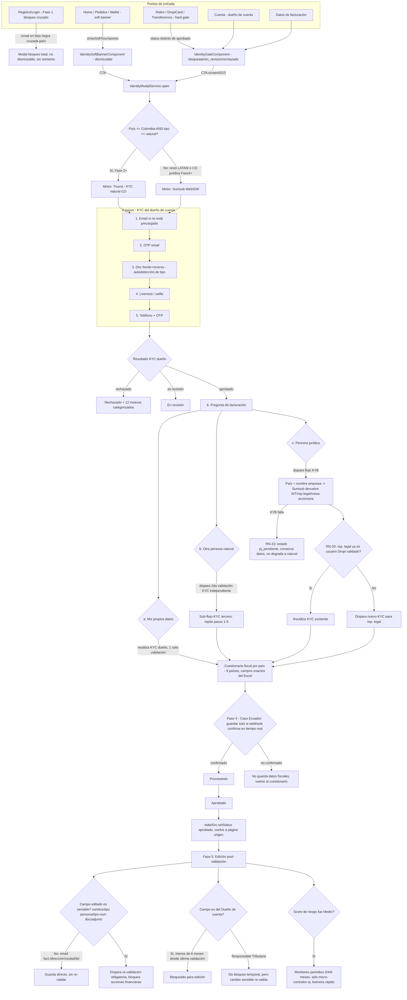

# Plan: Rediseño del flujo de validación de identidad (KYC/KYB) + facturación — consolidación en `/new/*`

## Contexto

Hoy existen **dos implementaciones paralelas y desconectadas** del flujo de validación de identidad en el prototipo:

1. **Sistema "productivo"**, ya integrado en las páginas reales `/new/*` y controlado por el demo-panel global: `IdentityDemoStateService` + `IdentityModalService` + `IdentityGateComponent` (bloqueo duro) + `IdentitySoftBannerComponent` (nudge suave) + `IdentitySumsubModalComponent` (simulación del WebSDK).
2. **Showcase aislado** en `configuraciones/flujo-identidad-2026-06-18` (`FlujoIdentidadComponent`), que implementa más literalmente el spec viejo de 15 vistas (`docs/Plan1.md`), con su propio sistema de tipos, sus propios mocks, y funcionalidad (OTP/MFA, taxonomía de 12 motivos de rechazo) que nunca se integró al sistema (1).

Esto generó gaps concretos contra las reglas de negocio reales (`docs/validacion/Historia.md`, `Consideraciones.md`, `Reglasvalidacion.md`, `StartUser.md`, `datos_para_sumsub.md`, transcripción de la reunión, y el Excel real `Copia de Información Datos de Facturación LATAM.xlsx`):

- El modal actual pide el tipo de facturación (personal/empresa) **antes** de capturar documento — el orden correcto que pidió el usuario es: correo → OTP correo → foto documento (detección automática de tipo) → prueba de vida → celular + OTP → **recién ahí** la pregunta de facturación con 3 rutas (mis datos / tercero persona natural / persona jurídica). Hoy solo existen 2 rutas (falta "tercero natural").
- No existe la distinción **Colombia-natural usa Truora / resto usa Sumsub** (Fase 2) — el modal está 100% marcado como Sumsub sin importar país/tipo de persona.
- El cuestionario fiscal solo cubre CO/MX/AR de forma hardcodeada; el Excel real tiene reglas exactas para 9 países (Paraguay, Argentina, Colombia, Perú, Guatemala, Costa Rica, México, Ecuador, Chile) con tipos de documento, regímenes y documentos a cargar específicos por país × tipo de persona.
- Faltan reglas de negocio clave: RN-20 (reutilizar KYC del representante legal si ya es usuario validado), RN-23 (KYB fallido → estado `pj_pendiente`, no degradar a natural), RN-11 (bloqueo de 6 meses en "Dueño de cuenta"), RN-14/15 (campos sensibles vs no sensibles en edición), RN-10 (monitoreo por score de riesgo), "Caso Ecuador" (nunca guardar datos fiscales sin confirmación real vía webhook).
- `wallet.component.ts` no tiene bloqueo duro en transferencias entre wallets (solo banner suave), pese a que la regla de negocio dice que debe bloquearse igual que retiros/DropiCard.
- Bug independiente: `configuraciones/flujo-identidad-2026-06-18` está registrada dos veces en `app.routes.ts`; por orden de matching de Angular, la versión `pages/old/...` es la que realmente responde, dejando la `pages/new/...` inalcanzable.

**Objetivo de este plan:** consolidar todo sobre el sistema (1) como única fuente de verdad, rediseñar el orden y cobertura del modal Sumsub/Truora según el flujo real descrito por el usuario, extender la cobertura a los 9 países del Excel, implementar las reglas de negocio faltantes, y dar al demo-panel controles para ver el flujo adaptado por fase del proyecto, por segmento de usuario y por país/motor de validación.

Se confirmaron dos hechos técnicos durante la investigación: el token de color canónico para `/new/*` es `_variables-new.scss` (`$primary-500: #FF6102`), y la ruta duplicada de `flujo-identidad-2026-06-18` efectivamente deja la versión `/old/` como la que responde en runtime — ambos se tratan como parte del plan.

## Decisiones de alcance (sin respuesta explícita del usuario — se aplicó el default recomendado)

- **Alcance**: se documentan las 7 partes completas (tipos base, modal, rama de 3 vías, formulario fiscal por país, gates de página, webhook Fase 4, demo-panel) con su orden de dependencia; la ejecución se trocea en PRs siguiendo ese orden.
- **Limpieza legacy**: se marca `ARCHIVADO` en `navigation-map.json` para las 5 entradas viejas de identidad y se corrige la colisión de rutas en `app.routes.ts`, sin borrar archivos ni componentes.
- **Cobertura de países**: los 9 países completos del Excel desde el inicio (no un subconjunto).

## Mermaid — journey consolidado



## Flujo explícito de usuario por fase, con wiretext

Esta sección responde específicamente a qué ve y qué hace el usuario en cada una de las 6 fases del proyecto, citando la regla exacta de `Reglasvalidacion.md`, `StartUser.md` y `Consideraciones.md` que la origina. Los wiretext son bocetos de bajo nivel (no mockups visuales) para dejar clara la estructura de cada pantalla — el detalle visual final sigue las specs de DS Registry.

### Fase 0 — Validación asistida (no-code / manual)

**Reglas que aplican:** Regla de Validación Nula (Reglasvalidacion.md §2: "prohibido exigir documentos... al momento del registro o recargas"); Interacción Sutil / Soft Touchpoint (Consideraciones.md Fase 0); Enfoque de Urgencia y Segmentación de Riesgo + Periodo Pedagógico e Incentivos + Carga Masiva Silenciosa + Manejo de Rechazos sin revelar investigación (Consideraciones.md Fase 0); Etapas 1-2 de `StartUser.md`.

**Flujo — usuario nuevo:**
1. Se registra, recarga wallet, crea órdenes. Ningún campo de identidad se pide (`Setup Moment`). Retiro/transferencia/DropiCard ya están bloqueados en el fondo, pero el usuario no lo nota hasta entrar a esas secciones (`StartUser.md` Etapa 1: "zonas de transferencia... bloqueadas, solo se da cuenta al ver notificación en cada sección").
2. Primera orden entregada → aparece el soft touchpoint (no bloquea nada).
3. Si el usuario ignora el soft touchpoint, no pasa nada más en Fase 0 — no hay escalamiento a bloqueo duro todavía (eso empieza en Fase 2).

**Flujo — usuario activo/antiguo (backoffice, no visible al usuario final salvo el aviso):**
1. Sistema segmenta por riesgo: >50 órdenes o movimientos de wallet, o comportamiento de riesgo (reportes, retiros sospechosos).
2. A los segmentados se les muestra una campaña "Semana de la seguridad" (Userpilot + WhatsApp/CRM) con incentivo monetario.
3. En paralelo, se hace carga masiva silenciosa al backoffice de Sumsub de usuarios ya validados por Cartera — el usuario no ve nada, no se le pide repetir nada.
4. Si el usuario se valida y falla por antecedentes graves (AML), el bloqueo usa mensaje genérico ("incumplimiento de políticas"), nunca revela que fue investigado.

**Wiretext 0-A — Soft touchpoint tras primera venta (Home, Etapa 2 Aha Moment):**
```
┌─────────────────────────────────────────────────┐
│  🎉  ¡Tu primera venta llegó!                     │
│                                                    │
│  Tienes $45.000 disponibles en tu wallet          │
│                                                    │
│  💡 Configura tus datos para poder retirarlos      │
│     cuando quieras. Toma 5 minutos.               │
│                                                    │
│      [ Más tarde ]        [ Configurar ahora → ]  │
└─────────────────────────────────────────────────┘
```
- "Más tarde" siempre visible en Fase 0 (nunca es bloqueo duro todavía).
- No usa la palabra "KYC" ni "validación de identidad" — lenguaje de beneficio, no legal.

**Wiretext 0-B — Campaña de incentivo para usuario antiguo de riesgo (Userpilot/CRM):**
```
┌───────────────────────────────────────────────────┐
│  🛡️  Semana de la seguridad                         │
│                                                      │
│  Valida tu identidad esta semana y recibe            │
│  $10.000 en saldo para tus fletes.                   │
│                                                      │
│  Vence en: 3 días                                    │
│                                                      │
│              [ Validar ahora ]                       │
└───────────────────────────────────────────────────┘
```

**Wiretext 0-C — Rechazo genérico (sin revelar investigación por antecedentes):**
```
┌─────────────────────────────────────────────┐
│  Tu cuenta fue restringida                    │
│                                                │
│  No pudimos habilitar esta función por         │
│  incumplimiento de nuestras políticas de uso.  │
│                                                │
│  Escríbenos a soporte@dropi.co si crees que    │
│  esto es un error.                             │
└─────────────────────────────────────────────┘
```
(Nunca menciona AML, lavado de activos, ni bases de datos criminales — deliberado.)

**Demo panel en esta fase:** `faseProyecto = fase0` oculta por completo el modal Sumsub/Truora con pasos OTP/liveness — solo se ven los wiretext 0-A/0-B/0-C. El botón "Verificar identidad" en Cuenta/Facturación no existe todavía como bloqueo, solo como sugerencia.

---

### Fase 1 — Bloqueo cruzado de usuarios baneados

**Reglas que aplican:** RN-17 (detección de duplicados por correo entre países); Detección en el Registro (Consideraciones.md Fase 1, "impide el avance y muestra un mensaje explicativo sin botón de reintento"); Buscador Multipaís + Bloqueo Modal No-Code (Consideraciones.md Fase 1).

**Flujo:**
1. Usuario (nuevo o ya activo en otro país) intenta registrarse o iniciar sesión.
2. Sistema cruza el correo contra la lista global de baneados de todos los países.
3. Si hay coincidencia → modal de pantalla completa, sin botón de cierre ni reintento, aparece antes de que pueda ver cualquier otra pantalla.
4. Si no hay coincidencia → continúa a Fase 0/2 normalmente.

**Wiretext 1-A — Bloqueo total (full-screen, sin salida):**
```
┌─────────────────────────────────────────────────┐
│                                                    │
│                     🚫                             │
│                                                    │
│      No podemos completar esta acción              │
│                                                    │
│   Esta cuenta no cumple con nuestras políticas      │
│   de uso de la plataforma en ninguno de              │
│   nuestros países de operación.                      │
│                                                    │
│   Si crees que esto es un error, escríbenos a        │
│   soporte@dropi.co                                   │
│                                                    │
│        (sin botón "Reintentar" ni "Cerrar")          │
└─────────────────────────────────────────────────┘
```
- Nota de diseño: este modal NO tiene `X` ni click-outside-to-close — es intencional (Heurística de control de usuario suspendida a propósito aquí, por regla de negocio explícita).

**Demo panel en esta fase:** toggle "Email en lista negra" en el segmento `baneado-cross-country`, disponible desde `faseProyecto >= fase1`.

---

### Fase 2 — Formulario unificado + KYC persona natural en Colombia (Truora)

**Reglas que aplican:** Regla del Bloqueo Restrictivo Parcial (Reglasvalidacion.md §2: bloqueo solo en salidas de dinero, nunca en crear-orden/recargar); "La Regla del Motor" (Reglasvalidacion.md §5: "a la orden se le cuida siempre"); Unificación Formulario→Validación (Consideraciones.md Fase 2); herramienta = Truora solo para CO natural (Historia.md "Herramientas por país").

**Flujo:**
1. Usuario CO persona natural intenta **retirar, transferir entre wallets, o usar DropiCard** (nunca al recargar o crear orden).
2. Aparece `IdentityGateComponent` (bloqueo duro) sobre esa acción específica — el resto de la plataforma (catálogo, órdenes, recargas) sigue funcionando sin restricción.
3. CTA "Verificar identidad" abre el formulario unificado — **branding Truora**, no Sumsub, porque es CO + natural.
4. El usuario llena datos personales UNA vez; el sistema ya asume que esos mismos datos son los de facturación (Escenario Base).
5. Truora valida. Si aprueba, los datos quedan simultáneamente en la tabla de identidad y en la de facturación — no se vuelven a pedir.

**Wiretext 2-A — Hard gate sobre acción de salida de dinero (ej. Retiros):**
```
┌─────────────────────────────────────────────────┐
│  🔒  Verifica tu identidad para retirar            │
│                                                    │
│  Por seguridad, necesitamos validar quién eres      │
│  antes de que puedas sacar tu dinero.               │
│  Toma ~5 minutos.                                   │
│                                                    │
│  ✅ Puedes seguir vendiendo y creando órdenes        │
│     mientras tanto — eso nunca se bloquea.           │
│                                                    │
│              [ Verificar identidad ]                 │
└─────────────────────────────────────────────────┘
```
- La línea "✅ Puedes seguir vendiendo..." es obligatoria en todo hard gate — hace explícita "la regla del motor".

**Wiretext 2-B — Formulario unificado, paso 1/2 (branding Truora, CO natural):**
```
┌───────────────────────────────────────────────────┐
│  Verificación de identidad              Truora  ⓘ   │
│  ●───○   Paso 1 de 2 · Datos personales             │
│                                                      │
│  País: Colombia (fijo)                               │
│                                                      │
│  Primer nombre      [_______________]                │
│  Primer apellido    [_______________]                │
│  Fecha de nacimiento [dd/mm/aaaa]                     │
│  Tipo de documento  [ Cédula ▾ ]                       │
│  Número de documento [_______________]                │
│  Municipio / Depto. [_______________]                  │
│  Dirección          [_______________]                   │
│  Correo de contacto [_______________]                    │
│  Teléfono           [+57][__________]                    │
│                                                      │
│  ☑ Estos datos también se usarán para tu facturación  │
│    (puedes cambiarlo más adelante)                     │
│                                                      │
│                                [ Continuar → ]         │
└───────────────────────────────────────────────────┘
```

**Wiretext 2-C — Paso 2/2, régimen fiscal CO (solo si se mantiene "usar mis datos"):**
```
┌───────────────────────────────────────────────────┐
│  Verificación de identidad              Truora  ⓘ   │
│  ●───●   Paso 2 de 2 · Datos tributarios            │
│                                                      │
│  Régimen fiscal      [ Régimen Simple (RST) ▾ ]       │
│  Responsabilidad IVA [ No responsable ▾ ]              │
│                                                      │
│  Documentos requeridos:                               │
│   📎 Cédula de ciudadanía          [ Cargar ]           │
│   📎 RUT actualizado                [ Cargar ]           │
│                                                      │
│  ☑ Acepto términos y condiciones                        │
│  ☑ Acepto la política de tratamiento de datos            │
│                                                      │
│                        [ Revisar antes de enviar ]      │
└───────────────────────────────────────────────────┘
```

**Demo panel en esta fase:** con `pais = CO` y `tipoPersona = natural`, el badge "Motor" debe mostrar **Truora** (no Sumsub) tan pronto `faseProyecto >= fase2`. Para cualquier otro país, o CO+jurídica, el badge sigue en Sumsub incluso en Fase 2 (la migración a Truora es específica de ese único combo).

---

### Fase 3 — KYB con Sumsub + motor de ruteo + KYT

**Reglas que aplican:** Flujo Invertido validar→precargar (Consideraciones.md Fase 3, fuera de Colombia); KYB Fricción Cero (Consideraciones.md Fase 3, "no digita el NIT"); RN-20 (KYC embebido del representante); RN-23 (protección al fallo KYB); Ruteo Dual RN-03 (identidad vs país de nacionalidad, facturación vs país de operación); Screening KYT/Tether OFAC-ONU (Consideraciones.md Fase 3); el orden exacto de 6 pasos que definió el usuario para el WebSDK.

**Flujo — cualquier país ≠ CO-natural (o CO-jurídica):**
1. El usuario dispara el mismo `IdentityGateComponent` al intentar una salida de dinero (igual que Fase 2), pero el motor ahora es **Sumsub WebSDK**, y el orden es "validar primero, precargar después": el KYC del dueño de cuenta corre completo ANTES de preguntar nada de facturación.
2. **Paso 1 — Email**: si ya está precargado (viene del registro), se salta.
3. **Paso 2 — OTP email**: código de 6 dígitos, reenvío tras 60s, bloqueo tras 3 intentos.
4. **Paso 3 — Documento**: sube foto de frente y reverso; el sistema detecta automáticamente qué tipo de documento es (cédula, pasaporte, DNI, etc. — sin catálogo por país, eso lo resuelve Sumsub).
5. **Paso 4 — Liveness**: prueba de vida con el rostro.
6. **Paso 5 — Teléfono + OTP**: mismo patrón que el paso 2, con el celular.
7. **Paso 6 — Pregunta de facturación** (recién aquí, con el KYC del dueño ya aprobado): "¿Deseas usar tus datos personales como datos de facturación, o prefieres facturar datos diferentes?" con 3 rutas:
   - **(a) Usar mis datos** → autocompletado desde el KYC recién hecho, el usuario solo confirma (objetivo: 90% sin modificar). Reutiliza la validación, no dispara una segunda.
   - **(b) Otra persona natural** → dispara una 2ª validación KYC independiente y modular para esa persona (mismos pasos 1-5, pero para el tercero).
   - **(c) Persona jurídica** → dispara flujo KYB: el usuario elige país + escribe el nombre de la empresa, Sumsub devuelve NIT/representante legal/mesa accionaria para confirmar (cero fricción, nunca digita el NIT).
8. Si eligió (c): RN-20 — el sistema compara si el representante legal ya es un usuario Dropi validado. Si coincide, reutiliza su KYC sin pedir nada más. Si no coincide, dispara un KYC nuevo para esa persona.
9. Si el KYB falla en cualquier punto: RN-23 — el estado queda `pj_pendiente`, se conservan todos los datos ya ingresados, NO se degrada al usuario a persona natural. Puede reintentar directamente sin perder lo avanzado.
10. Ruteo dual (RN-03, transversal a todo lo anterior): la identidad del dueño de cuenta se valida contra la base de su país de **nacionalidad**; los datos de facturación/fiscales se validan contra el país de **operación** en Dropi — pueden ser países distintos (ej. venezolano operando en Colombia).
11. KYT (aparte, en recargas/retiros de USDT): screening OFAC/ONU en cada movimiento; si hay riesgo alto, bloqueo de cuenta con mensaje de suspensión que no revela la investigación (mismo patrón que Fase 0).

**Wiretext 3-A — Paso 1, Email (si no está precargado):**
```
┌───────────────────────────────────────────────────┐
│  ✕                            Sumsub        1 / 6   │
│                                                      │
│         Antes de empezar, confirma tu correo         │
│                                                      │
│  Correo electrónico   [_______________________]       │
│                                                      │
│                              [ Enviar código → ]      │
└───────────────────────────────────────────────────┘
```

**Wiretext 3-B — Paso 2, OTP email:**
```
┌───────────────────────────────────────────────────┐
│  ✕                            Sumsub        2 / 6   │
│                                                      │
│  Enviamos un código a j***@correo.com                │
│                                                      │
│         [ _ ] [ _ ] [ _ ] [ _ ] [ _ ] [ _ ]           │
│                                                      │
│  Código incorrecto, te quedan 2 intentos             │
│                                                      │
│  Reenviar código en 0:47                              │
└───────────────────────────────────────────────────┘
```

**Wiretext 3-C — Paso 3, documento (autodetección, sin selector manual de tipo):**
```
┌───────────────────────────────────────────────────┐
│  ✕                            Sumsub        3 / 6   │
│                                                      │
│         📄 Foto del frente de tu documento            │
│                                                      │
│        ┌───────────────────────────────┐             │
│        │                                │             │
│        │       [ marco de cámara ]      │             │
│        │                                │             │
│        └───────────────────────────────┘             │
│                                                      │
│   Detectando tipo de documento automáticamente...    │
│                                                      │
│                      [ Tomar foto ]                    │
└───────────────────────────────────────────────────┘
```
(Repite un paso análogo para "reverso"; nunca se le pregunta al usuario "¿qué tipo de documento es?" — eso lo decide el sistema.)

**Wiretext 3-D — Paso 4, Liveness:**
```
┌───────────────────────────────────────────────────┐
│  ✕                            Sumsub        4 / 6   │
│                                                      │
│           Ahora, una prueba de vida rápida            │
│                                                      │
│              ┌───────────────────┐                    │
│              │    (óvalo guía     │                    │
│              │     de rostro)     │                    │
│              └───────────────────┘                    │
│                                                      │
│         Sigue las instrucciones en pantalla           │
└───────────────────────────────────────────────────┘
```

**Wiretext 3-E — Paso 5, Teléfono + OTP:**
```
┌───────────────────────────────────────────────────┐
│  ✕                            Sumsub        5 / 6   │
│                                                      │
│  Número de teléfono   [+57][__________]               │
│                              [ Enviar código → ]       │
│  ──────────────────────────────────────────────      │
│         [ _ ] [ _ ] [ _ ] [ _ ] [ _ ] [ _ ]           │
│  Reenviar código en 0:60                              │
└───────────────────────────────────────────────────┘
```

**Wiretext 3-F — Paso 6, pregunta de facturación (3 vías, después de todo el KYC):**
```
┌───────────────────────────────────────────────────┐
│  ✕                            Sumsub        6 / 6   │
│                                                      │
│  Ya verificamos tu identidad ✓                        │
│                                                      │
│  ¿Deseas usar tus datos personales como datos de       │
│  facturación, o prefieres facturar con datos            │
│  diferentes?                                            │
│                                                      │
│   ( ) Usar mis propios datos                            │
│   ( ) Facturar a nombre de otra persona natural           │
│   ( ) Facturar a nombre de una empresa                     │
│                                                      │
│                                [ Continuar → ]           │
└───────────────────────────────────────────────────┘
```

**Wiretext 3-G — Ruta (c), búsqueda KYB sin digitar NIT:**
```
┌───────────────────────────────────────────────────┐
│  Datos de tu empresa                                 │
│                                                      │
│  País de constitución   [ Chile ▾ ]                    │
│  Nombre de la empresa   [ Dropi_______________ ]        │
│                                       [ Buscar ]         │
│  ────────────────────────────────────────────────     │
│  Resultado encontrado:                                 │
│   🏢 DROPI SPA                                          │
│   RUT: 76.XXX.XXX-K                                      │
│   Representante legal: Juan Pérez                        │
│   Mesa accionaria: 3 socios                                │
│                                                      │
│                  [ Esta es mi empresa → ]                  │
└───────────────────────────────────────────────────┘
```

**Wiretext 3-H — RN-20, verificación del representante legal (caso: coincide con dueño ya validado):**
```
┌───────────────────────────────────────────────────┐
│  Verificación del representante legal                 │
│                                                      │
│  Juan Pérez ya está validado en Dropi ✓                 │
│  Reutilizaremos su verificación de identidad,            │
│  no necesita repetir el proceso.                          │
│                                                      │
│                     [ Continuar → ]                       │
└───────────────────────────────────────────────────┘
```
**Wiretext 3-H' — RN-20, caso: representante legal desconocido (dispara su propio KYC):**
```
┌───────────────────────────────────────────────────┐
│  Verificación del representante legal                 │
│                                                      │
│  Necesitamos validar la identidad de Juan Pérez         │
│  como representante legal de DROPI SPA.                   │
│  Esto es una segunda verificación, independiente          │
│  de la tuya.                                              │
│                                                      │
│                [ Verificar representante → ]               │
└───────────────────────────────────────────────────┘
```
(Abre el mismo sub-flujo de pasos 1-5, pero rotulado explícitamente como "verificación del representante legal", nunca como un error o repetición — literal de `Historia.md`/`Plan1.md` Vista 8.)

**Wiretext 3-I — RN-23, KYB fallido (estado `pj_pendiente`):**
```
┌─────────────────────────────────────────────────┐
│  ⚠️  Validación de empresa pendiente                │
│                                                    │
│  No pudimos validar tu empresa en este momento.     │
│  Tus datos quedaron guardados — no tienes que        │
│  volver a ingresarlos.                                │
│                                                    │
│  Mientras tanto, tu cuenta sigue operando              │
│  normalmente como persona natural.                      │
│                                                    │
│              [ Reintentar validación ]                  │
└─────────────────────────────────────────────────┘
```

**Wiretext 3-J — KYT, bloqueo por screening OFAC/ONU en USDT (sin revelar investigación):**
```
┌─────────────────────────────────────────────┐
│  Esta operación no se pudo completar           │
│                                                │
│  Tu cuenta fue suspendida temporalmente por     │
│  incumplimiento de nuestras políticas de uso.   │
│                                                │
│  Escríbenos a soporte@dropi.co                  │
└─────────────────────────────────────────────┘
```

**Demo panel en esta fase:** `faseProyecto = fase3` habilita: el badge "Motor" pasa a Sumsub para todo excepto CO-natural; aparecen las 3 opciones de facturación (hoy solo hay 2); aparece el toggle de "representante legal ya validado / desconocido" para demostrar RN-20; aparece el estado `pj_pendiente` como opción del chip IDENTIDAD.

---

### Fase 4 — Migración de la base existente

**Reglas que aplican:** Regla del Despliegue por Lotes + Regla del Periodo Pedagógico (Reglasvalidacion.md §4); Prevención del "Caso Ecuador" (Reglasvalidacion.md §4, webhook debe confirmar antes de liberar wallet); Carga Masiva ZIP + Decisión Legal Pendiente (Consideraciones.md Fase 4); Migración escalonada (StartUser.md Etapa 5).

**Flujo — usuario legacy validado automáticamente con Truora (candidato a migración masiva):**
1. Backend migra su estado a Sumsub vía ZIP, sin que el usuario haga nada ni note un cambio. Conserva el estado "aprobado".
2. No hay pantalla nueva para este caso — es intencionalmente invisible.

**Flujo — usuario legacy sin validación o pendiente de decisión Legal (cohortes por volumen):**
1. Recibe avisos pedagógicos 1-2 semanas antes de que se le aplique cualquier bloqueo (nunca inmediato ni a toda la base a la vez).
2. Si sigue sin validar cuando vence la ventana, entra al mismo `IdentityGateComponent` de Fase 2/3 (bloqueo solo en salidas de dinero).
3. En cualquier país donde el "Caso Ecuador" sea relevante (o cualquier país en general, es una regla transversal): el formulario de datos fiscales **nunca** guarda información hasta que el webhook de Sumsub confirme el estado real — nunca se acepta un NIT tipeado sin validar contra la fuente real.

**Wiretext 4-A — Aviso pedagógico previo al bloqueo (banner persistente, no modal):**
```
┌───────────────────────────────────────────────────┐
│  ⏳ Actualiza tus datos antes del 15 de julio          │
│                                                      │
│  A partir de esa fecha necesitarás validar tu          │
│  identidad para seguir retirando tu saldo.               │
│                                                      │
│         [ Validar ahora ]     [ Recordar luego ]         │
└───────────────────────────────────────────────────┘
```
- Aparece en Home/Wallet durante la ventana de tolerancia; nunca es full-screen ni bloqueante todavía.

**Wiretext 4-B — Gate de webhook, "Caso Ecuador" (evita guardar datos basura):**
```
┌─────────────────────────────────────────────────┐
│  Confirmando tus datos con la autoridad fiscal…    │
│                                                    │
│         ⏳  Esto puede tardar unos minutos          │
│                                                    │
│  No cierres esta ventana todavía                    │
└─────────────────────────────────────────────────┘
```
```
┌─────────────────────────────────────────────────┐
│  No pudimos confirmar estos datos                   │
│                                                    │
│  Revisa que el número de documento/NIT sea            │
│  correcto e inténtalo de nuevo.                        │
│                                                    │
│              [ Volver a intentar ]                     │
└─────────────────────────────────────────────────┘
```
(El segundo wiretext es el estado cuando el webhook NO confirma — el sistema se niega a guardar el dato ingresado, a diferencia del comportamiento histórico de Ecuador donde se guardaba cualquier cosa.)

**Demo panel en esta fase:** segmento `migrado-legacy` + `faseProyecto = fase4` habilita el banner 4-A automáticamente (sin acción del usuario) y expone el toggle "Webhook Ecuador: confirma / no confirma" descrito en el plan original, visible solo cuando `pais = EC`.

---

### Fase 5 — Edición post-validación con re-validación inteligente

**Reglas que aplican:** RN-11/RN-18 (bloqueo de 6 meses solo al Dueño de cuenta); RN-14/RN-15 (campos sensibles vs no sensibles); Fricción Intencional Defensiva (Reglasvalidacion.md §1); RN-10 (renovación por nivel de riesgo, Consideraciones.md Fase 5).

**Flujo — edición de datos del Dueño de cuenta (Cuenta):**
1. Usuario entra a "Mi cuenta". Si está aprobado y han pasado menos de 6 meses desde la última validación, los campos sensibles (nombre, tipo/número de documento, fecha de nacimiento) se muestran bloqueados con 🔒 y un tooltip explicando el motivo (prevención de fraude/lavado), sin excepción — este bloqueo aplica sin importar qué tan trivial parezca el cambio.
2. Pasados los 6 meses, se desbloquean y cualquier edición de estos campos dispara una re-validación completa.

**Flujo — edición de datos de facturación (Responsable Tributario):**
1. Estos campos NUNCA tienen bloqueo temporal — el usuario puede cambiar de persona natural a jurídica cuando quiera.
2. Pero el sistema distingue campo por campo: correo de facturación, dirección, ciudad, teléfono → se guardan directo, sin re-validar (RN-14, evita gastar validaciones de pago innecesarias).
3. Nombre/razón social, tipo de persona, tipo/número de documento → cualquier cambio dispara una re-validación obligatoria con Sumsub y bloquea las acciones financieras mientras se revisa (RN-15 + fricción intencional defensiva contra evasión fiscal).

**Flujo — monitoreo por riesgo (RN-10):**
1. Si el score de riesgo de la primera validación fue "Medio", el sistema programa un micro-control periódico (cada 3, 4 o 6 meses) — no una revalidación completa, solo algo rápido como un liveness.

**Wiretext 5-A — Cuenta, campos del Dueño bloqueados (<6 meses):**
```
┌───────────────────────────────────────────────────┐
│  Mi cuenta                                           │
│  ──────────────────────────────────────────────     │
│  🔒 Datos bloqueados hasta el 12/01/2027               │
│     (última validación: 12/07/2026)                     │
│                                                      │
│  Nombre         Juan Pérez              🔒 disabled     │
│  Documento      CC 1234567890           🔒 disabled     │
│  Fecha nac.     01/01/1990              🔒 disabled     │
│                                                      │
│  ℹ️ Por seguridad no puedes modificar estos datos       │
│     hasta cumplir 6 meses desde tu última               │
│     validación (prevención de fraude/lavado).            │
└───────────────────────────────────────────────────┘
```

**Wiretext 5-B — Datos de facturación, campos mixtos (no sensibles editables, sensibles con fricción):**
```
┌───────────────────────────────────────────────────┐
│  Datos de facturación                                │
│                                                      │
│  Email de facturación   [___________]  (editable)      │
│  Dirección               [___________]  (editable)      │
│  Ciudad                  [___________]  (editable)      │
│  Teléfono                [___________]  (editable)      │
│  ──────────────────────────────────────────────     │
│  Tipo de persona    [ Natural ▾ ]      ⚠️ sensible        │
│  Razón social        [___________]      ⚠️ sensible        │
│  Tipo/núm. documento [___________]      ⚠️ sensible        │
│                                                      │
│  ⚠️ Cambiar los campos marcados requiere una nueva        │
│     validación con Sumsub. Tus retiros/transferencias      │
│     quedarán bloqueados mientras se revisa.                 │
│                                                      │
│       [ Guardar cambios no sensibles ]                       │
│       [ Guardar y re-validar campos sensibles ]                │
└───────────────────────────────────────────────────┘
```
- Los dos botones están deliberadamente separados: guardar lo no sensible nunca debe esperar a que el usuario decida tocar un campo sensible.

**Wiretext 5-C — Monitoreo periódico por riesgo medio (RN-10, micro-control):**
```
┌─────────────────────────────────────────────┐
│  🔄 Verificación rápida de rutina                │
│                                                  │
│  Como parte de nuestro monitoreo periódico,       │
│  necesitamos confirmar que sigues siendo tú.        │
│  Solo toma unos segundos.                            │
│                                                  │
│              [ Tomar selfie rápida ]                  │
└─────────────────────────────────────────────┘
```

**Demo panel en esta fase:** stepper "Meses desde última validación" controla directamente si 5-A muestra los campos bloqueados o editables; chip "Riesgo = Medio" habilita el disparo del wiretext 5-C; los dos botones de 5-B deben poder probarse independientemente (guardar dirección sin tocar razón social, y viceversa).

---

## Tabla de vistas/pasos clave

| # | Vista/paso | Página o modal | Mount point | Mock data clave | Interacciones clave |
|---|---|---|---|---|---|
| 1 | Modal bloqueo cruzado (Fase 1) | Modal no-dismissable | Global en `LayoutNewComponent` o guard de login/registro | `bannedEmails: Record<Pais,string[]>` (nuevo) | Sin CTA de reintento, solo canal de soporte |
| 2 | Soft banner | Componente opt-in por página | `home`, `ordenes`, `wallet` | `showSoftTouchpoints` | Dismiss (corregir: hoy es solo en memoria, debe persistir) |
| 3 | Hard gate | Componente opt-in por página | `retiros-saldo`, `dropicard`, **`wallet` (falta hoy, agregar `contexto="transferencia"`)** | `status`, `variant` | CTA abre modal en screen0/2/3 |
| 4 | Resolución de motor (país+persona) | Lógica interna del modal | `identity-sumsub-modal.component.ts` | `getMotor(pais, tipoPersona)` nuevo | Paso silencioso, no es elección del usuario |
| 5 | Paso 1 — Email | Substep del modal | nuevo `SubStep = 'email'` | `emailPrellenado` | Se salta si ya está precargado |
| 6 | Paso 2 — OTP email | Substep del modal | nuevo `SubStep = 'otp-email'` | patrón OTP portado de `flujo-identidad` | 6 dígitos, reenvío, bloqueo tras N fallos |
| 7 | Paso 3 — Doc frente/reverso | Substep del modal | reemplaza selección manual de tipo por auto-detección simulada | `docTypes` extendido a 9 países | Usuario ya no elige tipo manualmente |
| 8 | Paso 4 — Liveness | Substep del modal | mantiene `selfie`, copy actualizado | `selfieCapturada` | Sin cambios mecánicos |
| 9 | Paso 5 — Teléfono + OTP | Substep del modal | nuevo `SubStep = 'telefono' / 'otp-telefono'` | espejo del patrón OTP | igual a paso 2 |
| 10 | Paso 6 — Pregunta de facturación (3 vías) | Substep del modal | nuevo `SubStep = 'billing-choice'`, reemplaza el viejo `screen0` | `TipoFacturacion = 'mismo-dueno' \| 'tercero-natural' \| 'empresa'` | 3 CTAs que ramifican |
| 11 | 6b — Sub-KYC tercero natural | Substeps anidados del modal | nueva secuencia que repite pasos 1-4 para 2da persona | `MockThirdPartyPersona` (nuevo) | KYC modular independiente |
| 12 | 6c — KYB empresa | Substep existente extendido | país + razón social → confirmación (NIT/rep legal/mesa accionaria) | `EMPRESAS_MOCK` con shape estructurado | Solo confirmar, sin digitar NIT |
| 13 | RN-20 — chequeo de reutilización KYC del rep. legal | Substep del modal | nuevo `SubStep = 'rep-legal-check'` | comparación contra `MockUserData` existente | Si coincide, se salta; si no, dispara KYC nuevo |
| 14 | RN-23 — estado `pj_pendiente` | Estado terminal persistente | nuevo valor en `IdentitySatelliteStatus` | conserva `datosFiscales`/`empresaSeleccionada` | No degrada a persona natural |
| 15 | Cuestionario fiscal (9 países) | Substep del modal | reescrito data-driven desde `PAIS_BILLING_FIELDS` | ver mocks abajo | Formulario dinámico, no ramas hardcodeadas |
| 16 | Webhook Fase 4 (caso Ecuador) | Lógica interna, sin vista nueva | `startProcesando()` | `webhookConfirmed` (nuevo, togglable desde demo-panel) | Bloquea guardado hasta confirmación real |
| 17 | Estados finales | Modal | rechazo con taxonomía de 12 motivos portada de `flujo-identidad` | `RejectionReasonCode` | aprobado/en_revision/rechazado/pj_pendiente |
| 18 | Cuenta (dueño de cuenta) | Página | `cuenta.component.ts` | `lastValidatedAt` (nuevo) | 🔒 si aprobado Y <6 meses (RN-11) |
| 19 | Datos de facturación | Página | `datos-facturacion.component.ts` | campos por país desde `PAIS_BILLING_FIELDS` | No sensibles guardan directo; sensibles re-validan (RN-14/15); `onGuardar()` implementado de verdad |
| 20 | Demo panel | Barra global | `prototype-demo-panel.component.ts` | ver sección siguiente | Nuevos ejes: fase de proyecto, segmento, badge de motor |

## Decisión: `FaseUsuario` (existente) vs "Fase del proyecto" (pedida) — son ejes distintos, no se fusionan

- `FaseUsuario` (`setup|activacion|habito|profesional|legacy`) es un eje de **ciclo de vida PLG**: en qué punto del journey está un usuario (día 1, día 15, día 20+, mes 3+, legacy), y controla el timing de soft-touchpoints/estado por defecto.
- La "Fase 0-5" del proyecto (asistida / bloqueo cruzado / formulario unificado KYC-CO / KYB+ruteo+KYT / migración / edición-revalidación) es un eje de **entrega del producto**: qué funcionalidades existen en el código en ese momento (Fase 0 no tiene bloqueos duros ni motivo de rechazo específico; Fase 2 agrega Truora + bloqueos duros; Fase 3 agrega KYB/ruteo/KYT; Fase 4 agrega migración masiva + webhook-gating; Fase 5 agrega edición/re-validación).
- Son ortogonales: un usuario `profesional` (3 meses en la plataforma) se puede demostrar bajo cualquier Fase de proyecto, y un usuario `legacy` es justamente el caso central de la Fase 4. Fusionarlos impediría mostrar, por ejemplo, "usuario nuevo (`setup`) viviendo el ruteo KYB de la Fase 3" por separado de "usuario legacy viviendo la migración de la Fase 4".
- Se agregan como **dos filas de chips independientes** en el demo-panel: renombrar la fila actual "FASE" a "Momento del usuario" y agregar una fila nueva "Fase de entrega" (0-5) que controla qué pantallas/reglas son alcanzables en el demo.

## Cambios por archivo

**`src/app/common/models/identity-flow.models.ts`**
- Extender `Pais`/`PaisPersona` a los 9 países × natural/jurídica.
- Agregar `MotorValidacion = 'truora' | 'sumsub'` + función `getMotor(pais, tipoPersona)` con la regla CO-natural→Truora, resto→Sumsub.
- Reemplazar los campos fiscales planos (`co_*`, `mx_*`, `ar_*`) por una tabla estructurada `PAIS_BILLING_FIELDS: Record<Pais, Record<TipoPersona, PaisBillingFieldConfig>>` transcrita exactamente del Excel (documento, regex/regla de formato, opciones de régimen, documentos requeridos, etiqueta de localidad).
- Agregar `'pj_pendiente'` a `IdentitySatelliteStatus` (RN-23).
- Agregar `RejectionReasonCode` (12 valores) + `REJECTION_REASON_COPY`, portados de `flujo-identidad.component.ts`.
- Agregar `TipoFacturacion = 'mismo-dueno' | 'tercero-natural' | 'empresa'` (reemplaza el binario actual).
- Agregar `MockThirdPartyPersona` + instancias mock.
- Extender `MockUserData` con `lastValidatedAt`, `riskScore`, `representanteLegal?`.
- Repurposar `DEMO_SCENARIO_PRESETS` (hoy huérfano/sin uso) como datos base de los nuevos presets del demo-panel, en vez de borrarlo.

**`src/app/common/services/identity-demo-state.service.ts`**
- Nuevo signal `faseProyecto: FaseProyecto` ('fase0'..'fase5'), independiente de `fase` (PLG) existente.
- Nuevo signal `segmentoUsuario` ('dropshipper-natural' | 'proveedor-juridica' | 'migrado-legacy' | 'baneado-cross-country').
- Computed `motorValidacion` delegando a `getMotor`.
- Signals `riskScore`, `lastValidatedAt` + computed `dueñoBloqueadoPorTiempo` (RN-11).
- Signal `webhookConfirmed` (Fase 4 caso Ecuador).
- Actualizar listas válidas de país/persona a las 18 combinaciones.

**`src/app/common/components/identity-sumsub-modal/identity-sumsub-modal.component.ts` (+.html/.scss)**
- Reordenar `SubStep` al flujo de 6 pasos pedido; quitar selección manual de `doc-tipo`, simular auto-detección al capturar frente.
- Mover la pregunta de facturación (`billing-choice`, 3 vías) al final, después de selfie + teléfono/OTP — ya no es el viejo `screen0` inicial.
- Reescribir `subStepsForPersona()` con 3 ramas (mismo-dueño / tercero-natural / empresa).
- Extender `DOC_TYPES`/`EMPRESAS_MOCK` a los 9 países; `EMPRESAS_MOCK` pasa a tener shape estructurado (`razonSocial, nit, representanteLegal, mesaAccionaria`).
- Agregar `motorLabel` computed (Truora/Sumsub) que cambia branding/copy del modal según país+persona — corrige la contradicción de marca Sumsub-only detectada.
- Cuestionario fiscal reescrito data-driven desde `PAIS_BILLING_FIELDS`.
- Agregar gate de webhook en `startProcesando()` (Fase 4).
- Agregar rama RN-23 (`pj_pendiente` en vez de degradar a natural si falla KYB).
- Agregar substep `rep-legal-check` (RN-20).

**`src/app/layout/layout-new/demo-panel/prototype-demo-panel.component.ts` (+.html/.scss)**
- Fila nueva "Fase de entrega" (0-5), fila renombrada "Momento del usuario" (la actual FASE PLG).
- Fila "Segmento" (dropshipper natural / proveedor jurídica / migrado legacy / baneado cross-country) que también fija país/persona/fase por defecto razonables.
- Badge de solo lectura "Motor" (Truora/Sumsub) visible sin abrir el modal.
- Extender chips de país de 5 a 9.
- Toggle "Webhook Ecuador" (solo visible si `faseProyecto >= fase4` y `pais === 'EC'`).
- Chip "Riesgo" (bajo/medio/alto) + stepper de "meses desde última validación" para demostrar RN-10/RN-11.

**`src/app/pages/new/financiero/datos-facturacion/datos-facturacion.component.ts`**
- Extender opciones de país y bloques tributarios por país (hoy solo CO), renderizando desde `PAIS_BILLING_FIELDS` para consistencia con el modal.
- Implementar RN-14/15: campos no sensibles (email, dirección, municipio, teléfono) guardan directo con un `onGuardar()` real (hoy stub vacío); campos sensibles (razón social, tipo de persona, tipo/número de documento) abren el modal en modo re-validación y bloquean acciones financieras durante `en_revision`.

**`src/app/pages/new/configurar/cuenta/cuenta.component.ts`**
- Implementar RN-11: bloqueo de edición solo si `aprobado` Y dentro de 6 meses desde `lastValidatedAt`, con tooltip explicando el motivo (fraude/lavado).

**`src/app/pages/new/financiero/wallet/wallet.component.ts`**
- Montar `<app-identity-gate contexto="transferencia">` (hoy falta, solo hay soft banner) para que transferencias entre wallets sean bloqueo duro real, igual que retiro/DropiCard. Mantener el soft banner para el nudge general de la página.

**`navigation-map.json`**
- Marcar como `ARCHIVADO` las 5 entradas viejas: `validacion-identidad`, `validacion-identidad-hub`, `validacion-identidad-pais`, `verificacion-identidad`, `flujo-identidad-2026-06-18`. No borrar componentes ni rutas, solo el campo de estado.
- Actualizar la descripción de las entradas `cuenta`/`datos-facturacion` para reflejar el modal rediseñado.

**`src/app/app.routes.ts`**
- Corregir la colisión: `configuraciones/flujo-identidad-2026-06-18` está registrada dos veces (línea ~155 apuntando a `pages/old/flujo-identidad`, línea ~609 a `pages/new/configurar/flujo-identidad`); por orden de matching la `/old/` gana hoy. Eliminar/renombrar el registro duplicado para que quede consistente con el estado `ARCHIVADO` que se le pondrá en `navigation-map.json`.

## Datos mock a agregar

1. `PAIS_BILLING_FIELDS` — tabla de 9 países × 2 tipos de persona transcrita exactamente del Excel `Copia de Información Datos de Facturación LATAM.xlsx` (documento, formato/regla, régimen fiscal, documentos a subir), con campos compartidos (`localidadLabel` variable por país, dirección, email de facturación, teléfono, nombre/razón social, checkboxes de T&C y tratamiento de datos).
2. `mocks/identity-billing-field-map.json` — extender de 3 países (CO/MX/AR) a los 9.
3. `MockThirdPartyPersona` — 1-2 registros para la ruta "tercero persona natural".
4. Escenarios KYB pareados para RN-20: uno donde el representante legal coincide con un `MOCK_USERS` ya validado (reutiliza KYC) y otro donde es un desconocido (dispara KYC nuevo). `EMPRESAS_MOCK` pasa a tener shape estructurado por país.
5. `RejectionReasonCode` (12 códigos) + copy, portado de `flujo-identidad.component.ts`.
6. `riskScore` + fecha de próximo monitoreo, para demo de RN-10.

## Orden de entrega sugerido (PRs independientes y revisables)

1. **Fundación de tipos** — `identity-flow.models.ts` + `identity-demo-state.service.ts` (nuevos signals/tipos, sin cambio de comportamiento visible todavía). Prerequisito de todo lo demás.
2. **Rediseño del orden del modal** — reordenar `identity-sumsub-modal.component.ts` a los 6 pasos, agregar email/OTP/teléfono-OTP, auto-detección de documento, motor Truora/Sumsub, extender a 9 países.
3. **Rama de 3 vías + KYB/rep. legal** — tercero-natural, RN-20, RN-23 (`pj_pendiente`). Depende de (2).
4. **Formulario fiscal data-driven** — reemplazar ramas hardcodeadas en el modal y en `datos-facturacion.component.ts` por el renderer sobre `PAIS_BILLING_FIELDS`. Depende de (1), se beneficia de (2)/(3).
5. **Gates y reglas de página** — hard gate en wallet, RN-11 en cuenta, RN-14/15 + `onGuardar()` real en datos-facturación. Paralelizable entre sí una vez exista (1).
6. **Webhook Fase 4** — gate en `startProcesando()`. Pequeño, después de (2).
7. **Controles del demo-panel** — filas nuevas, badge de motor, chips de país extendidos, toggles de riesgo/webhook. Último, para no re-tocarlo en cada paso anterior.
8. **Limpieza de navigation-map.json + fix de ruta duplicada** — independiente del resto, bajo riesgo.

## Verificación

- `yarn start` (con `nvm use` primero) y recorrer en navegador cada uno de los 3 caminos de facturación (mismo dueño / tercero natural / empresa) para al menos 3 países representativos (Colombia natural con Truora, un país Sumsub-only como México, y el caso KYB con Ecuador para probar el webhook-gate).
- Confirmar en el demo-panel que cambiar "Fase de entrega" oculta/muestra las pantallas correctas (p. ej. Fase 0 sin OTP/liveness, Fase 5 con reglas de edición activas) sin afectar el eje "Momento del usuario".
- Verificar a 1024px sin scroll horizontal en el modal rediseñado y en `datos-facturacion`/`cuenta` con los nuevos bloques por país.
- Revisar consola sin errores durante todo el recorrido (Playwright o manual).
- Confirmar que `navigation-map.json` sigue siendo JSON válido tras marcar las entradas `ARCHIVADO`, y que la ruta `configuraciones/flujo-identidad-2026-06-18` resuelve a un solo componente tras el fix.
</content>
