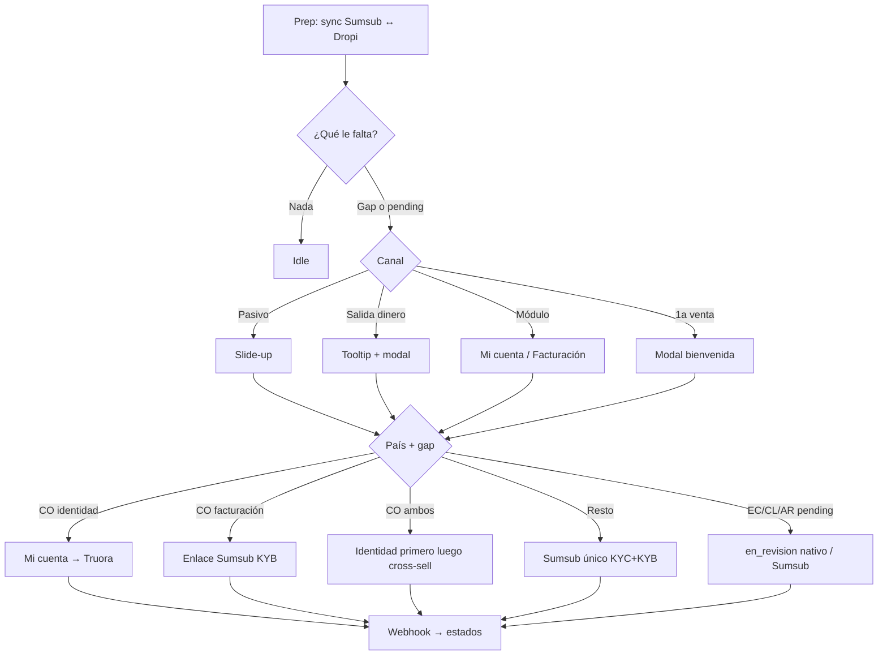

# Service Blueprint — Validación tech-native (loop único de completar gaps)

> Especificación textual completa del blueprint. Las columnas son el **loop de izquierda a derecha**; las filas son los siete carriles. Este documento y [`Service_Blueprint_Diagrama_Fase_5.html`](Service_Blueprint_Diagrama_Fase_5.html) contienen la **misma matriz**, ramas, estados, conectores y copies.
>
> ⚠️ **Naming (anti-confusión):** el nombre de archivo conserva “Fase_5” por historial del repo, pero **este blueprint NO es la “Fase 5 — edición post-validación” de [`Historia.md`](Historia.md)**. Aquí se documenta el **loop tech-native para completar gaps** de identidad y facturación (evolución de Fase 0 con UI nativa + sync Sumsub↔Dropi). La edición post-aprobación (`field_diff`, RN-11 como eje) vive en el [Addendum](#addendum--edición-post-aprobación-historia-fase-5) al final.
>
> 🧭 **¿Buscas la lógica de ramas?** Ver [`Service_Blueprint_Fase_5_Mapa-Decision.md`](Service_Blueprint_Fase_5_Mapa-Decision.md). Resumen por audiencia: [`Service_Blueprint_Fase_5_Tabla.md`](Service_Blueprint_Fase_5_Tabla.md). Copies: [`UX-Writing-Validacion-TechNative.md`](UX-Writing-Validacion-TechNative.md).

## 1. Propósito y diferencia frente a Fase 0

Fase 0 cierra validación con UserPilot, CRM y Google Sheets. Este blueprint describe el **mismo journey de negocio** (soft → hard → validar → resolver) con **tecnología nativa**:

| Mecanismo | Fase 0 (no-code) | Tech-native (este blueprint) |
|---|---|---|
| Canal de intervención | UserPilot / CRM | UI nativa Dropi (slide-up, tooltip, modal, módulos) |
| Actualización de estados | Descarga Sumsub → Sheet → apagar modal a mano | Webhook firmado → backend → state machine → UI |
| Destinos | Enlaces DOC ENLACES vía UserPilot | Misma config DOC ENLACES, apertura nativa |
| Back Office | Ejecutor del proceso | Revisor de excepciones + prep de sync |
| Eje del flujo | Antigüedad (nuevo / activo) | **Gaps:** ¿tiene identidad? ¿tiene facturación? + país |

**Automatización del happy path:** sin UserPilot, sin Google Sheets operativos, sin envíos CRM manuales para cambiar estado. Prep sí puede incluir lotes técnicos de migración (p. ej. pendientes EC/CL/AR → Sumsub).

## 2. Fuente de verdad y precondiciones

- Journey y coerción: [`Service_Blueprint_Diagrama Fase 0.md`](Service_Blueprint_Diagrama%20Fase%200.md), [`UX-Writing-Modales-UserPilot.md`](UX-Writing-Modales-UserPilot.md).
- Reglas: hard gate solo salidas; validación nula en registro; RN-11 — [`Reglasvalidacion.md`](Reglasvalidacion.md).
- Faseo del proyecto: [`Historia.md`](Historia.md) (este loop es la expresión tech del cierre legal de validación + facturación; no reescribe el número de fase del roadmap).
- Copies: [`UX-Writing-Validacion-TechNative.md`](UX-Writing-Validacion-TechNative.md).

**Precondición tecnológica:** APIs de perfil/facturación, estado de identidad en backend, sync Sumsub↔Dropi, WebSDK Truora/Sumsub, webhooks firmados e idempotentes, hard gate financiero.

## 3. Cómo leer este blueprint (importante — evita la confusión)

**No es una película de 7 actos en fila.** Es un embudo con un tramo en paralelo:

```
C0 Prep  →  C1 ¿Qué le falta?
                 │
                 ├─ nada ──────────────────────────► IDLE (fin)
                 │
                 └─ hay gap ──► ¿por qué canal entra? ──┐
                        │                              │
                        │   C2 Soft  (Home / pasivo)   │  ← estos tres
                        │   C3 Hard  (quiere sacar $$) │    son PARALELOS
                        │   C4 Módulo (abre cuenta/    │    no se encadenan
                        │             facturación /    │    entre sí
                        │             1ª venta)        │
                        └──────────────┬───────────────┘
                                       ▼
                                 C5 Validación (proveedor)
                                       ▼
                                 C6 Resolución (webhook)
```

| Tipo de columna | Columnas | Significado |
|---|---|---|
| **Secuencial** | C0 → C1 → … → C5 → C6 | Siempre en este orden cuando aplica |
| **Canal paralelo** | C2 · C3 · C4 | El usuario entra por **uno** según lo que haga; **no** pasa Soft → Hard → Módulo |
| **Convergencia** | C5 | Todos los CTAs de C2/C3/C4 llegan aquí |
| **Cierre** | C6 | Solo tras webhook |

**Regla de oro para stakeholders:** si preguntas “¿después del slide-up viene el hard gate?”, la respuesta es **no**. El hard gate aparece solo si intenta sacar dinero. Puede ver soft, cerrarlo, y nunca ver hard hasta que toque un retiro.

### Leyenda semántica

- 🟢 **Verde — usuario/hito positivo**
- 🟣 **Morado — sistema/backstage**
- 🔵 **Azul — UI nativa**
- 🔴 **Rojo — motor de identidad / hard gate**
- 🟡 **Amarillo — decisión**
- ⚪ **Gris — soporte/herramienta**
- **Flecha → entre C0–C1–C5–C6:** secuencia obligada
- **Flecha → desde C1 a C2/C3/C4:** elección de canal (una sola)
- **Flecha → desde C2/C3/C4 a C5:** CTA del usuario
- **Flecha ↓:** dentro de la misma columna, de un carril al de abajo

## 4. Matriz completa — 7 columnas × 7 carriles

| Carril | 0. Prep — sync | 1. Segmentación | 2. Soft touch | 3. Hard gate | 4. Módulo | 5. Validación | 6. Resolución |
|---|---|---|---|---|---|---|---|
| **Usuarios** | Base con estados a sincronizar (pendiente, incompleto, aprobado, pendiente manual EC/CL/AR). | Dropshipper / Proveedor / Marca: con o sin identidad, con o sin facturación, por país. | Usuario con al menos un gap, navegando sin tocar salidas. | Usuario con gap que intenta retiro, transferencia o DropiCard. | Usuario que abre `Información de cuenta` o `Datos de facturación`. | Usuario en flujo Truora y/o Sumsub según país y gap. | Usuario con resultado `aprobado`, `rechazado`, `incompleto` o `en_revision`. |
| **Tarea** | Verificar pendientes, aprobados y faltantes; sync Sumsub → estados Dropi. | Clasificar gaps: ambos OK → idle; falta algo → canal. | Mostrar nudge sutil; usuario puede cerrar y seguir. | Bloquear salida; tooltip + modal con CTA al destino correcto. | Completar o consultar módulo según país y estado. | Ejecutar validación en el proveedor; esperar webhook. | Publicar estado, liberar o mantener gate; confetti / cross-sell si aplica. |
| **Front stage — Canales** | Ninguno (backstage). | Ninguno (decisión de sistema). | Slide-up nativo inferior derecho. | Tooltip + modal nativo. | Páginas nativas Mi cuenta / Facturación. | WebSDK / enlace Sumsub o Truora (DOC ENLACES). | Estado in-app + notificación transaccional automática. |
| **Front stage — Acciones** | Invisible. | Invisible. | Slide-up: ver §9. | Tooltip + modal por gap: ver §9. | CO: form identidad / enlace facturación / lista read-only. Resto: CTA a Sumsub único. | Proveedor (sin nombre en UI). Banner `en_revision` si aplica. | Toasts/banners de estado + confetti / cross-sell. |
| **Back stage — Acciones** | API sync; lote EC/CL/AR pendientes → Sumsub + `en_revision`. | Lee flags `has_identity`, `has_billing`, `country`, `manual_pending`. | Registra impression; no bloquea. | Aplica hard gate solo a salidas; resuelve CTA por matriz de gaps. | Carga datos; aplica RN-11 en campos de Dueño si ya validados. | `country-process-router`; abre destino; firma webhook. | State machine; actualiza identidad + facturación; cola de excepciones. |
| **Herramientas** | API Sumsub · base estados Dropi · jobs de sync. | Motor de flags / segmentación. | Frontend Dropi. | Frontend · hard gate API. | Frontend · API perfil/facturación. | Truora · Sumsub · DOC ENLACES · WebSDK. | Webhook · state machine · notificaciones · cola excepciones. |
| **Stakeholders** | TI + Legal (lote pending B). | TI. | PD / Growth. | PD + Financiero (regla de salidas). | PD. | TI + proveedores. | TI; Legal/Soporte solo excepciones. |

## 5. Tarjetas de sesión — qué pasa, con qué condición, a dónde va

Cada columna responde: **¿Cuándo entro?** · **¿Qué ve/hace?** · **¿Si… entonces…?** · **¿A dónde salgo?** · **¿Qué NO es esta columna?**

---

### C0 · Prep (backstage) — “antes de que el usuario note nada”

| | |
|---|---|
| **¿Cuándo?** | Jobs de sync / lote operativo (no es un clic del usuario). |
| **Condición de entrada** | Siempre corre para mantener flags alineados con Sumsub (y Truora en CO). |
| **Qué pasa** | 1) Lee estados del proveedor. 2) Escribe en Dropi: `aprobado` / `incompleto` / `en_revision` / pendiente. 3) **EC/CL/AR pending manual:** crea/actualiza applicant en Sumsub y deja Dropi en `en_revision` (defecto). |
| **Si… entonces…** | Si Legal bloquea migración de pending B → rama alternativa: espera 72h sin abrir Sumsub nuevo ([Mapa §5](Service_Blueprint_Fase_5_Mapa-Decision.md#5-ecclar--pendiente-manual)). |
| **Sale a** | **C1** con flags listos (`has_identity`, `has_billing`, `country`, `manual_pending`). |
| **NO es** | Una pantalla. El usuario no “vive” C0. |

---

### C1 · Segmentación — “el rombo que decide si molestamos o no”

| | |
|---|---|
| **¿Cuándo?** | En cada sesión relevante (login, Home, intento financiero, apertura de módulo). |
| **Condición de entrada** | Flags de C0 disponibles. |
| **Qué pasa** | Evalúa gaps: identidad OK/NO × facturación OK/NO × país × pending. |
| **Si… entonces…** | **Si ambos OK** → IDLE (no soft, no hard, no modal). **Si `manual_pending` EC/CL/AR** → UI de C6 `en_revision` (o C5 si Sumsub pide continuar). **Si hay gap** → no elige C2/C3/C4 todavía: espera el **canal** (qué hace el usuario). |
| **Sale a** | Idle · o deja al usuario en la app hasta que dispare C2, C3 o C4. |
| **NO es** | Un modal. No muestra copy. Solo decide elegibilidad. |

---

### C2 · Soft touch — canal paralelo A: “navega sin sacar dinero”

| | |
|---|---|
| **¿Cuándo?** | Home / navegación pasiva **y** C1 dijo “hay gap”. |
| **Condición de entrada** | `has_identity = false` **o** `has_billing = false` (o ambos). **Y** el usuario **no** está haciendo clic en retiro/transfer/DropiCard. |
| **Qué ve** | Slide-up inferior derecho: **Verifica tu cuenta** · seguridad · **Completar ahora** · X cierra. |
| **Si… entonces…** | **Si cierra X** → sigue en Dropi; soft puede volver en otra sesión; **no** salta a C3. **Si pulsa Completar ahora** → ruteo §6 → **C5** (o C4 si el CTA es “Ir a Información de cuenta” en CO identidad). **Si mientras tanto intenta sacar dinero** → entra **C3** (otro canal), no “después” de C2. |
| **Sale a** | C5 (CTA) · o Idle temporal (cerró) · o C3 si cambia de intención. |
| **NO es** | El paso 2 obligatorio. No tapa pantalla. No bloquea órdenes. |

---

### C3 · Hard gate — canal paralelo B: “quiere sacar dinero”

| | |
|---|---|
| **¿Cuándo?** | Clic en **retiro**, **transferencia entre wallets** o **DropiCard** (salidas) **y** C1 dijo “hay gap”. |
| **Condición de entrada** | Mismo gap que C2, pero el disparador es la **acción de salida**. Crear orden / vender / recibir saldo **no** entran aquí. |
| **Qué ve** | 1) Control deshabilitado + tooltip *Completa tu validación para usar esta función.* 2) Modal según gap/país (§9): identidad → Mi cuenta; solo fact. CO → enlace Sumsub; ambas CO → prioridad identidad; resto → un Sumsub. |
| **Si… entonces…** | **Si acepta CTA** → **C5** (o C4 Mi cuenta si CO identidad). **Si intenta cerrar/evadir** → modal reaparece al reintentar la salida (como interceptor Fase 0.5). **Si no hay gap** → C3 no existe; el movimiento sale normal. |
| **Sale a** | C5 / C4 (según CTA). |
| **NO es** | Continuación del soft. Puede ocurrir **sin** haber visto nunca el slide-up. |

---

### C4 · Módulo — canal paralelo C: “entra a cuenta, facturación o celebra 1ª venta”

| | |
|---|---|
| **¿Cuándo?** | Abre `Información de cuenta` o `Datos de facturación`, **o** se registra **primera orden / primer movimiento wallet**. |
| **Condición de entrada** | Intención de módulo o evento de valor; gaps definen qué UI muestra. |

**Sub-sesión C4a — Colombia · Información de cuenta**

| Estado del módulo | Condición | Qué ve | Sale a |
|---|---|---|---|
| Sin identidad | `has_identity = false` | Formulario Dropi editable | Al completar → **C5 Truora** (liveness + doc) |
| Con identidad + RN-11 vigente | `aprobado` y &lt; 6 meses | Form completo **bloqueado** + fecha `unlock_at` | No C5; solo consulta |
| Con identidad + RN-11 vencido | `aprobado` y ≥ 6 meses | Editable | Cambios sensibles → addendum (no este loop) |

**Sub-sesión C4b — Colombia · Datos de facturación**

| Estado | Condición | Qué ve | Sale a |
|---|---|---|---|
| Vacío | `has_billing = false` | Copy + **enlace** Sumsub (**sin** form KYB Dropi) | **C5 Sumsub** facturación/KYB |
| Completo | `has_billing = true` | Lista read-only + alerta 6 meses + soporte | No C5 |

**Sub-sesión C4c — Resto de países**

| Condición | Qué ve | Sale a |
|---|---|---|
| Hay gap (identidad o facturación o ambas) | Un CTA “Completar / Continuar validación” | **C5 un Sumsub** (KYC+KYB) |
| Sin gap | Datos en módulos | Idle |

**Sub-sesión C4d — Primera venta / primer movimiento wallet**

| Condición | Qué ve | Si… entonces… |
|---|---|---|
| Primer evento de valor + hay gap | Modal **¡Tu primera venta en Dropi!** | CTA → misma matriz §6 que C3. **Ahora no** → cierra; soft (C2) puede seguir. Prioridad: si faltan ambos en CO → identidad primero. |

| **NO es C4** | Un paso entre Soft y Hard. Soft y Hard pueden no haber pasado nunca. |

---

### C5 · Validación — “ya eligió CTA; entra al proveedor”

| | |
|---|---|
| **¿Cuándo?** | CTA desde C2, C3 o C4 (o Continuar validación desde incompleto). |
| **Condición de entrada** | Router conoce `country` + gap + tipo persona. Usuario **no** elige Truora/Sumsub. |
| **Qué pasa** | Abre destino DOC ENLACES. Estado Dropi → `en_revision`. Hard gate de salidas activo; órdenes/entradas libres. |

| SI país/gap | ENTONCES destino | Luego |
|---|---|---|
| CO + falta identidad (o ambas) | Truora desde Mi cuenta | Webhook identidad → C6; si aún falta facturación → cross-sell a Sumsub |
| CO + solo facturación | Enlace Sumsub KYB | Webhook → C6 |
| Resto A/D/E o B sin pending | Un Sumsub (largo/corto/sin marca/móvil) | Webhook → C6 |
| EC/CL/AR pending migrado | Ya en revisión; solo C5 si Sumsub pide retomar | C6 |

| **Sale a** | **C6** cuando llega webhook (o se queda en `en_revision` esperando). |
| **NO es** | Formulario fiscal Dropi para KYB en CO. |

---

### C6 · Resolución — “el webhook cierra (o pide otro paso)”

| | |
|---|---|
| **¿Cuándo?** | Webhook firmado e idempotente de Truora/Sumsub. |
| **Condición de entrada** | Evento válido ligado al intento. |
| **Qué pasa** | State machine actualiza módulos Identidad + Facturación; una notificación por transición. |

| SI estado | ENTONCES UI | Gate salidas | Siguiente |
|---|---|---|---|
| `aprobado` + ambos gaps OK | ¡Cuenta verificada! + confetti | Libera | Idle |
| `aprobado` + CO aún falta el otro gap | Confetti + cross-sell (identidad→facturación o al revés) | Sigue parcial hasta completar el otro | CTA → C4/C5 del gap restante |
| `rechazado` | No pudimos validar… | Se mantiene | Reintento → C5 o soporte |
| `incompleto` | Te falta un paso | Se mantiene | Continuar → C5 |
| `en_revision` (incl. EC/CL/AR migrado) | Seguimos revisando… | Solo salidas | Espera; no reenviar docs |

| **NO es** | Actualización manual en Google Sheets ni apagar modal a mano. |

## 6. Matriz de ruteo de CTA (gaps × país)

| Gap | Colombia | Resto (A/D/E) | EC/CL/AR |
|---|---|---|---|
| Solo identidad | → Información de cuenta → Truora | → Sumsub único | → Sumsub (o banner revisión si pending migrado) |
| Solo facturación | → Enlace Sumsub KYB | → Sumsub único | → Sumsub |
| Ambos | Primero identidad; luego confetti + enlace facturación | Un solo enlace | Un solo enlace |
| Ninguno | Idle | Idle | Idle |
| Pendiente manual | N/A | N/A | Prep migra a Sumsub; UI `en_revision` |

## 7. State machine (resumen)

Misma disciplina que el blueprint previo tech: firma, idempotencia, no sobrescribir aprobados en rechazo, una notificación por transición efectiva, cola solo para excepciones. Meta operativa manual ≤ 8% (`Historia.md`).

## 8. Tabla de conexiones (SI condición → ENTONCES destino)

Léela como un interruptor: cada fila es una flecha real del journey. Las filas 3–6 **no se encadenan** entre sí.

| # | Tipo | SI (condición) | ENTONCES | Destino | Etiqueta corta |
|---|---|---|---|---|---|
| 1 | Secuencia | Sync terminó | Flags listos | C0 → C1 | Estados listos |
| 2 | Fin | `has_identity` y `has_billing` = true | Sin UI de validación | C1 → Idle | Ambos OK |
| 3 | Canal A | Hay gap **y** está en Home/pasivo | Muestra slide-up | C1 → **C2** | Soft |
| 4 | Canal B | Hay gap **y** clic en retiro/transfer/DropiCard | Tooltip + modal | C1 → **C3** | Hard |
| 5 | Canal C | Hay gap **y** abre Mi cuenta o Facturación | UI del módulo | C1 → **C4** | Módulo |
| 6 | Canal C′ | Primera orden o primer movimiento wallet + gap | Modal bienvenida | → **C4d** (mismo ruteo CTA) | 1ª venta |
| 7 | Pending B | `manual_pending` EC/CL/AR tras Prep | Banner revisión | → **C6** `en_revision` (o C5 si incompleto Sumsub) | Pending |
| 8 | Convergencia | CTA desde C2 o C3 o C4 | Abre proveedor | → **C5** | CTA → validar |
| 9 | Secuencia | Webhook válido | State machine | C5 → **C6** | Webhook |
| 10 | Loop CO | C6 `aprobado` pero aún falta el otro gap | Confetti + CTA | C6 → **C4/C5** del gap que falta | Cross-sell |
| 11 | Reintento | C6 `incompleto` o `rechazado` + usuario actúa | Retoma o apela | → **C5** o soporte | Continuar |

**Errores de lectura frecuentes (y la corrección):**

| Malentendido | Realidad |
|---|---|
| “C2 va a C3 va a C4” | No. Son **canales distintos**; el usuario usa uno según lo que haga. |
| “Si cierra el soft, queda bloqueado” | No. Soft es opt-out; el bloqueo solo es C3 en salidas. |
| “Facturación CO es un form en Dropi” | No. Es enlace Sumsub o lista read-only. |
| “Fuera de CO también hay Truora + Sumsub separados” | No. Un solo Sumsub para identidad + facturación. |
| “Pending EC/CL/AR sigue en WhatsApp/admin forever” | Defecto: Prep lo pasa a Sumsub + `en_revision` nativo. |

Detalle de bifurcaciones: [Mapa de decisión](Service_Blueprint_Fase_5_Mapa-Decision.md).

## 9. Formato e interfaz de cada mensaje al usuario (Front stage)

Fuente canónica de copy: [`UX-Writing-Validacion-TechNative.md`](UX-Writing-Validacion-TechNative.md). Resumen en cajas:

| Columna | Caja | Formato | Headline / Body / Botón |
|---|---|---|---|
| C2 | Soft slide-up | Slide-up | **Verifica tu cuenta** · *En Dropi lo necesitamos para confirmar quién eres y mantener la plataforma segura.* · **Completar ahora** |
| C3 | Tooltip | Tooltip | *Completa tu validación para usar esta función.* |
| C3 | Modal — falta identidad | Modal | **Completa tu identidad para continuar** · *Antes de mover fondos…* · **Ir a Información de cuenta** |
| C3 | Modal — solo facturación CO | Modal | **Completa tus datos de facturación** · *Por seguridad y para desbloquear…* · **Completar facturación** |
| C3 | Modal — faltan ambas CO | Modal | **Valida tus datos para continuar** · *…Empieza por tu identidad…* · **Completar identidad** |
| C3 | Modal — resto países | Modal | **Valida tus datos para continuar** · *…Te llevamos a completar la validación.* · **Continuar a validación** |
| C2/C4 | Bienvenida 1ª venta | Modal | **¡Tu primera venta en Dropi!** · *…completa tu validación…* · **Completar validación** / **Ahora no** |
| C4 | Facturación vacía CO | Página + enlace | **Completa tus datos de facturación** · enlace Sumsub (sin form Dropi) |
| C4 | Facturación completa | Lista + alerta | Alerta 6 meses + soporte lateral |
| C6 | Cross-sell identidad OK | Modal + confetti | **¡Identidad lista!** · **Completar facturación** |
| C6 | Cross-sell facturación OK | Modal + confetti | **¡Datos de facturación listos!** · **Ir a Información de cuenta** |
| C6 | Todo OK | Toast + confetti | **¡Cuenta verificada!** |
| C6 | Estados | Banner/toast | Aprobado / En revisión / Incompleto / Rechazado (tabla en pack UX) |

## 10. Flujo lógico (visión única)



## 11. Matriz de trazabilidad

| Regla / decisión | Fuente | Dónde en este blueprint |
|---|---|---|
| Soft touch pedagógico | Fase 0 Etapa 0 | C2 slide-up |
| Hard gate solo salidas | `Reglasvalidacion.md` | C3 |
| Colombia Truora + Sumsub facturación | Fase 0 DOC ENLACES C | C4–C5 |
| Resto Sumsub único | Fase 0 A/B/D/E; Consideraciones flujo invertido | C5 |
| Sync webhook sin Sheets | Evolución tech vs Fase Continua | C0, C6 |
| EC/CL/AR pending → Sumsub | Decisión producto este replanteo | C0, Mapa §5 |
| RN-11 6 meses | `Historia.md` / Reglas | C4 módulos + Addendum |
| Meta ≤8% manual | `Historia.md` | C6 excepciones |

## 12. Criterios de aceptación (loop gaps)

1. Usuario con ambos OK no ve soft ni hard.
2. Soft se puede cerrar; hard en salidas no.
3. En CO, facturación nunca muestra formulario KYB nativo Dropi — solo enlace o lista read-only.
4. En CO con ambos gaps, el CTA prioriza identidad.
5. Fuera de CO, un solo enlace resuelve identidad + facturación.
6. Pending EC/CL/AR migrado ve `en_revision` sin pedir reenviar docs (salvo Sumsub incompleto).
7. Webhook aprobado libera salidas; rechazo no borra datos previos válidos.
8. Stakeholder responde en &lt;2 min las 5 preguntas del criterio de éxito del plan (gap, canal, país, pending B, webhook).

---

## Addendum — Edición post-aprobación (Historia Fase 5)

> Este addendum es el flujo **hermano**, no el eje del diagrama. Corresponde a [`Historia.md`](Historia.md) línea 62: *edición post-validación con re-validación inteligente*.

**Cuándo aplica:** usuario ya `aprobado` que quiere **cambiar** datos (no completar gaps).

| Pieza | Regla |
|---|---|
| RN-11 | Dueño: campos sensibles de identidad bloqueados 6 meses tras última validación (`unlock_at` visible). Responsable Tributario: sin bloqueo temporal. |
| Sensibles | Nombre, tipo de persona, tipo/número de documento, documento adjunto → re-validación (misma matriz de destinos C/A/B/D/E). |
| No sensibles | Dirección, ciudad, correo de facturación → guardado directo + auditoría; costo validación `0`. |
| Precedencia | Un sensible en el lote manda todo el lote a re-validación. |
| Rechazo | Conserva versión aprobada anterior. |
| UI | Formulario con valores aprobados; propuesta hasta webhook `aprobado`. Facturación CO post-aprobada: lista + alerta 6 meses (no form libre). |

No se dibuja como columnas principales del loop de gaps para no mezclar “completar por primera vez” con “editar después”. Si se necesita diagrama dedicado, puede derivarse de este addendum sin alterar C0–C6.
