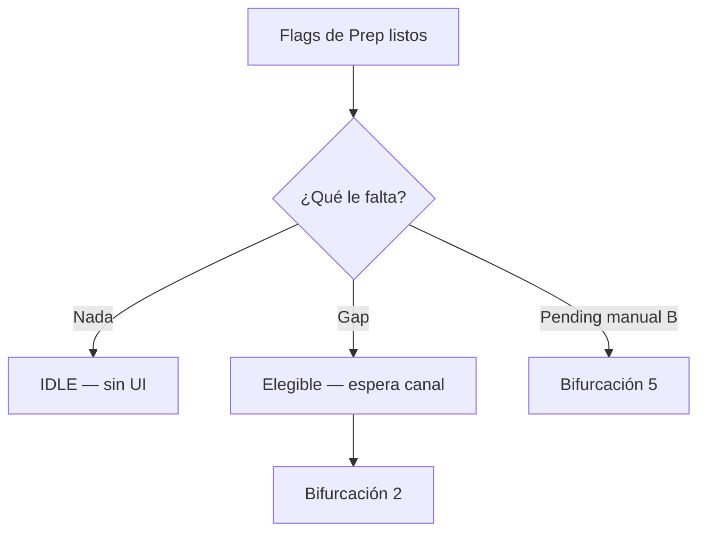
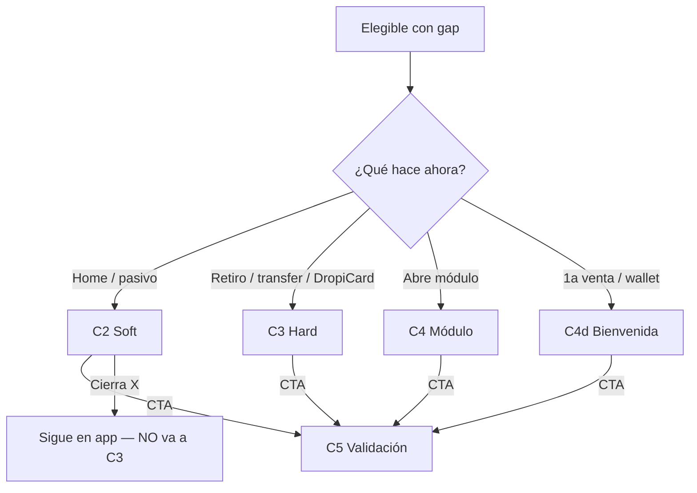
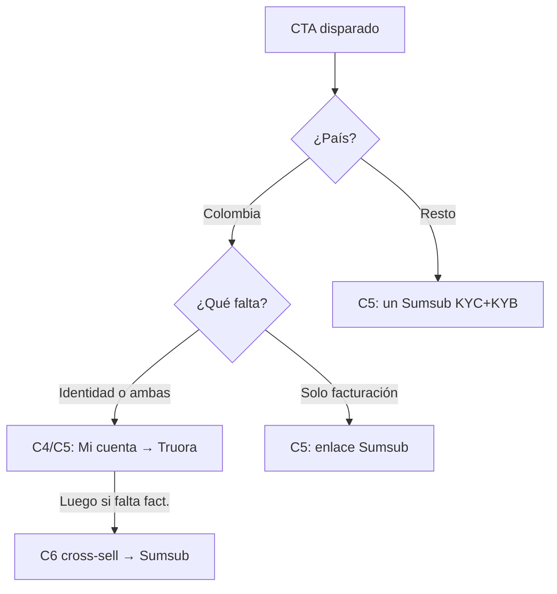
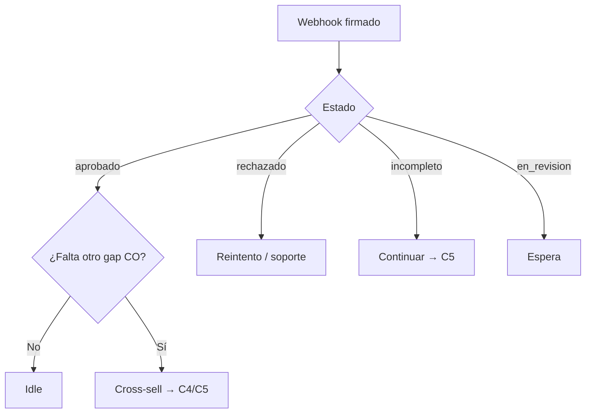
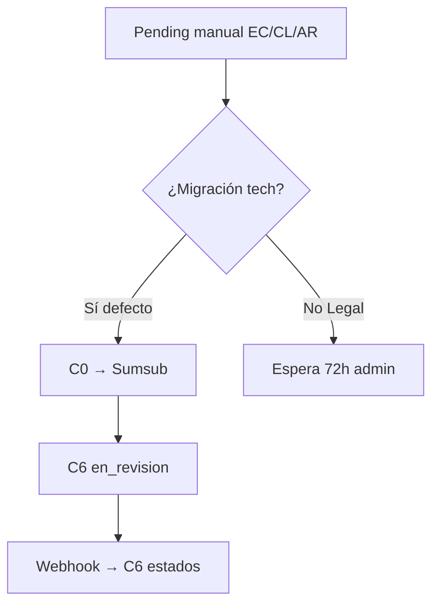

# Mapa de decisión — Validación tech-native (cómo pasamos de un lado a otro)

> [← Volver al Blueprint](Service_Blueprint_Diagrama_Fase_5.md) · versión visual: [Service_Blueprint_Fase_5_Mapa-Decision.html](Service_Blueprint_Fase_5_Mapa-Decision.html)
>
> ⚠️ **Naming:** loop de **completar lo que falta**, no edición `field_diff` de Historia Fase 5.
>
> 📐 **Cómo leer con el Blueprint:** C2 Soft · C3 Hard · C4 Módulo son **canales en paralelo** (no una secuencia). Este mapa detalla el **SI → ENTONCES** de cada salto.

El [Blueprint](Service_Blueprint_Diagrama_Fase_5.md) muestra **qué ve** el usuario. Aquí: **con qué condición** cambia de caja.

Hay **5 bifurcaciones** + **4 reglas transversales**.

| # | Bifurcación | Pregunta | Vive en |
|---|---|---|---|
| 1 | [Gaps y Estado API](#gaps) | ¿Le falta algo y en qué estado está según la API? | C1 |
| 2 | [Canal](#canal) | ¿Qué está haciendo y qué antigüedad tiene? | C2 · C3 · C4 (paralelos) |
| 3 | [País + gap](#pais-gap) | ¿A qué destino y proveedor va el CTA? | C4 → C5 |
| 4 | [Webhook](#webhook) | ¿Qué respondió el proveedor y cómo queda la UI? | C6 |
| 5 | [EC/CL/AR](#5-ecclar--pendiente-manual) | ¿Venía de revisión manual? | C0 → C6 |

---

## 1. Gaps y Estado API — ¿Qué le falta y en qué estado está?

**En una frase:** Antes de iniciar cualquier acción, el sistema decide en milisegundos consultando vía API las bases de datos de Truora y Sumsub — sin descargas manuales ni Google Sheets de por medio. Si ya tiene identidad y facturación completas, no lo interrumpimos. Si le falta algo, determinamos su canal de entrada.

| SI (Estado devuelto por API) | ENTONCES (Condición de Gap) | Destino en el Flujo |
|---|---|---|
| `has_identity` Y `has_billing` = Aprobado | Idle: sin soft, sin hard, sin modal. | Fin del flujo (Operación normal) |
| Falta identidad y/o facturación (Incompleto o Sin Iniciar) | Elegible para intervención (Nueva o Antigua cuenta). | Espera canal (Bifurcación 2) |
| Estado API = Pendiente / En Revisión | Validación en curso por parte del proveedor. | Bloqueo transaccional temporal → Espera Webhook de resolución |

Cajas: [`gap-idle`](Service_Blueprint_Diagrama_Fase_5.html#gap-idle) · [`gap-missing`](Service_Blueprint_Diagrama_Fase_5.html#gap-missing)

---

## 2. Canal — ¿Cómo entra al flujo? (Rutas Paralelas)

**En una frase:** La intervención se adapta a la antigüedad y la acción del usuario. El bloqueo estricto (Hard Gate) solo aparece al tocar salidas de dinero.

| SI el usuario… | Antigüedad / Estado | UI (Pantalla de Intervención) | ¿Bloqueante? |
|---|---|---|---|
| Recibe 1ra orden (venta) o hace 1er mov. wallet | Nuevo (Sin iniciar validaciones) | **C4d Welcome:** Modal de bienvenida — *"¡Tu primera venta en Dropi! Completa tu validación…"* | No (Puede posponer) |
| Navega en Home / Dashboard | Antiguo (Le falta alguna validación) | **C2 Soft Touch:** Modal Slide-up sutil invitando a completar datos | No (Puede cerrar 'X') |
| Clic en Retirar / Transferir / DropiCard | Nuevo o Antiguo (Con gaps) | **C3 Hard Gate:** Control deshabilitado + Tooltip y Modal restrictivo | Sí (Obligatorio) |
| Abre Info de Cuenta o Facturación | Nuevo o Antiguo (Con gaps) | **C4 Módulo nativo:** Formulario Dropi o CTA a Sumsub | Según estado |

**Mito a matar:** Soft → Hard → Módulo. **Realidad:** uno de tres canales → C5.

---

## 3. Ruteo Tech-Native — País + Gap (¿A dónde lo mandamos?)

**En una frase:** Colombia separa la identidad (Truora) de la facturación (Sumsub). El resto de LATAM unifica ambas en un solo paso de Sumsub.

| SI (Condición del Usuario) | Proveedor (API) | Lo que el usuario ve y hace (Destino) |
|---|---|---|
| **Colombia** + Falta Identidad | **Truora (KYC)** | Va a Información de Cuenta → Llena Formulario Dropi → Flujo Truora. |
| **Colombia** + Falta Facturación | **Sumsub (KYB)** | **Sin formulario en Dropi.** Enlace directo al WebSDK de Sumsub para validar la empresa (KYB). |
| **Otros Países** + Cualquier Gap | **Sumsub (KYC+KYB)** | Módulo único. Todo ocurre en Sumsub sin separar identidad y facturación. Todos los mensajes de esta rama llevan aquí. |
| **Excepción: EC / CL / AR** (Pending manual) | **Sumsub (Migración)** | Migración de los casos manuales pendientes a Sumsub. Tras resolución, operan como "Otros Países". |

---

## 4. Resultado webhook — ¿Qué le mostramos y cómo queda la UI?

| SI (Estado Webhook) | ENTONCES UI (Mensaje en Dropi) | Comportamiento del Módulo (Regla 6 meses) |
|---|---|---|
| **Aprobado (Ambos OK)** | Toast: *"¡Cuenta verificada!"* + Confetti | **Datos en Solo Lectura (Read-only).** Alerta: *"No puedes editar esta información durante 6 meses"*. |
| **Aprobación Parcial (CO)** | Modal: *"¡Identidad lista! Completar facturación"* + Confetti | El módulo completado se bloquea por 6 meses. El otro gap sigue abierto y exigible. |
| **Rechazado** | *"No pudimos validar tu información"* | Los datos previos válidos se conservan. Se habilitan los reintentos hacia Sumsub/Truora. |
| **Incompleto** | *"Te falta un paso"* | Botón "Continuar" para retomar exactamente donde quedó en la API. |

---

## 5. EC/CL/AR — pendiente manual

| SI | ENTONCES (defecto producto) | Alternativa Legal |
|---|---|---|
| Usuario en revisión admin manual (B) | Prep crea/actualiza applicant Sumsub; Dropi `en_revision` | Mantener espera 72h sin nuevo Sumsub |
| Sumsub pide completar | CTA Continuar → C5 | — |
| Usuario B **sin** pending + gap | Un enlace Sumsub corto KYC+KYB | — |

---

## Reglas transversales

### Regla A · Hard gate solo salidas
Órdenes, ventas y entradas **nunca** pasan por C3. Solo retiros, transferencias y DropiCard.

### Regla B · Webhook directo
Sin Google Sheets en happy path. Un evento actualiza identidad + facturación.

### Regla C · Consolidación de EC/CL/AR (Excepción Técnica)
TI debe definir un script de migración para los usuarios de Ecuador, Chile y Argentina que actualmente tienen KYB manual. Si el usuario está en estado manual "Aprobado", se homologará a `has_billing = true` vía base de datos. Si está "Pendiente", se inyectará en el nuevo flujo de Sumsub.

### Regla D · Bloqueo de UI (Regla de los 6 Meses)
El frontend debe escuchar la variable `last_validation_date` proveniente de la base de datos tras el Webhook de aprobación. Si `current_date < last_validation_date + 6 meses`, los *inputs* de Información de Cuenta y Facturación deben renderizarse como `disabled`, inyectando obligatoriamente el tooltip de advertencia de la regla de los 6 meses.

---

## Cadena mínima para un stakeholder

1. ¿Le falta algo? (1) → si no, idle.  
2. ¿Qué está haciendo? (2) → soft **o** hard **o** módulo.  
3. ¿CO o resto + qué gap? (3) → destino.  
4. ¿Qué dijo el webhook? (4) → UI + gate.  
5. ¿Era pending B? (5) → revisión nativa.

Copy: [`UX-Writing-Validacion-TechNative.md`](UX-Writing-Validacion-TechNative.md) · cada columna del [Blueprint](Service_Blueprint_Diagrama_Fase_5.md) ya trae esta misma tabla inline · [Tabla](Service_Blueprint_Fase_5_Tabla.md).

[← Volver al Blueprint](Service_Blueprint_Diagrama_Fase_5.md)
