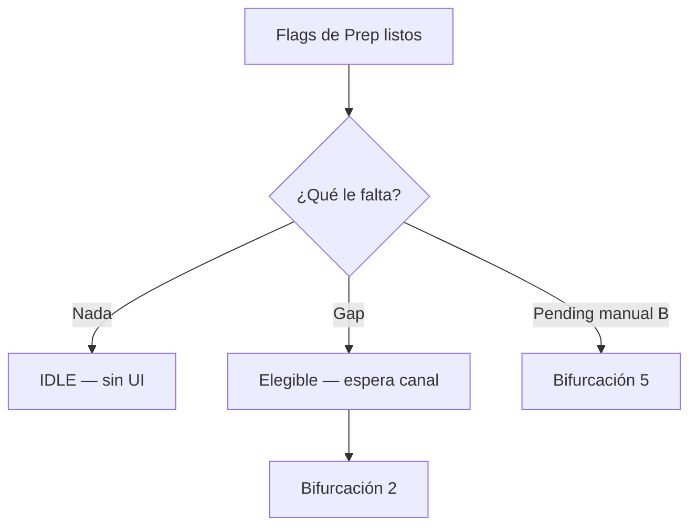
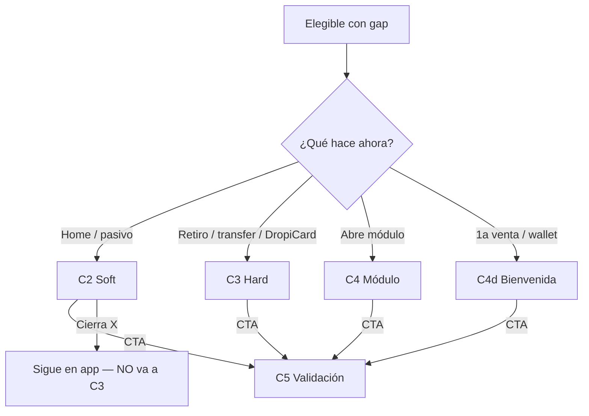
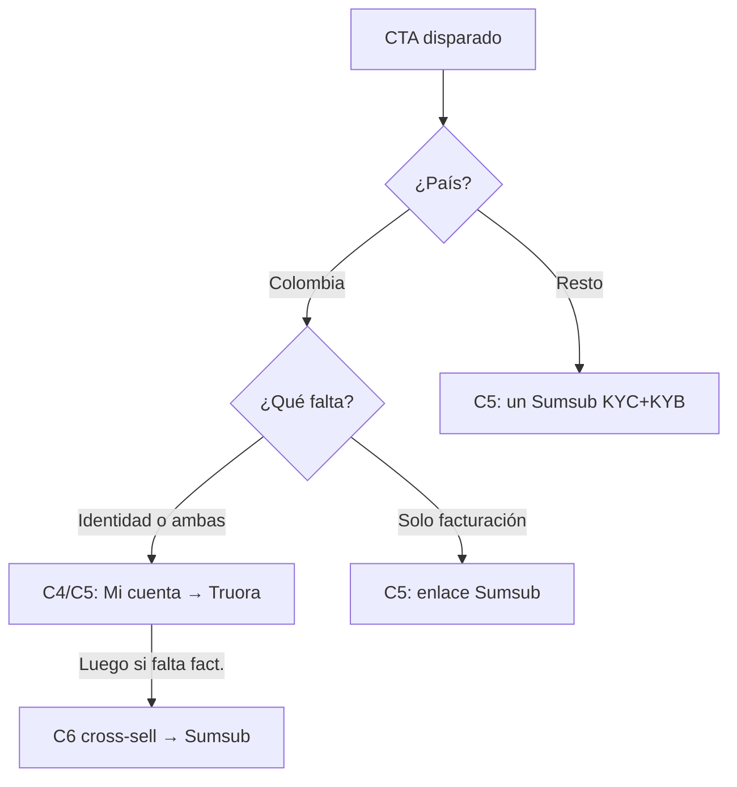
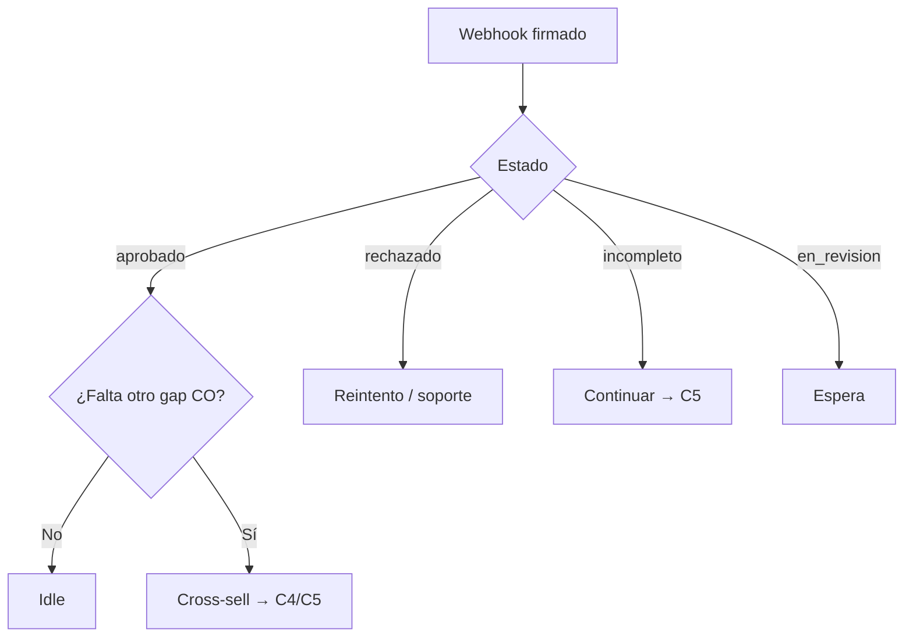
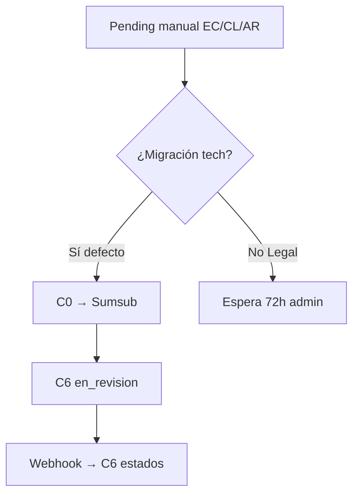

# Mapa de decisión — Validación tech-native (cómo pasamos de un lado a otro)

> [← Volver al Blueprint](Service_Blueprint_Diagrama_Fase_5.md) · versión visual: [Service_Blueprint_Fase_5_Mapa-Decision.html](Service_Blueprint_Fase_5_Mapa-Decision.html)
>
> ⚠️ **Naming:** loop de **completar gaps**, no edición `field_diff` de Historia Fase 5.
>
> 📐 **Cómo leer con el Blueprint:** C2 Soft · C3 Hard · C4 Módulo son **canales en paralelo** (no una secuencia). Este mapa detalla el **SI → ENTONCES** de cada salto.

El [Blueprint](Service_Blueprint_Diagrama_Fase_5.md) muestra **qué ve** el usuario. Aquí: **con qué condición** cambia de caja.

Hay **5 bifurcaciones** + **4 reglas transversales**.

| # | Bifurcación | Pregunta | Vive en |
|---|---|---|---|
| 1 | [Gaps y Estado API](#gaps) | ¿Le falta algo y en qué estado está según la API? | C1 |
| 2 | [Canal](#canal) | ¿Qué está haciendo y qué antigüedad tiene? | C2 · C3 · C4 (paralelos) |
| 3 | [País + gap](#pais-gap) | ¿A qué destino y proveedor va el CTA? | C4 → C5 |
| 4 | [Webhook](#webhook) | ¿Qué respondió el proveedor y cómo queda la UI? | C6 |
| 5 | [EC/CL/AR](#5-ecclar--pendiente-manual) | ¿Venía de revisión manual? | C0 → C6 |

---

## 1. Gaps y Estado API — ¿Qué le falta y en qué estado está?

**En una frase:** Antes de iniciar cualquier acción, el sistema consulta vía API el estado del usuario (Aprobado, Pendiente, Sin Iniciar). Si ya tiene identidad y facturación completas, no lo molestamos. Si le falta algo, determinamos por qué canal entra.

| SI (Estado devuelto por API) | ENTONCES (Condición de Gap) | Destino |
|---|---|---|
| `has_identity` Y `has_billing` = Aprobado | Idle: sin soft, sin hard, sin modal. | Fin del flujo |
| Falta identidad y/o facturación (Sin iniciar o Incompleto) | Elegible para intervención (Nueva o Antigua cuenta). | Espera canal (Bifurcación 2) |
| Estado API = Pendiente | Validación en curso. | Bloqueo transaccional temporal → Espera Webhook (C6) |

Cajas: [`gap-idle`](Service_Blueprint_Diagrama_Fase_5.html#gap-idle) · [`gap-missing`](Service_Blueprint_Diagrama_Fase_5.html#gap-missing)

---

## 2. Canal — ¿Cómo entra al flujo? (Paralelos)

**En una frase:** El gap se muestra distinto según la antigüedad del usuario y su acción. Cerrar el soft no abre el hard. El hard solo aparece al tocar dinero.

| SI el usuario… | Antigüedad / Estado | ENTONCES canal | UI (Pantalla) | ¿Obligatorio? | Sale a |
|---|---|---|---|---|---|
| Recibe 1ra orden (venta) o hace 1er mov. wallet | Nuevo (Sin iniciar nada) | **C4d Welcome** | Modal de bienvenida "Verifica tu cuenta antes de operar" | No (X) | CTA → C5 / C4 |
| Navega en Home / Dashboard | Antiguo (Falta alguna validación) | **C2 Soft** | Modal Slide-up (Sutil) invitando a completar datos | No (X) | CTA → C5 / C4 |
| Clic en Retirar / Transferir / DropiCard | Nuevo o Antiguo (Con gaps) | **C3 Hard** | Tooltip de bloqueo + Modal restrictivo | Sí (Gate) | CTA → C5 / C4 |
| Abre Info de Cuenta o Facturación | Nuevo o Antiguo (Con gaps) | **C4 Módulo** | Formulario Dropi o Link Sumsub | Según estado | CTA → C5 |

**Mito a matar:** Soft → Hard → Módulo. **Realidad:** uno de tres canales → C5.

---

## 3. País + gap — ¿A dónde lo mandamos? (Routing)

**En una frase:** El CTA resuelve el destino según el país y el validador asignado. Colombia divide flujos (Truora/Sumsub); el resto de LATAM los unifica.

| SI (Condición) | ENTONCES Destino | Proveedor (API) | Lo que el usuario ve / hace |
|---|---|---|---|
| **Colombia** + Falta Identidad | Información de Cuenta | **Truora (KYC)** | Formulario de datos personales en Dropi + Flujo de Identidad Truora. |
| **Colombia** + Falta Facturación | Módulo Financiero | **Sumsub (KYB)** | **Sin formulario en Dropi.** Enlace directo al WebSDK de Sumsub para empresas. |
| **Otros Países** + Cualquier Gap | Módulo Único | **Sumsub (KYC+KYB)** | Un solo flujo continuo dentro de Sumsub, sin separar identidad y facturación. |
| **Excepción: EC / CL / AR** (Pending manual) | Transición a automatización | **Sumsub (Migración)** | (Por definir) Migrar casos pendientes a Sumsub o ejecutar flujo manual temporal. Una vez resuelto, pasan al flujo "Otros Países". |

---

## 4. Resultado webhook — ¿Qué le mostramos y cómo queda la UI?

| SI estado webhook | ENTONCES UI (Mensaje) | Comportamiento en Módulo Dropi | Gate salidas |
|---|---|---|---|
| **Aprobado (Ambos OK)** | Modal: "¡Cuenta verificada!" + Confetti | **Datos Personales y Facturación se muestran en modo Solo Lectura (Read-only).** Aparece aviso: *"No puedes editar esta información durante 6 meses"*. | Libera |
| **Aprobado Parcial (CO)** | Confirmación del paso + Cross-sell | El módulo completado se bloquea (6 meses). El módulo restante sigue abierto. | Parcial |
| **Rechazado** | "No pudimos validar tu información" | Los flujos de reintento permanecen activos. | Se mantiene |
| **Incompleto / Timeout** | "Te falta un paso" | Botón "Continuar" para retomar flujo en API. | Se mantiene |

---

## 5. EC/CL/AR — pendiente manual

| SI | ENTONCES (defecto producto) | Alternativa Legal |
|---|---|---|
| Usuario en revisión admin manual (B) | Prep crea/actualiza applicant Sumsub; Dropi `en_revision` | Mantener espera 72h sin nuevo Sumsub |
| Sumsub pide completar | CTA Continuar → C5 | — |
| Usuario B **sin** pending + gap | Un enlace Sumsub corto KYC+KYB | — |

---

## Reglas transversales

### Regla A · Hard gate solo salidas
Órdenes, ventas y entradas **nunca** pasan por C3. Solo retiros, transferencias y DropiCard.

### Regla B · Webhook directo
Sin Google Sheets en happy path. Un evento actualiza identidad + facturación.

### Regla C · Consolidación de EC/CL/AR (Excepción Técnica)
TI debe definir un script de migración para los usuarios de Ecuador, Chile y Argentina que actualmente tienen KYB manual. Si el usuario está en estado manual "Aprobado", se homologará a `has_billing = true` vía base de datos. Si está "Pendiente", se inyectará en el nuevo flujo de Sumsub.

### Regla D · Bloqueo de UI (Regla de los 6 Meses)
El frontend debe escuchar la variable `last_validation_date` proveniente de la base de datos tras el Webhook de aprobación. Si `current_date < last_validation_date + 6 meses`, los *inputs* de Información de Cuenta y Facturación deben renderizarse como `disabled`, inyectando obligatoriamente el tooltip de advertencia de la regla de los 6 meses.

---

## Cadena mínima para un stakeholder

1. ¿Le falta algo? (1) → si no, idle.  
2. ¿Qué está haciendo? (2) → soft **o** hard **o** módulo.  
3. ¿CO o resto + qué gap? (3) → destino.  
4. ¿Qué dijo el webhook? (4) → UI + gate.  
5. ¿Era pending B? (5) → revisión nativa.

Copy: [`UX-Writing-Validacion-TechNative.md`](UX-Writing-Validacion-TechNative.md) · Blueprint §5 tarjetas · [Tabla](Service_Blueprint_Fase_5_Tabla.md).

[← Volver al Blueprint](Service_Blueprint_Diagrama_Fase_5.md)
